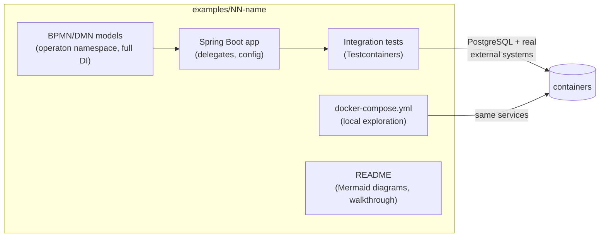

# Operaton Examples

A curated catalog of minimal, production-quality example projects for
[Operaton](https://operaton.org) — the open-source BPMN process engine.
Every example is self-contained, builds with **both** Maven Wrapper and
Gradle Wrapper, ships a Docker Compose setup for local exploration, and is
verified end-to-end by **Testcontainers** integration tests: building an
example means testing its processes against real integrations.

## Requirements

| Tool | Version |
|---|---|
| JDK | 21 |
| Docker | any recent version (required for tests and local run) |
| Distribution images (`operaton/tomcat`, `operaton/wildfly`, `operaton/operaton`) | `2.1.1` |

Pinned stack (all examples): Spring Boot **4.1.0**, Operaton **2.1.1**,
Maven Wrapper **3.9.12**, Gradle Wrapper **9.2.0**, PostgreSQL **16**.

## Using an example

```bash
cd examples/01-getting-started
docker compose up -d --wait # start PostgreSQL (and example-specific services)
./mvnw spring-boot:run      # or: ./gradlew bootRun
# Cockpit/Tasklist: http://localhost:8080  (demo/demo)
./mvnw verify               # or: ./gradlew build — runs Testcontainers ITs
```

## Catalog

### Examples

| # | Example | Demonstrates |
|---|---|---|
| 01 | [getting-started](examples/01-getting-started) | Embedded engine, service task delegate, user task, exclusive gateway |
| 02 | [service-tasks](examples/02-service-tasks) | Java delegates, expression delegates, BpmnError, job retry |
| 03 | [external-task-worker](examples/03-external-task-worker) | External task pattern, long-polling worker, topic subscription |
| 04 | [user-task-forms](examples/04-user-task-forms) | User tasks, embedded forms, task lifecycle, form variables |
| 05 | [dmn-decision](examples/05-dmn-decision) | DMN decision tables, DRD, decision evaluation, business rule task |
| 06 | [message-events](examples/06-message-events) | Message start event, intermediate message catch, business-key correlation |
| 07 | [timer-events](examples/07-timer-events) | Timer boundary event (SLA escalation), job executor API, testing timers |
| 08 | [error-compensation](examples/08-error-compensation) | BPMN compensation (saga pattern), compensation handlers, BpmnError trigger |
| 09 | [multi-instance](examples/09-multi-instance) | Parallel multi-instance user tasks, collection loop, completion condition |
| 10 | [integration-rest](examples/10-integration-rest) | REST delegate via RestTemplate, 4xx→BpmnError, WireMock Testcontainers |
| 11 | [integration-mail](examples/11-integration-mail) | Spring Mail in delegates, Mailpit Testcontainers for SMTP + REST assertions |
| 12 | [integration-kafka](examples/12-integration-kafka) | Kafka listener starts process, delegate publishes result, Awaitility assertions |
| 13 | [call-activity](examples/13-call-activity) | Process composition via call activity, variable in/out mappings, child process history |
| 14 | [signal-events](examples/14-signal-events) | Signal broadcast vs. message point-to-point, intermediate catch/throw, multi-subscriber |
| 15 | [event-subprocess](examples/15-event-subprocess) | Non-interrupting signal audit subprocess, interrupting error handler subprocess |
| 16 | [inclusive-gateway](examples/16-inclusive-gateway) | Inclusive (OR) gateway — multiple concurrent paths, join waits for all active tokens |
| 17 | [async-continuation](examples/17-async-continuation) | asyncBefore transaction boundaries, manual job execution, failedJobRetryTimeCycle |

### Use Cases

| # | Use Case | Process | Demonstrates |
|---|---|---|---|
| UC-01 | [leave-request](use-cases/uc-01-leave-request) | Employee leave approval | Timer escalation (non-interrupting), VacationBalanceService, SQL schema init |
| UC-02 | [loan-application](use-cases/uc-02-loan-application) | Loan origination | REST credit scoring, DMN risk assessment, Spring Mail notifications |
| UC-03 | [incident-management](use-cases/uc-03-incident-management) | IT support ticket | Signal escalation boundary, timer SLA boundary, 4-swimlane BPMN, REST integration |
| UC-04 | [order-fulfillment](use-cases/uc-04-order-fulfillment) | E-commerce order | Error boundary on payment, async continuation, compensation, WireMock inventory/payment stubs |

### Platform Integration

| # | Example | Demonstrates |
|---|---|---|
| 18 | [integration-connectors](examples/18-integration-connectors) | HTTP connector (declarative, no Java delegate) + custom Connector SPI |
| 19 | [runtime-quarkus](examples/19-runtime-quarkus) | Embedded engine in Quarkus/CDI (no Spring Boot) |
| 20 | [distribution-tomcat](examples/20-distribution-tomcat) | Process-application WAR deployed into `operaton/tomcat` shared-engine container |
| 21 | [distribution-wildfly](examples/21-distribution-wildfly) | Process-application WAR deployed into `operaton/wildfly` shared-engine container |
| 22 | [operations-flowset-control](examples/22-operations-flowset-control) | `operaton/operaton` with built-in webapps disabled; Flowset Control as external ops UI |

## Anatomy of every example



## Quality bar

Every example satisfies [docs/EXAMPLE_STANDARDS.md](docs/EXAMPLE_STANDARDS.md)
— the definition of done covering modeling, testing, documentation and dual
builds. CI builds every example with both build systems on every push.

## Contributing (humans and AI agents)

AI agents: start with [AGENTS.md](AGENTS.md).
Humans: same rules — see the review checklist in
[docs/EXAMPLE_STANDARDS.md](docs/EXAMPLE_STANDARDS.md#10-review-checklist-copy-into-every-example-pr).

## License

[Apache-2.0](LICENSE)
