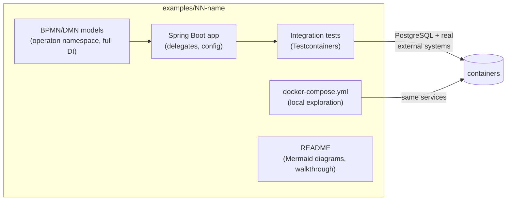

# Operaton Examples

A curated catalog of minimal, production-quality example projects for
[Operaton](https://operaton.org) — the open-source BPMN process engine.
Every example is self-contained, builds with **both** Maven Wrapper and
Gradle Wrapper, ships a Docker Compose setup for local exploration, and is
verified end-to-end by **Testcontainers** integration tests: building an
example means testing its processes against real integrations.

## Requirements

| Tool | Version |
|---|---|
| JDK | 21 |
| Docker | any recent version (required for tests and local run) |

Pinned stack (all examples): Spring Boot **4.0.6**, Operaton **2.1.0**,
Maven Wrapper **3.9.12**, Gradle Wrapper **9.2.0**, PostgreSQL **16**.

## Using an example

```bash
cd examples/01-getting-started
docker compose up -d --wait # start PostgreSQL (and example-specific services)
./mvnw spring-boot:run      # or: ./gradlew bootRun
# Cockpit/Tasklist: http://localhost:8080  (demo/demo)
./mvnw verify               # or: ./gradlew build — runs Testcontainers ITs
```

## Catalog

| # | Example | Demonstrates | Status |
|---|---|---|---|
| 01 | [getting-started](examples/01-getting-started) | Embedded engine, service task delegate, user task, exclusive gateway | ✅ |
| 02 | [service-tasks](examples/02-service-tasks) | External service tasks, Java delegates, expression delegates | ✅ |
| 03 | [external-task-worker](examples/03-external-task-worker) | External task pattern, long-polling worker, topic subscription | ✅ |
| 04 | [user-task-forms](examples/04-user-task-forms) | User tasks, embedded forms, task lifecycle, form variables | ✅ |
| 05 | [dmn-decision](examples/05-dmn-decision) | DMN decision tables, DRD, decision evaluation, loan-application process | ✅ |
| 06 | [message-events](examples/06-message-events) | Message start event, intermediate message catch, business-key correlation, MismatchingMessageCorrelationException | ✅ |
| 07 | [timer-events](examples/07-timer-events) | Timer boundary event (SLA escalation), job executor API, testing timers without wall-clock waits | ✅ |
| 15 | [event-subprocess](examples/15-event-subprocess) | Event subprocesses — non-interrupting signal audit log, interrupting error handler, cross-cutting concerns without polluting the main flow | ✅ |
| 16 | [inclusive-gateway](examples/16-inclusive-gateway) | Inclusive (OR) gateway — multiple concurrent paths, joining wait for all active tokens | ✅ |
| 08–15, 17–18 | _see roadmap_ | compensation, REST integration, mail, Kafka, Keycloak, multi-tenancy, … | 🚧 |

The full roadmap with per-example scope lives in
[docs/superpowers/plans/2026-06-12-operaton-examples-repository.md](docs/superpowers/plans/2026-06-12-operaton-examples-repository.md).

## Anatomy of every example



## Quality bar

Every example satisfies [docs/EXAMPLE_STANDARDS.md](docs/EXAMPLE_STANDARDS.md)
— the definition of done covering modeling, testing, documentation and dual
builds. CI builds every example with both build systems on every push.

## Contributing (humans and AI agents)

AI agents: start with [AGENTS.md](AGENTS.md).
Humans: same rules — see the review checklist in
[docs/EXAMPLE_STANDARDS.md](docs/EXAMPLE_STANDARDS.md#10-review-checklist-copy-into-every-example-pr).

## License

[Apache-2.0](LICENSE)
