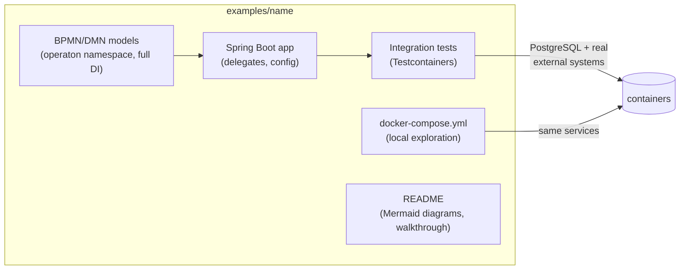

# Operaton Examples

A curated catalog of minimal, production-quality example projects for
[Operaton](https://operaton.org) — the open-source BPMN process engine.
Every example is self-contained, builds with **both** Maven Wrapper and
Gradle Wrapper, ships a Docker Compose setup for local exploration, and is
verified end-to-end by **Testcontainers** integration tests: building an
example means testing its processes against real integrations.

## Requirements

| Tool | Version |
|---|---|
| JDK | 21 |
| Docker | any recent version (required for tests and local run) |

## Using an example

```bash
cd examples/core-examples/getting-started
docker compose up -d --wait # start PostgreSQL (and example-specific services)
./mvnw spring-boot:run      # or: ./gradlew bootRun
# Cockpit/Tasklist: http://localhost:8080  (demo/demo)
./mvnw verify               # or: ./gradlew build — runs Testcontainers ITs
```

## Catalog

### Core Examples

| Example | Demonstrates |
|---|---|
| [getting-started](examples/core-examples/getting-started) | Embedded engine, service task delegate, user task, exclusive gateway |
| [service-tasks](examples/core-examples/service-tasks) | Java delegates, expression delegates, BpmnError, job retry |
| [external-task-worker](examples/core-examples/external-task-worker) | External task pattern, long-polling worker, topic subscription |
| [user-task-forms](examples/core-examples/user-task-forms) | User tasks, embedded forms, task lifecycle, form variables |
| [dmn-decision](examples/core-examples/dmn-decision) | DMN decision tables, DRD, decision evaluation, business rule task |
| [message-events](examples/core-examples/message-events) | Message start event, intermediate message catch, business-key correlation |
| [timer-events](examples/core-examples/timer-events) | Timer boundary event (SLA escalation), job executor API, testing timers |
| [error-compensation](examples/core-examples/error-compensation) | BPMN compensation (saga pattern), compensation handlers, BpmnError trigger |
| [multi-instance](examples/core-examples/multi-instance) | Parallel multi-instance user tasks, collection loop, completion condition |
| [integration-rest](examples/core-examples/integration-rest) | REST delegate via RestTemplate, 4xx→BpmnError, WireMock Testcontainers |
| [integration-mail](examples/core-examples/integration-mail) | Spring Mail in delegates, Mailpit Testcontainers for SMTP + REST assertions |
| [integration-kafka](examples/core-examples/integration-kafka) | Kafka listener starts process, delegate publishes result, Awaitility assertions |
| [call-activity](examples/core-examples/call-activity) | Process composition via call activity, variable in/out mappings, child process history |
| [signal-events](examples/core-examples/signal-events) | Signal broadcast vs. message point-to-point, intermediate catch/throw, multi-subscriber |
| [event-subprocess](examples/core-examples/event-subprocess) | Non-interrupting signal audit subprocess, interrupting error handler subprocess |
| [inclusive-gateway](examples/core-examples/inclusive-gateway) | Inclusive (OR) gateway — multiple concurrent paths, join waits for all active tokens |
| [async-continuation](examples/core-examples/async-continuation) | asyncBefore transaction boundaries, manual job execution, failedJobRetryTimeCycle |

### Advanced Engine Features

| Example | Demonstrates |
|---|---|
| [engine-plugin](examples/advanced-features/engine-plugin) | Custom `AbstractProcessEnginePlugin` with `BpmnParseListener` injecting `TaskListener` for audit logging |
| [job-retry-profile](examples/advanced-features/job-retry-profile) | `failedJobRetryTimeCycle`, custom retry profiles, observing and controlling retry counts |
| [command-interceptor](examples/advanced-features/command-interceptor) | `CommandInterceptor` wrapping all engine API calls for auditing (name + duration) |
| [process-migration](examples/advanced-features/process-migration) | `MigrationPlan` API to migrate running instances between process definition versions |
| [spin-json](examples/advanced-features/spin-json) | JSON-typed process variables via Operaton Spin — store and retrieve Java objects as JSON |
| [xslt-script-task](examples/advanced-features/xslt-script-task) | XSLT transformation in a Groovy script task using javax.xml.transform |
| [multi-tenancy](examples/advanced-features/multi-tenancy) | Tenant-identifier multi-tenancy: shared engine, isolated deployments and instances per tenant |
| [bpmn-model-api-parse](examples/advanced-features/bpmn-model-api-parse) | Programmatic inspection of deployed BPMN models using the BPMN Model API |
| [bpmn-model-api-generate](examples/advanced-features/bpmn-model-api-generate) | Create and deploy BPMN processes programmatically without XML authoring |
| [unit-testing](examples/advanced-features/unit-testing) | Fast isolated unit tests with `ProcessEngineExtension` + H2, complemented by Testcontainers ITs |

### Platform Integration

| Example | Demonstrates |
|---|---|
| [integration-connectors](examples/platform-integration/integration-connectors) | HTTP connector (declarative, no Java delegate) + custom Connector SPI |
| [runtime-quarkus](examples/platform-integration/runtime-quarkus) | Embedded engine in Quarkus/CDI (no Spring Boot) |
| [distribution-tomcat](examples/platform-integration/distribution-tomcat) | Process-application WAR deployed into `operaton/tomcat` shared-engine container |
| [distribution-wildfly](examples/platform-integration/distribution-wildfly) | Process-application WAR deployed into `operaton/wildfly` shared-engine container |

### Use Cases

| Use Case | Process | Demonstrates |
|---|---|---|
| [leave-request](examples/use-cases/leave-request) | Employee leave approval | Timer escalation (non-interrupting), VacationBalanceService, SQL schema init |
| [loan-application](examples/use-cases/loan-application) | Loan origination | REST credit scoring, DMN risk assessment, Spring Mail notifications |
| [incident-management](examples/use-cases/incident-management) | IT support ticket | Signal escalation boundary, timer SLA boundary, 4-swimlane BPMN, REST integration |
| [order-fulfillment](examples/use-cases/order-fulfillment) | E-commerce order | Error boundary on payment, async continuation, compensation, WireMock inventory/payment stubs |
| [candidate-screening](examples/use-cases/candidate-screening) | AI recruiting screening | LLM scoring + email generation via HTTP connector, LLM-driven confidence gateway, human-in-the-loop on borderline, calendar slot query, WireMock IT |
| [insurance-claim](examples/use-cases/insurance-claim) | Insurance damage claim | Event-based gateway (message vs timer race), parallel fraud check and damage appraisal, DMN settlement with FIRST hit policy |
| [travel-booking](examples/use-cases/travel-booking) | Travel booking SAGA | BPMN transaction subprocess, cancel end event, cancel boundary event, automatic compensation rollback |
| [complaint-resolution](examples/use-cases/complaint-resolution) | Customer complaint | Escalation events: non-interrupting throw + boundary (parallel approval), interrupting end event + boundary (specialist reroute) |
| [employee-onboarding](examples/use-cases/employee-onboarding) | Employee HR onboarding | Call activity orchestration: parallel MI for equipment provisioning, single call activity for system access, in/out variable mapping |
| [procurement-collaboration](examples/use-cases/procurement-collaboration) | Buyer ↔ Supplier procurement | Two-pool collaboration, three correlated messages, async continuation decoupling |
| [supply-chain-tracking](examples/use-cases/supply-chain-tracking) | Shipment tracking | Event-based gateway, async Kafka message correlation by business key, P7D timer re-arm |
| [expense-reimbursement](examples/use-cases/expense-reimbursement) | Vision LLM receipt verification | Multimodal vision LLM via delegate, three-way match verification, FIRST-hit DMN, LLM-drafted email |

## Anatomy of every example


```mermaid
flowchart LR
    subgraph example [examples/name]
        BPMN["BPMN/DMN models<br/>(operaton namespace, full DI)"]
        APP["Spring Boot app<br/>(delegates, config)"]
        IT["Integration tests<br/>(Testcontainers)"]
        DC["docker-compose.yml<br/>(local exploration)"]
        RM["README<br/>(Mermaid diagrams, walkthrough)"]
    end
    BPMN --> APP
    APP --> IT
    IT -->|"PostgreSQL + real<br/>external systems"| TC[(containers)]
    DC -->|same services| TC
```

## Quality bar

Every example satisfies [docs/EXAMPLE_STANDARDS.md](docs/EXAMPLE_STANDARDS.md)
— the definition of done covering modeling, testing, documentation and dual
builds. CI builds every example with both build systems on every push.

## Contributing (humans and AI agents)

AI agents: start with [AGENTS.md](AGENTS.md).
Humans: same rules — see the review checklist in
[docs/EXAMPLE_STANDARDS.md](docs/EXAMPLE_STANDARDS.md#10-review-checklist-copy-into-every-example-pr).

## BPMN Concept Reference

Quick lookup: which example demonstrates each BPMN construct.

### BPMN Concepts

| BPMN Concept                   | Example(s)                                                                                                                                                                                                 | Notes |
|--------------------------------|------------------------------------------------------------------------------------------------------------------------------------------------------------------------------------------------------------|---|
| Service task                   | <ul><li>[getting-started](examples/core-examples/getting-started)</li><li>[service-tasks](examples/core-examples/service-tasks)</li></ul>                                                                  | Java delegate, Spring bean, expression |
| User task                      | <ul><li>[user-task-forms](examples/core-examples/user-task-forms)</li></ul>                                                                                                                                | Forms, candidate groups |
| Script task                    | <ul><li>[service-tasks](examples/core-examples/service-tasks)</li></ul>                                                                                                                                    | JavaScript / Groovy inline |
| Business rule task (DMN)       | <ul><li>[dmn-decision](examples/core-examples/dmn-decision)</li><li>[insurance-claim](examples/use-cases/insurance-claim)</li></ul>                                                                        | FEEL expressions, hit policies |
| Exclusive gateway (XOR)        | <ul><li>[getting-started](examples/core-examples/getting-started)</li><li>[dmn-decision](examples/core-examples/dmn-decision)</li></ul>                                                                    | Default flow, condition expressions |
| Parallel gateway (AND)         | <ul><li>[insurance-claim](examples/use-cases/insurance-claim)</li></ul>                                                                                                                                    | AND-split / AND-join, concurrent branches |
| Event-based gateway            | <ul><li>[insurance-claim](examples/use-cases/insurance-claim)</li></ul>                                                                                                                                    | Race between message and timer |
| Inclusive gateway (OR)         | <ul><li>[inclusive-gateway](examples/core-examples/inclusive-gateway)</li></ul>                                                                                                                            | OR-split / OR-join |
| Message start event            | <ul><li>[message-events](examples/core-examples/message-events)</li><li>[procurement-collaboration](examples/use-cases/procurement-collaboration)</li></ul>                                                | Start by message correlation |
| Timer start event              | [timer-events](examples/core-examples/timer-events)                                                                                                                                                        | Cron, cycle, duration |
| Message intermediate catch     | <ul><li>[message-events](examples/core-examples/message-events)</li><li>[insurance-claim](examples/use-cases/insurance-claim)</li><li>[procurement-collaboration](examples/use-cases/procurement-collaboration)</li></ul> | Correlation by business key |
| Timer intermediate catch       | <ul><li>[timer-events](examples/core-examples/timer-events)</li><li>[insurance-claim](examples/use-cases/insurance-claim)</li></ul>                                                                        | ISO-8601 duration variable |
| Signal intermediate catch/throw | [signal-events](examples/core-examples/signal-events)                                                                                                                                                      | Broadcast signal |
| Error boundary event           | [error-compensation](examples/core-examples/error-compensation)                                                                                                                                            | Interrupting and non-interrupting |
| Compensation                   | <ul><li>[error-compensation](examples/core-examples/error-compensation)</li><li>[travel-booking](examples/use-cases/travel-booking)</li></ul>                                                              | Manual throw (error-compensation) vs. transaction-driven (travel-booking) |
| Transaction subprocess         | [travel-booking](examples/use-cases/travel-booking)                                                                                                                                                        | All-or-nothing SAGA; cancel end event triggers auto-compensation |
| Cancel event (end + boundary   | [travel-booking](examples/use-cases/travel-booking)                                                                                                                                                        | Cancel end event inside transaction + cancel boundary on transaction |
| Multi-instance                 | <ul><li>[multi-instance](examples/core-examples/multi-instance)</li><li>[employee-onboarding](examples/use-cases/employee-onboarding)</li></ul>                                                            | Sequential and parallel sub-tasks; collection-driven parallel MI call activity |
| Call activity                  | <ul><li>[call-activity](examples/core-examples/call-activity)</li><li>[employee-onboarding](examples/use-cases/employee-onboarding)</li></ul>                                                              | Sub-process reuse, in/out variable mapping, parallel multi-instance over collection |
| Event sub-process              | [event-subprocess](examples/core-examples/event-subprocess)                                                                                                                                                | Error- and message-triggered |
| External task                  | [external-task-worker](examples/core-examples/external-task-worker)                                                                                                                                        | Worker API, long polling |
| Async continuation             | <ul><li>[async-continuation](examples/core-examples/async-continuation)</li><li>[procurement-collaboration](examples/use-cases/procurement-collaboration)</li></ul>                                        | `asyncBefore`, exclusive job lock |
| Escalation event               | [complaint-resolution](examples/use-cases/complaint-resolution                                                                                                                                             | Non-interrupting throw + boundary (parallel), interrupting end event + boundary (cancel) |
| Collaboration / message flow (two pools | [procurement-collaboration](examples/use-cases/procurement-collaboration)                                                                                                                                  | Two process definitions communicating via message correlation within one engine |
| Cross-instance correlation key | [procurement-collaboration](examples/use-cases/procurement-collaboration)                                                                                                                                  | `processInstanceVariableEquals()` routes messages to the correct instance by `requestId` |

### Integrations

| Integration | Example(s) |
|---|---|
| REST (Spring WebClient) | core-examples/integration-rest |
| Mail (Jakarta Mail) | core-examples/integration-mail |
| Kafka | core-examples/integration-kafka |
| Operaton Connectors | platform-integration/integration-connectors |
| Micrometer / Prometheus | approval-sla-metrics |
| Keycloak identity provider | platform-integration/integration-keycloak |
| Vision LLM (Ollama) | [expense-reimbursement](examples/use-cases/expense-reimbursement) |

### Platforms / Runtimes

| Platform | Example(s) |
|---|---|
| Spring Boot (embedded) | core-examples/getting-started, all use-cases, approval-sla-metrics, … |
| Quarkus (embedded) | platform-integration/runtime-quarkus |
| Tomcat (shared engine) | platform-integration/distribution-tomcat |
| WildFly (shared engine) | platform-integration/distribution-wildfly |
| Operaton Run + Keycloak plugin (custom image) | platform-integration/integration-keycloak |

## License

[Apache-2.0](LICENSE)
