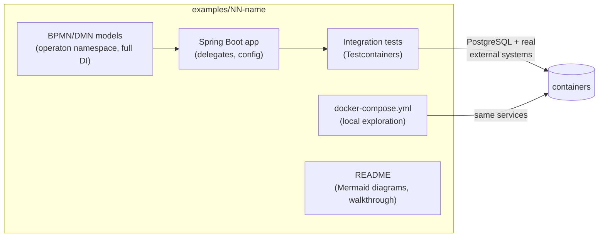
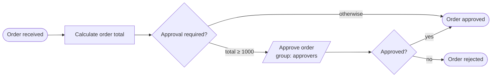

# operaton-examples Repository Implementation Plan

> **For agentic workers:** REQUIRED SUB-SKILL: Use superpowers:subagent-driven-development (recommended) or superpowers:executing-plans to implement this plan task-by-task. Steps use checkbox (`- [ ]`) syntax for tracking.

**Goal:** Bootstrap the public GitHub repository `kthoms/operaton-examples` with the repository foundation (AI guidelines, quality standards, CI) and one fully working reference example (`01-getting-started`) that sets the gold standard every future example is measured against.

**Architecture:** A flat, numbered catalog of self-contained example projects under `examples/`. Each example is a minimal Spring Boot 4 application embedding the Operaton 2.1.0 engine, buildable with both Maven Wrapper and Gradle Wrapper from the same source tree, with Testcontainers-based integration tests that execute the BPMN/DMN processes end-to-end, a `docker-compose.yml` for local exploration, and a README with Mermaid diagrams. A single standards document (`docs/EXAMPLE_STANDARDS.md`) plus `CLAUDE.md`/`AGENTS.md` encode the rules so AI agents produce consistent examples. GitHub Actions builds every example with both build systems on every push.

**Tech Stack:** Java 21, Spring Boot 4.0.6, Operaton 2.1.0 (`operaton-bom`), Maven Wrapper 3.9.x, Gradle Wrapper 9.x, JUnit 5, Testcontainers (PostgreSQL, later Kafka/Keycloak/Mailpit), Docker Compose, GitHub Actions, Mermaid.

---

## Scope decision (read first)

This program has two kinds of work:

1. **Foundation + reference example** — covered **in full detail** by this plan (Tasks 1–12). It produces working, tested software on its own.
2. **The remaining catalog (~17 examples)** — each is an independent sub-project. Per the scope-check rule, each gets its **own follow-up plan**, written against `docs/EXAMPLE_STANDARDS.md` after the reference example is merged. The catalog with scope and acceptance criteria per example is defined in the *Roadmap* section at the end of this document. Do not attempt to implement roadmap examples from this plan alone.

## Research findings this plan is built on

- **operaton-starter** (`/Users/kthoms/Development/git/operaton/operaton-starter`): Operaton 2.1.0 via `operaton-bom`, Spring Boot 4.0.6, Java 21. Starter coordinates: `org.operaton.bpm.springboot:operaton-bpm-spring-boot-starter-webapp`, test support `org.operaton.bpm:operaton-bpm-junit5`. BPMN uses `xmlns:operaton="http://operaton.org/schema/1.0/bpmn"` with attributes like `operaton:historyTimeToLive`, `operaton:candidateGroups`, `operaton:delegateExpression`. Its four use cases (leave request, loan application, incident management, order fulfillment) define README structure and docker-compose patterns (PostgreSQL 16, Mailpit, WireMock). **Gap we fix here:** it tests against an H2 profile, not Testcontainers, and has no AI guideline files.
- **BMAD quality gates** (`operaton-starter/docs/bmad/planning-artifacts/`): "100% of generated projects compile, pass their included tests, and start successfully" as a hard CI merge gate; READMEs must contain Role → Prerequisites → Build in isolation → Run locally → Usage example; complete runnable delegates, never stubs.
- **camunda-examples** (`/Users/kthoms/Development/git/camunda-examples`): 21-example shortlist worth porting (service tasks sync/async, external tasks, user task forms, DMN DRG, engine plugins, multi-tenancy, message start, migration, JUnit5 testing). Skip: SOAP/JSF/AngularJS cockpit plugins, EE-only examples.

## Repository layout (target state after this plan)

```
operaton-examples/
├── .editorconfig
├── .gitignore
├── CLAUDE.md                      # AI entry point → points to AGENTS.md
├── AGENTS.md                      # full AI guidelines (tool-agnostic)
├── LICENSE                        # Apache-2.0
├── README.md                      # catalog + mermaid overview
├── .github/workflows/ci.yml      # dual-build matrix over examples/*
├── docs/
│   ├── EXAMPLE_STANDARDS.md       # definition of done, conventions
│   └── superpowers/plans/         # this plan + future per-example plans
└── examples/
    └── 01-getting-started/        # reference example (this plan)
        ├── mvnw, mvnw.cmd, .mvn/, pom.xml
        ├── gradlew, gradlew.bat, gradle/, build.gradle.kts, settings.gradle.kts
        ├── docker-compose.yml
        ├── README.md
        └── src/
            ├── main/java/io/github/kthoms/operaton/examples/gettingstarted/
            │   ├── GettingStartedApplication.java
            │   └── CalculateOrderTotalDelegate.java
            ├── main/resources/
            │   ├── application.yaml
            │   └── order-approval.bpmn
            └── test/java/io/github/kthoms/operaton/examples/gettingstarted/
                └── OrderApprovalProcessIT.java
```

**Pinned versions (single source of truth for all examples):**

| Component | Version |
|---|---|
| Java | 21 |
| Spring Boot | 4.0.6 |
| Operaton | 2.1.0 |
| Maven Wrapper | 3.9.12 |
| Gradle Wrapper | 9.2 |
| PostgreSQL image | `postgres:16-alpine` |

---

### Task 1: Initialize git repository and base files

**Files:**
- Create: `.gitignore`
- Create: `.editorconfig`
- Create: `LICENSE`

- [ ] **Step 1: Initialize git**

```bash
cd /Users/kthoms/Development/git/operaton/operaton-examples
git init -b main
```

Expected: `Initialized empty Git repository`.

- [ ] **Step 2: Write `.gitignore`**

```gitignore
# Build output
target/
build/
out/

# IDE
.idea/
*.iml
.vscode/
.settings/
.classpath
.project

# OS
.DS_Store

# Gradle/Maven local state
.gradle/

# Local env overrides
.env
```

- [ ] **Step 3: Write `.editorconfig`**

```ini
root = true

[*]
charset = utf-8
end_of_line = lf
insert_final_newline = true
trim_trailing_whitespace = true
indent_style = space
indent_size = 4

[*.{yml,yaml,json,xml,md,gradle.kts}]
indent_size = 2

[*.bpmn]
indent_size = 2
```

- [ ] **Step 4: Add Apache-2.0 LICENSE**

```bash
curl -fsSL https://www.apache.org/licenses/LICENSE-2.0.txt -o LICENSE
head -3 LICENSE
```

Expected: first lines contain `Apache License` / `Version 2.0, January 2004`.

- [ ] **Step 5: Commit**

```bash
git add .gitignore .editorconfig LICENSE docs/superpowers/plans/
git commit -m "chore: initialize repository with license and editor config"
```

---

### Task 2: Write the standards document (`docs/EXAMPLE_STANDARDS.md`)

This is the contract every example (and every AI agent writing one) must satisfy. It is the most important file in the repo.

**Files:**
- Create: `docs/EXAMPLE_STANDARDS.md`

- [ ] **Step 1: Write `docs/EXAMPLE_STANDARDS.md`**

````markdown
# Example Standards — Definition of Done

Every example in this repository MUST satisfy every item below. There are no
exceptions. An example that fails one checklist item is not mergeable.
These standards are derived from the operaton-starter use-case templates and
its BMAD quality gates ("100% compile, pass tests, start successfully").

## 1. Scope

- One example demonstrates **one** primary Operaton concept (named in the
  README's first sentence). Secondary concepts are allowed only when required
  by the primary one.
- Minimal: no code, dependency, or model element that does not serve the
  demonstrated concept. If a class can be deleted and the example still
  demonstrates its concept, delete it.
- Self-contained: an example never depends on another example or on a shared
  parent module. Copy, don't share — examples are read in isolation.

## 2. Project structure

```
examples/NN-short-name/
├── mvnw, mvnw.cmd, .mvn/wrapper/          # Maven Wrapper (committed)
├── pom.xml
├── gradlew, gradlew.bat, gradle/wrapper/  # Gradle Wrapper (committed)
├── build.gradle.kts, settings.gradle.kts
├── docker-compose.yml                     # only the services this example needs
├── README.md
└── src/
    ├── main/java/io/github/kthoms/operaton/examples/<name>/
    ├── main/resources/                    # *.bpmn, *.dmn, application.yaml
    └── test/java/io/github/kthoms/operaton/examples/<name>/
```

- Directory name: `NN-kebab-case` where `NN` is a two-digit ordinal defining
  recommended reading order.
- Java package: `io.github.kthoms.operaton.examples.<name>` where `<name>` is
  the directory name without the ordinal, with hyphens removed
  (`01-getting-started` → `gettingstarted`).
- Maven coordinates: groupId `io.github.kthoms.operaton.examples`,
  artifactId = directory name without ordinal (`getting-started`),
  version `0.1.0-SNAPSHOT`.

## 3. Dual build — Maven AND Gradle

- `./mvnw verify` and `./gradlew build` MUST both succeed from a clean
  checkout with only JDK 21 and Docker installed.
- Both builds compile the same `src/` tree and run the same tests.
- Versions (Java, Spring Boot, Operaton) MUST be identical in `pom.xml` and
  `build.gradle.kts`, and MUST match the table in the root README.
- Dependency management via BOMs only: `spring-boot-dependencies` /
  `SpringBootPlugin.BOM_COORDINATES` plus `org.operaton.bpm:operaton-bom`.
  Never pin a version that a BOM already manages.

## 4. BPMN / DMN models

- Namespace: `xmlns:operaton="http://operaton.org/schema/1.0/bpmn"` — never
  the `camunda` namespace, in attributes or namespace declarations.
- Every process: `operaton:historyTimeToLive` set (default `P30D`),
  `isExecutable="true"`, process `id` in kebab-case matching the file name
  (`order-approval.bpmn` → id `order-approval`).
- Every element has a meaningful `name` (verb-object for tasks: "Calculate
  order total"). Sequence flows out of gateways are named with their
  condition ("total ≥ 1000", "otherwise").
- Exclusive gateways: every non-default outgoing flow has a
  `conditionExpression`; exactly one default flow is marked.
- Models include full BPMN DI (`bpmndi:BPMNDiagram`) so they render in the
  Operaton Cockpit and bpmn.io — a model without diagram interchange is
  not "well modeled".
- User tasks use `operaton:candidateGroups` (not hard-coded assignees).
- Service tasks use `operaton:delegateExpression="${beanName}"` referencing a
  Spring bean (not `operaton:class`), unless the example demonstrates
  otherwise.

## 5. Testing — Testcontainers, end-to-end

- Integration tests are named `*IT` and live in `src/test/java`.
- Every IT class runs against **PostgreSQL via Testcontainers**
  (`@Testcontainers` + `@Container` + `@ServiceConnection`). H2 is forbidden
  in integration tests — examples must prove they work on a real database.
- External systems the example integrates with (Kafka, Keycloak, mail, …)
  are ALSO started via Testcontainers in the IT — the test must exercise the
  real integration, not a mock of it. (WireMock is acceptable only when the
  example's concept is "call an arbitrary third-party REST API".)
- Tests execute the process end-to-end: deploy → start → drive through wait
  states → assert it ended in the expected end event, with expected variable
  values and expected side effects on integrated systems.
- Both happy path and at least one alternative/error path are tested.
- No `Thread.sleep` — use Awaitility for asynchronous continuations and the
  job executor.
- `./mvnw verify` runs the ITs via failsafe; `./gradlew build` runs them via
  the standard `test` task. Building an example IS testing it.

## 6. Docker Compose (local exploration)

- `docker-compose.yml` contains exactly the services needed to run the
  example locally (always PostgreSQL; plus the example's external systems).
- Every service has a `healthcheck`; dependent services use
  `depends_on: condition: service_healthy`.
- Fixed, documented host ports; credentials are throwaway dev values stated
  in the README.
- `docker compose up -d` followed by `./mvnw spring-boot:run` MUST work with
  zero manual configuration.

## 7. Application conventions

- Spring Boot 4, single `@SpringBootApplication` class named
  `<Name>Application`.
- `application.yaml` (not `.properties`); datasource points at the
  docker-compose PostgreSQL; an admin user `demo/demo` is configured via
  `operaton.bpm.admin-user` so Cockpit/Tasklist are never empty.
- Additional users/groups seeded idempotently (DataInitializer component or
  `data.sql`), using human names (`alice`, `bob`), never `user1`.
- Delegates are complete, runnable implementations — never stubs that log
  "TODO".

## 8. Documentation

Every example README contains, in this order:

1. **Title + one-sentence statement** of the demonstrated concept.
2. **What you will learn** — 3-5 bullets.
3. **Process model** — Mermaid `flowchart` mirroring the BPMN (and a Mermaid
   `sequenceDiagram` when systems interact). The Mermaid diagram must match
   the BPMN model element-for-element.
4. **Prerequisites** — JDK 21, Docker; exact versions.
5. **Run it** — `docker compose up -d`, then both
   `./mvnw spring-boot:run` and `./gradlew bootRun`; URLs and credentials
   for Cockpit/Tasklist (http://localhost:8080, demo/demo).
6. **Walk through it** — numbered manual walkthrough (Tasklist clicks and/or
   `curl` commands) covering the happy path and one alternative path.
7. **How it works** — short prose linking model elements to code
   (file links, not code dumps).
8. **Run the tests** — `./mvnw verify` and `./gradlew build`, one sentence on
   what the ITs prove.

- Code comments only where the code cannot speak (e.g. why an async
  continuation is placed where it is).

## 9. Quality gate (CI)

- CI builds every example with BOTH wrappers on every push/PR; a red example
  blocks merge.
- Adding an example = adding its directory; CI discovers it automatically.

## 10. Review checklist (copy into every example PR)

```
- [ ] ./mvnw verify passes from clean checkout
- [ ] ./gradlew build passes from clean checkout
- [ ] docker compose up -d && ./mvnw spring-boot:run works, Cockpit reachable
- [ ] BPMN/DMN use operaton namespace, have DI, names, historyTimeToLive
- [ ] ITs use Testcontainers (PostgreSQL + real integrations), no H2, no sleeps
- [ ] Happy path + alternative path tested end-to-end
- [ ] README has all 8 sections; Mermaid matches BPMN element-for-element
- [ ] Versions match pom.xml == build.gradle.kts == root README table
- [ ] No dead code, no unused dependencies, no TODO/stub delegates
```
````

- [ ] **Step 2: Commit**

```bash
git add docs/EXAMPLE_STANDARDS.md
git commit -m "docs: add example standards (definition of done)"
```

---

### Task 3: Write AI guidelines (`AGENTS.md`, `CLAUDE.md`)

**Files:**
- Create: `AGENTS.md`
- Create: `CLAUDE.md`

- [ ] **Step 1: Write `AGENTS.md`**

````markdown
# AI Agent Guidelines — operaton-examples

You are working in a curated catalog of Operaton example projects. Quality
bar: every example must be bullet-proof — building it means testing its
processes against real integrations. Read `docs/EXAMPLE_STANDARDS.md` before
writing anything; it is the binding definition of done.

## Non-negotiable rules

1. **Standards first.** `docs/EXAMPLE_STANDARDS.md` overrides your defaults.
   If a request conflicts with it, surface the conflict instead of silently
   deviating.
2. **Reference example.** `examples/01-getting-started` is the canonical
   shape. When in doubt about structure, build files, test style, README
   layout, or BPMN conventions — mirror it.
3. **Operaton, not Camunda.** Dependencies are `org.operaton.*`; BPMN/DMN
   extension namespace is `http://operaton.org/schema/1.0/bpmn` with the
   `operaton:` prefix. When porting from Camunda 7 examples, translate every
   `camunda` occurrence; grep for `camunda` before finishing — the result
   must be empty.
4. **Dual build parity.** Any dependency or version change must be applied to
   BOTH `pom.xml` and `build.gradle.kts`, then verified with BOTH
   `./mvnw verify` and `./gradlew build`. Never claim success without having
   run both.
5. **Testcontainers, real systems.** Integration tests start PostgreSQL and
   every integrated external system as containers. Never substitute H2 or an
   in-process fake for the system the example is about.
6. **TDD per example.** Write the failing integration test (deploy → run →
   assert end state) before implementing delegates/configuration.
7. **Minimalism.** Before finishing, actively remove: unused dependencies,
   dead code, gratuitous abstraction layers, configuration that restates
   defaults.
8. **Evidence before claims.** Paste the tail of the passing build output in
   your summary. "Should work" is a failure state.

## Workflow for a new example

1. Read `docs/EXAMPLE_STANDARDS.md` and the reference example.
2. Check the Roadmap section of the repository plan (docs/superpowers/plans/)
   for the example's defined scope and acceptance criteria.
3. Copy the reference example's wrapper files and build-file skeletons;
   adjust artifactId/package.
4. Model the BPMN/DMN first (with DI), then write the failing IT, then
   implement.
5. Write README last, against the running example (commands you actually ran).
6. Run the full review checklist from EXAMPLE_STANDARDS.md §10.

## Pinned versions

Defined in the root README version table. Never bump a version in a single
example; version bumps are repo-wide changes touching all examples.
````

- [ ] **Step 2: Write `CLAUDE.md`**

```markdown
# CLAUDE.md

Read and follow `AGENTS.md` and `docs/EXAMPLE_STANDARDS.md` before any work
in this repository. They define binding quality gates for all examples.
```

- [ ] **Step 3: Commit**

```bash
git add AGENTS.md CLAUDE.md
git commit -m "docs: add AI agent guidelines"
```

---

### Task 4: Root README with catalog and overview diagram

**Files:**
- Create: `README.md`

- [ ] **Step 1: Write `README.md`**

````markdown
# Operaton Examples

A curated catalog of minimal, production-quality example projects for
[Operaton](https://operaton.org) — the open-source BPMN process engine.
Every example is self-contained, builds with **both** Maven Wrapper and
Gradle Wrapper, ships a Docker Compose setup for local exploration, and is
verified end-to-end by **Testcontainers** integration tests: building an
example means testing its processes against real integrations.

## Requirements

| Tool | Version |
|---|---|
| JDK | 21 |
| Docker | any recent version (required for tests and local run) |

Pinned stack (all examples): Spring Boot **4.0.6**, Operaton **2.1.0**,
Maven Wrapper **3.9.12**, Gradle Wrapper **9.2**, PostgreSQL **16**.

## Using an example

```bash
cd examples/01-getting-started
docker compose up -d        # start PostgreSQL (and example-specific services)
./mvnw spring-boot:run      # or: ./gradlew bootRun
# Cockpit/Tasklist: http://localhost:8080  (demo/demo)
./mvnw verify               # or: ./gradlew build — runs Testcontainers ITs
```

## Catalog

| # | Example | Demonstrates | Status |
|---|---|---|---|
| 01 | [getting-started](examples/01-getting-started) | Embedded engine, service task delegate, user task, exclusive gateway | ✅ |
| 02–18 | _see roadmap_ | external tasks, DMN, messages, timers, compensation, Kafka, Keycloak, mail, multi-tenancy, migration, … | 🚧 |

The full roadmap with per-example scope lives in
[docs/superpowers/plans/2026-06-12-operaton-examples-repository.md](docs/superpowers/plans/2026-06-12-operaton-examples-repository.md).

## Anatomy of every example



## Quality bar

Every example satisfies [docs/EXAMPLE_STANDARDS.md](docs/EXAMPLE_STANDARDS.md)
— the definition of done covering modeling, testing, documentation and dual
builds. CI builds every example with both build systems on every push.

## Contributing (humans and AI agents)

AI agents: start with [AGENTS.md](AGENTS.md).
Humans: same rules — see the review checklist in
[docs/EXAMPLE_STANDARDS.md](docs/EXAMPLE_STANDARDS.md#10-review-checklist-copy-into-every-example-pr).

## License

[Apache-2.0](LICENSE)
````

- [ ] **Step 2: Commit**

```bash
git add README.md
git commit -m "docs: add root README with catalog and quality bar"
```

---

### Task 5: CI workflow with automatic example discovery

**Files:**
- Create: `.github/workflows/ci.yml`

- [ ] **Step 1: Write `.github/workflows/ci.yml`**

```yaml
name: CI

on:
  push:
    branches: [main]
  pull_request:

jobs:
  discover:
    runs-on: ubuntu-latest
    outputs:
      examples: ${{ steps.list.outputs.examples }}
    steps:
      - uses: actions/checkout@v4
      - id: list
        run: |
          examples=$(ls -d examples/*/ | sed 's|/$||' | jq -R . | jq -cs .)
          echo "examples=$examples" >> "$GITHUB_OUTPUT"
          echo "Discovered: $examples"

  build:
    needs: discover
    runs-on: ubuntu-latest
    strategy:
      fail-fast: false
      matrix:
        example: ${{ fromJson(needs.discover.outputs.examples) }}
        build: [maven, gradle]
    name: ${{ matrix.example }} (${{ matrix.build }})
    steps:
      - uses: actions/checkout@v4
      - uses: actions/setup-java@v4
        with:
          distribution: temurin
          java-version: 21
          cache: ${{ matrix.build }}
      - name: Build and test (Maven)
        if: matrix.build == 'maven'
        working-directory: ${{ matrix.example }}
        run: ./mvnw -B -ntp verify
      - name: Build and test (Gradle)
        if: matrix.build == 'gradle'
        working-directory: ${{ matrix.example }}
        run: ./gradlew build --no-daemon
```

- [ ] **Step 2: Commit**

```bash
git add .github/workflows/ci.yml
git commit -m "ci: build every example with Maven and Gradle wrappers"
```

(The workflow first runs when the repo is pushed in Task 12; Docker is
available on `ubuntu-latest`, so Testcontainers ITs run in CI unmodified.)

---

### Task 6: Reference example — build files and wrappers

**Files:**
- Create: `examples/01-getting-started/pom.xml`
- Create: `examples/01-getting-started/settings.gradle.kts`
- Create: `examples/01-getting-started/build.gradle.kts`
- Create: wrappers `mvnw`, `mvnw.cmd`, `.mvn/wrapper/*`, `gradlew`, `gradlew.bat`, `gradle/wrapper/*`

- [ ] **Step 1: Create directory skeleton**

```bash
mkdir -p examples/01-getting-started/src/main/java/io/github/kthoms/operaton/examples/gettingstarted \
         examples/01-getting-started/src/main/resources \
         examples/01-getting-started/src/test/java/io/github/kthoms/operaton/examples/gettingstarted
```

- [ ] **Step 2: Write `examples/01-getting-started/pom.xml`**

```xml
<?xml version="1.0" encoding="UTF-8"?>
<project xmlns="http://maven.apache.org/POM/4.0.0"
         xmlns:xsi="http://www.w3.org/2001/XMLSchema-instance"
         xsi:schemaLocation="http://maven.apache.org/POM/4.0.0 https://maven.apache.org/xsd/maven-4.0.0.xsd">
  <modelVersion>4.0.0</modelVersion>

  <groupId>io.github.kthoms.operaton.examples</groupId>
  <artifactId>getting-started</artifactId>
  <version>0.1.0-SNAPSHOT</version>
  <packaging>jar</packaging>
  <name>Operaton Example 01 — Getting Started</name>

  <properties>
    <project.build.sourceEncoding>UTF-8</project.build.sourceEncoding>
    <maven.compiler.release>21</maven.compiler.release>
    <spring-boot.version>4.0.6</spring-boot.version>
    <operaton.version>2.1.0</operaton.version>
  </properties>

  <dependencyManagement>
    <dependencies>
      <dependency>
        <groupId>org.springframework.boot</groupId>
        <artifactId>spring-boot-dependencies</artifactId>
        <version>${spring-boot.version}</version>
        <type>pom</type>
        <scope>import</scope>
      </dependency>
      <dependency>
        <groupId>org.operaton.bpm</groupId>
        <artifactId>operaton-bom</artifactId>
        <version>${operaton.version}</version>
        <type>pom</type>
        <scope>import</scope>
      </dependency>
    </dependencies>
  </dependencyManagement>

  <dependencies>
    <dependency>
      <groupId>org.operaton.bpm.springboot</groupId>
      <artifactId>operaton-bpm-spring-boot-starter-webapp</artifactId>
    </dependency>
    <dependency>
      <groupId>org.postgresql</groupId>
      <artifactId>postgresql</artifactId>
      <scope>runtime</scope>
    </dependency>

    <dependency>
      <groupId>org.springframework.boot</groupId>
      <artifactId>spring-boot-starter-test</artifactId>
      <scope>test</scope>
    </dependency>
    <dependency>
      <groupId>org.springframework.boot</groupId>
      <artifactId>spring-boot-testcontainers</artifactId>
      <scope>test</scope>
    </dependency>
    <dependency>
      <groupId>org.testcontainers</groupId>
      <artifactId>junit-jupiter</artifactId>
      <scope>test</scope>
    </dependency>
    <dependency>
      <groupId>org.testcontainers</groupId>
      <artifactId>postgresql</artifactId>
      <scope>test</scope>
    </dependency>
  </dependencies>
  <!-- Note: this example's tests are synchronous, so no Awaitility here.
       The operaton starter brings JDBC support transitively; if the context
       fails for missing DataSource beans, add spring-boot-starter-jdbc to
       BOTH build files. -->

  <build>
    <plugins>
      <plugin>
        <groupId>org.springframework.boot</groupId>
        <artifactId>spring-boot-maven-plugin</artifactId>
        <version>${spring-boot.version}</version>
      </plugin>
      <plugin>
        <groupId>org.apache.maven.plugins</groupId>
        <artifactId>maven-failsafe-plugin</artifactId>
        <executions>
          <execution>
            <goals>
              <goal>integration-test</goal>
              <goal>verify</goal>
            </goals>
          </execution>
        </executions>
      </plugin>
    </plugins>
  </build>
</project>
```

- [ ] **Step 3: Write `examples/01-getting-started/settings.gradle.kts`**

```kotlin
rootProject.name = "getting-started"
```

- [ ] **Step 4: Write `examples/01-getting-started/build.gradle.kts`**

```kotlin
import org.springframework.boot.gradle.plugin.SpringBootPlugin

plugins {
    java
    id("org.springframework.boot") version "4.0.6"
}

group = "io.github.kthoms.operaton.examples"
version = "0.1.0-SNAPSHOT"

java {
    toolchain {
        languageVersion = JavaLanguageVersion.of(21)
    }
}

repositories {
    mavenCentral()
}

val operatonVersion = "2.1.0"

dependencies {
    implementation(platform(SpringBootPlugin.BOM_COORDINATES))
    implementation(platform("org.operaton.bpm:operaton-bom:$operatonVersion"))

    implementation("org.operaton.bpm.springboot:operaton-bpm-spring-boot-starter-webapp")
    runtimeOnly("org.postgresql:postgresql")

    testImplementation("org.springframework.boot:spring-boot-starter-test")
    testImplementation("org.springframework.boot:spring-boot-testcontainers")
    testImplementation("org.testcontainers:junit-jupiter")
    testImplementation("org.testcontainers:postgresql")
}

tasks.test {
    useJUnitPlatform()
}
```

- [ ] **Step 5: Generate the Maven Wrapper**

```bash
cd examples/01-getting-started
mvn -N wrapper:wrapper -Dmaven=3.9.12
./mvnw --version
```

Expected: `Apache Maven 3.9.12`. (Prerequisite: a local `mvn`. If none is
installed: `brew install maven`.)

- [ ] **Step 6: Generate the Gradle Wrapper**

```bash
cd examples/01-getting-started
gradle wrapper --gradle-version 9.2
./gradlew --version
```

Expected: `Gradle 9.2`. (Prerequisite: a local `gradle`. If none is
installed: `brew install gradle`. Alternative: copy `gradlew`, `gradlew.bat`,
`gradle/wrapper/` from any Gradle 9.x project and set
`distributionUrl=...gradle-9.2-bin.zip` in
`gradle/wrapper/gradle-wrapper.properties`.)

- [ ] **Step 7: Verify both builds resolve dependencies (no sources yet)**

```bash
./mvnw -B -ntp dependency:resolve -q && echo MAVEN_OK
./gradlew dependencies --configuration compileClasspath -q | head -20
```

Expected: `MAVEN_OK`; Gradle lists `org.operaton.bpm.springboot:operaton-bpm-spring-boot-starter-webapp -> 2.1.0`.
If `operaton-bom` import fails, check coordinates against
`/Users/kthoms/Development/git/operaton/operaton-starter/pom.xml` and fix both build files identically.

- [ ] **Step 8: Commit**

```bash
git add examples/01-getting-started
git commit -m "feat(01): build files and wrappers for getting-started example"
```

---

### Task 7: Reference example — failing integration test (TDD)

**Files:**
- Test: `examples/01-getting-started/src/test/java/io/github/kthoms/operaton/examples/gettingstarted/OrderApprovalProcessIT.java`
- Create: `examples/01-getting-started/src/main/java/io/github/kthoms/operaton/examples/gettingstarted/GettingStartedApplication.java` (minimal shell so the test compiles)
- Create: `examples/01-getting-started/src/main/resources/application.yaml`

- [ ] **Step 1: Write the application shell**

`GettingStartedApplication.java`:

```java
package io.github.kthoms.operaton.examples.gettingstarted;

import org.springframework.boot.SpringApplication;
import org.springframework.boot.autoconfigure.SpringBootApplication;

@SpringBootApplication
public class GettingStartedApplication {

    public static void main(String[] args) {
        SpringApplication.run(GettingStartedApplication.class, args);
    }
}
```

- [ ] **Step 2: Write `application.yaml`**

```yaml
spring:
  application:
    name: getting-started
  datasource:
    url: jdbc:postgresql://localhost:5432/operaton
    username: operaton
    password: operaton

operaton:
  bpm:
    admin-user:
      id: demo
      password: demo
      first-name: Demo
    filter:
      create: All tasks
```

- [ ] **Step 3: Write the failing integration test**

`OrderApprovalProcessIT.java`:

```java
package io.github.kthoms.operaton.examples.gettingstarted;

import org.junit.jupiter.api.Test;
import org.operaton.bpm.engine.HistoryService;
import org.operaton.bpm.engine.RuntimeService;
import org.operaton.bpm.engine.TaskService;
import org.operaton.bpm.engine.history.HistoricProcessInstance;
import org.operaton.bpm.engine.runtime.ProcessInstance;
import org.operaton.bpm.engine.task.Task;
import org.springframework.beans.factory.annotation.Autowired;
import org.springframework.boot.test.context.SpringBootTest;
import org.springframework.boot.testcontainers.service.connection.ServiceConnection;
import org.testcontainers.containers.PostgreSQLContainer;
import org.testcontainers.junit.jupiter.Container;
import org.testcontainers.junit.jupiter.Testcontainers;

import java.util.Map;

import static org.assertj.core.api.Assertions.assertThat;

@SpringBootTest
@Testcontainers
class OrderApprovalProcessIT {

    @Container
    @ServiceConnection
    static PostgreSQLContainer<?> postgres = new PostgreSQLContainer<>("postgres:16-alpine");

    @Autowired RuntimeService runtimeService;
    @Autowired TaskService taskService;
    @Autowired HistoryService historyService;

    @Test
    void smallOrderIsApprovedAutomatically() {
        ProcessInstance instance = startOrder(2, 100.0); // total 200 < 1000

        HistoricProcessInstance historic = historicInstance(instance);
        assertThat(historic.getState()).isEqualTo(HistoricProcessInstance.STATE_COMPLETED);
        assertThat(historic.getEndActivityId()).isEqualTo("EndEvent_OrderApproved");
        assertThat(historicVariable(instance, "orderTotal")).isEqualTo(200.0);
    }

    @Test
    void largeOrderRequiresApprovalAndCanBeApproved() {
        ProcessInstance instance = startOrder(3, 500.0); // total 1500 >= 1000

        Task task = taskService.createTaskQuery()
            .processInstanceId(instance.getId())
            .taskCandidateGroup("approvers")
            .singleResult();
        assertThat(task).isNotNull();
        assertThat(task.getTaskDefinitionKey()).isEqualTo("UserTask_ApproveOrder");

        taskService.complete(task.getId(), Map.of("approved", true));

        HistoricProcessInstance historic = historicInstance(instance);
        assertThat(historic.getState()).isEqualTo(HistoricProcessInstance.STATE_COMPLETED);
        assertThat(historic.getEndActivityId()).isEqualTo("EndEvent_OrderApproved");
    }

    @Test
    void largeOrderCanBeRejected() {
        ProcessInstance instance = startOrder(10, 500.0); // total 5000 >= 1000

        Task task = taskService.createTaskQuery()
            .processInstanceId(instance.getId())
            .singleResult();
        taskService.complete(task.getId(), Map.of("approved", false));

        HistoricProcessInstance historic = historicInstance(instance);
        assertThat(historic.getEndActivityId()).isEqualTo("EndEvent_OrderRejected");
    }

    private ProcessInstance startOrder(int quantity, double unitPrice) {
        return runtimeService.startProcessInstanceByKey("order-approval",
            Map.of("quantity", quantity, "unitPrice", unitPrice));
    }

    private HistoricProcessInstance historicInstance(ProcessInstance instance) {
        return historyService.createHistoricProcessInstanceQuery()
            .processInstanceId(instance.getId())
            .singleResult();
    }

    private Object historicVariable(ProcessInstance instance, String name) {
        return historyService.createHistoricVariableInstanceQuery()
            .processInstanceId(instance.getId())
            .variableName(name)
            .singleResult()
            .getValue();
    }
}
```

- [ ] **Step 4: Run the test, verify it fails for the right reason**

```bash
cd examples/01-getting-started
./mvnw -B -ntp verify
```

Expected: FAIL — `smallOrderIsApprovedAutomatically` errors with
"no processes deployed with key 'order-approval'" (the BPMN does not exist
yet). The Spring context and PostgreSQL container must come up successfully;
if the context fails to start, fix that first — that is a build problem, not
the expected TDD failure.

- [ ] **Step 5: Commit the red state**

```bash
git add examples/01-getting-started/src
git commit -m "test(01): failing IT for order-approval process (TDD red)"
```

---

### Task 8: Reference example — BPMN model and delegate (TDD green)

**Files:**
- Create: `examples/01-getting-started/src/main/resources/order-approval.bpmn`
- Create: `examples/01-getting-started/src/main/java/io/github/kthoms/operaton/examples/gettingstarted/CalculateOrderTotalDelegate.java`

- [ ] **Step 1: Write the delegate**

`CalculateOrderTotalDelegate.java`:

```java
package io.github.kthoms.operaton.examples.gettingstarted;

import org.operaton.bpm.engine.delegate.DelegateExecution;
import org.operaton.bpm.engine.delegate.JavaDelegate;
import org.springframework.stereotype.Component;

@Component
public class CalculateOrderTotalDelegate implements JavaDelegate {

    @Override
    public void execute(DelegateExecution execution) {
        int quantity = (Integer) execution.getVariable("quantity");
        double unitPrice = (Double) execution.getVariable("unitPrice");
        execution.setVariable("orderTotal", quantity * unitPrice);
    }
}
```

- [ ] **Step 2: Write `order-approval.bpmn`**

```xml
<?xml version="1.0" encoding="UTF-8"?>
<bpmn:definitions xmlns:bpmn="http://www.omg.org/spec/BPMN/20100524/MODEL"
                  xmlns:bpmndi="http://www.omg.org/spec/BPMN/20100524/DI"
                  xmlns:dc="http://www.omg.org/spec/DD/20100524/DC"
                  xmlns:di="http://www.omg.org/spec/DD/20100524/DI"
                  xmlns:operaton="http://operaton.org/schema/1.0/bpmn"
                  id="Definitions_OrderApproval"
                  targetNamespace="http://operaton.org/examples">

  <bpmn:process id="order-approval" name="Order Approval" isExecutable="true"
                operaton:historyTimeToLive="P30D">

    <bpmn:startEvent id="StartEvent_OrderReceived" name="Order received">
      <bpmn:outgoing>Flow_ToCalculate</bpmn:outgoing>
    </bpmn:startEvent>

    <bpmn:serviceTask id="ServiceTask_CalculateTotal" name="Calculate order total"
                      operaton:delegateExpression="${calculateOrderTotalDelegate}">
      <bpmn:incoming>Flow_ToCalculate</bpmn:incoming>
      <bpmn:outgoing>Flow_ToApprovalGateway</bpmn:outgoing>
    </bpmn:serviceTask>

    <bpmn:exclusiveGateway id="Gateway_ApprovalRequired" name="Approval required?"
                           default="Flow_AutoApprove">
      <bpmn:incoming>Flow_ToApprovalGateway</bpmn:incoming>
      <bpmn:outgoing>Flow_NeedsApproval</bpmn:outgoing>
      <bpmn:outgoing>Flow_AutoApprove</bpmn:outgoing>
    </bpmn:exclusiveGateway>

    <bpmn:userTask id="UserTask_ApproveOrder" name="Approve order"
                   operaton:candidateGroups="approvers">
      <bpmn:incoming>Flow_NeedsApproval</bpmn:incoming>
      <bpmn:outgoing>Flow_ToDecisionGateway</bpmn:outgoing>
    </bpmn:userTask>

    <bpmn:exclusiveGateway id="Gateway_Approved" name="Approved?">
      <bpmn:incoming>Flow_ToDecisionGateway</bpmn:incoming>
      <bpmn:outgoing>Flow_Approved</bpmn:outgoing>
      <bpmn:outgoing>Flow_Rejected</bpmn:outgoing>
    </bpmn:exclusiveGateway>

    <bpmn:endEvent id="EndEvent_OrderApproved" name="Order approved">
      <bpmn:incoming>Flow_AutoApprove</bpmn:incoming>
      <bpmn:incoming>Flow_Approved</bpmn:incoming>
    </bpmn:endEvent>

    <bpmn:endEvent id="EndEvent_OrderRejected" name="Order rejected">
      <bpmn:incoming>Flow_Rejected</bpmn:incoming>
    </bpmn:endEvent>

    <bpmn:sequenceFlow id="Flow_ToCalculate" sourceRef="StartEvent_OrderReceived"
                       targetRef="ServiceTask_CalculateTotal"/>
    <bpmn:sequenceFlow id="Flow_ToApprovalGateway" sourceRef="ServiceTask_CalculateTotal"
                       targetRef="Gateway_ApprovalRequired"/>
    <bpmn:sequenceFlow id="Flow_NeedsApproval" name="total ≥ 1000"
                       sourceRef="Gateway_ApprovalRequired" targetRef="UserTask_ApproveOrder">
      <bpmn:conditionExpression xsi:type="bpmn:tFormalExpression"
            xmlns:xsi="http://www.w3.org/2001/XMLSchema-instance">${orderTotal &gt;= 1000}</bpmn:conditionExpression>
    </bpmn:sequenceFlow>
    <bpmn:sequenceFlow id="Flow_AutoApprove" name="otherwise"
                       sourceRef="Gateway_ApprovalRequired" targetRef="EndEvent_OrderApproved"/>
    <bpmn:sequenceFlow id="Flow_ToDecisionGateway" sourceRef="UserTask_ApproveOrder"
                       targetRef="Gateway_Approved"/>
    <bpmn:sequenceFlow id="Flow_Approved" name="yes"
                       sourceRef="Gateway_Approved" targetRef="EndEvent_OrderApproved">
      <bpmn:conditionExpression xsi:type="bpmn:tFormalExpression"
            xmlns:xsi="http://www.w3.org/2001/XMLSchema-instance">${approved}</bpmn:conditionExpression>
    </bpmn:sequenceFlow>
    <bpmn:sequenceFlow id="Flow_Rejected" name="no"
                       sourceRef="Gateway_Approved" targetRef="EndEvent_OrderRejected">
      <bpmn:conditionExpression xsi:type="bpmn:tFormalExpression"
            xmlns:xsi="http://www.w3.org/2001/XMLSchema-instance">${not approved}</bpmn:conditionExpression>
    </bpmn:sequenceFlow>
  </bpmn:process>

  <bpmndi:BPMNDiagram id="BPMNDiagram_OrderApproval">
    <bpmndi:BPMNPlane id="BPMNPlane_OrderApproval" bpmnElement="order-approval">
      <bpmndi:BPMNShape id="Shape_Start" bpmnElement="StartEvent_OrderReceived">
        <dc:Bounds x="152" y="202" width="36" height="36"/>
      </bpmndi:BPMNShape>
      <bpmndi:BPMNShape id="Shape_Calculate" bpmnElement="ServiceTask_CalculateTotal">
        <dc:Bounds x="240" y="180" width="100" height="80"/>
      </bpmndi:BPMNShape>
      <bpmndi:BPMNShape id="Shape_GwApprovalRequired" bpmnElement="Gateway_ApprovalRequired" isMarkerVisible="true">
        <dc:Bounds x="395" y="195" width="50" height="50"/>
      </bpmndi:BPMNShape>
      <bpmndi:BPMNShape id="Shape_Approve" bpmnElement="UserTask_ApproveOrder">
        <dc:Bounds x="500" y="80" width="100" height="80"/>
      </bpmndi:BPMNShape>
      <bpmndi:BPMNShape id="Shape_GwApproved" bpmnElement="Gateway_Approved" isMarkerVisible="true">
        <dc:Bounds x="655" y="95" width="50" height="50"/>
      </bpmndi:BPMNShape>
      <bpmndi:BPMNShape id="Shape_EndApproved" bpmnElement="EndEvent_OrderApproved">
        <dc:Bounds x="762" y="202" width="36" height="36"/>
      </bpmndi:BPMNShape>
      <bpmndi:BPMNShape id="Shape_EndRejected" bpmnElement="EndEvent_OrderRejected">
        <dc:Bounds x="762" y="62" width="36" height="36"/>
      </bpmndi:BPMNShape>
      <bpmndi:BPMNEdge id="Edge_ToCalculate" bpmnElement="Flow_ToCalculate">
        <di:waypoint x="188" y="220"/><di:waypoint x="240" y="220"/>
      </bpmndi:BPMNEdge>
      <bpmndi:BPMNEdge id="Edge_ToApprovalGateway" bpmnElement="Flow_ToApprovalGateway">
        <di:waypoint x="340" y="220"/><di:waypoint x="395" y="220"/>
      </bpmndi:BPMNEdge>
      <bpmndi:BPMNEdge id="Edge_NeedsApproval" bpmnElement="Flow_NeedsApproval">
        <di:waypoint x="420" y="195"/><di:waypoint x="420" y="120"/><di:waypoint x="500" y="120"/>
      </bpmndi:BPMNEdge>
      <bpmndi:BPMNEdge id="Edge_AutoApprove" bpmnElement="Flow_AutoApprove">
        <di:waypoint x="445" y="220"/><di:waypoint x="762" y="220"/>
      </bpmndi:BPMNEdge>
      <bpmndi:BPMNEdge id="Edge_ToDecisionGateway" bpmnElement="Flow_ToDecisionGateway">
        <di:waypoint x="600" y="120"/><di:waypoint x="655" y="120"/>
      </bpmndi:BPMNEdge>
      <bpmndi:BPMNEdge id="Edge_Approved" bpmnElement="Flow_Approved">
        <di:waypoint x="680" y="145"/><di:waypoint x="680" y="220"/><di:waypoint x="762" y="220"/>
      </bpmndi:BPMNEdge>
      <bpmndi:BPMNEdge id="Edge_Rejected" bpmnElement="Flow_Rejected">
        <di:waypoint x="680" y="95"/><di:waypoint x="680" y="80"/><di:waypoint x="762" y="80"/>
      </bpmndi:BPMNEdge>
    </bpmndi:BPMNPlane>
  </bpmndi:BPMNDiagram>
</bpmn:definitions>
```

- [ ] **Step 3: Run the Maven build, verify green**

```bash
cd examples/01-getting-started
./mvnw -B -ntp verify
```

Expected: `BUILD SUCCESS`, failsafe reports `Tests run: 3, Failures: 0`.
If the gateway condition errors with "Unknown property used in expression:
${orderTotal >= 1000}", the delegate did not set the variable — debug the
delegate, not the expression.

- [ ] **Step 4: Run the Gradle build, verify green**

```bash
./gradlew build --no-daemon
```

Expected: `BUILD SUCCESSFUL`, 3 tests passed (check
`build/reports/tests/test/index.html` on failure).

- [ ] **Step 5: Commit**

```bash
git add examples/01-getting-started/src
git commit -m "feat(01): order-approval process with delegate, ITs green on both builds"
```

---

### Task 9: Reference example — Docker Compose for local exploration

**Files:**
- Create: `examples/01-getting-started/docker-compose.yml`

- [ ] **Step 1: Write `docker-compose.yml`**

```yaml
services:
  postgres:
    image: postgres:16-alpine
    container_name: getting-started-postgres
    environment:
      POSTGRES_DB: operaton
      POSTGRES_USER: operaton
      POSTGRES_PASSWORD: operaton
    ports:
      - "5432:5432"
    healthcheck:
      test: ["CMD-SHELL", "pg_isready -U operaton -d operaton"]
      interval: 5s
      timeout: 3s
      retries: 10
```

- [ ] **Step 2: Smoke-test the local run**

```bash
cd examples/01-getting-started
docker compose up -d --wait
./mvnw spring-boot:run &
sleep 30
curl -sf -u demo:demo http://localhost:8080/engine-rest/process-definition?key=order-approval | head -c 300
kill %1
docker compose down -v
```

Expected: JSON array containing `"key":"order-approval"`. If the app fails to
connect, verify the compose health status (`docker compose ps`) and the
datasource URL in `application.yaml`.

- [ ] **Step 3: Commit**

```bash
git add examples/01-getting-started/docker-compose.yml
git commit -m "feat(01): docker compose for local exploration"
```

---

### Task 10: Reference example — README with Mermaid

**Files:**
- Create: `examples/01-getting-started/README.md`

- [ ] **Step 1: Write `README.md`**

````markdown
# 01 — Getting Started

A minimal Spring Boot application embedding the Operaton engine, demonstrating
the three building blocks of every process application: a **service task**
backed by a Java delegate, a **user task** with a candidate group, and an
**exclusive gateway** routing on a process variable.

## What you will learn

- Embed Operaton in Spring Boot with `operaton-bpm-spring-boot-starter-webapp`
- Implement a `JavaDelegate` as a Spring bean and wire it with
  `operaton:delegateExpression`
- Route with an exclusive gateway, condition expressions, and a default flow
- Assign user tasks to a group with `operaton:candidateGroups`
- Verify a process end-to-end with Testcontainers (real PostgreSQL)

## Process model

`src/main/resources/order-approval.bpmn` — open it in the
[bpmn.io demo](https://demo.bpmn.io) or Operaton Cockpit to see the diagram.



## Prerequisites

- JDK 21
- Docker (for PostgreSQL — both for local runs and the integration tests)

## Run it

```bash
docker compose up -d --wait
./mvnw spring-boot:run      # or: ./gradlew bootRun
```

Open http://localhost:8080 — Cockpit and Tasklist, login `demo` / `demo`.

## Walk through it

1. Start an instance needing approval:
   ```bash
   curl -u demo:demo -H 'Content-Type: application/json' \
     -d '{"variables":{"quantity":{"value":3,"type":"Integer"},"unitPrice":{"value":500.0,"type":"Double"}}}' \
     http://localhost:8080/engine-rest/process-definition/key/order-approval/start
   ```
2. In Tasklist (as `demo`), find **Approve order** under *All tasks*, claim it,
   set variable `approved` = `true` (type Boolean), complete it.
3. In Cockpit, the instance history shows the path through the approval task
   to *Order approved*.
4. Repeat with `"quantity":{"value":1}` — total 500 skips approval and the
   instance completes immediately (visible only in Cockpit history).

## How it works

- [order-approval.bpmn](src/main/resources/order-approval.bpmn) is
  auto-deployed from the classpath at startup.
- [CalculateOrderTotalDelegate](src/main/java/io/github/kthoms/operaton/examples/gettingstarted/CalculateOrderTotalDelegate.java)
  is a Spring `@Component`; the service task references it by bean name via
  `operaton:delegateExpression="${calculateOrderTotalDelegate}"`.
- The gateway's outgoing flow `total ≥ 1000` carries
  `${orderTotal >= 1000}`; the auto-approve flow is the gateway's default.

## Run the tests

```bash
./mvnw verify        # or: ./gradlew build
```

[OrderApprovalProcessIT](src/test/java/io/github/kthoms/operaton/examples/gettingstarted/OrderApprovalProcessIT.java)
boots the application against a Testcontainers PostgreSQL and drives all three
paths end-to-end: auto-approval, manual approval, and rejection.
````

- [ ] **Step 2: Verify Mermaid renders**

Paste the mermaid block into https://mermaid.live or preview the README in an
IDE with Mermaid support. Expected: 8 nodes matching the BPMN
element-for-element (start, service task, 2 gateways, user task, 2 end
events — plus labeled edges).

- [ ] **Step 3: Commit**

```bash
git add examples/01-getting-started/README.md
git commit -m "docs(01): README with mermaid model and walkthrough"
```

---

### Task 11: Full review against the standards checklist

- [ ] **Step 1: Run the EXAMPLE_STANDARDS §10 checklist**

Execute each item literally; record results:

```bash
cd examples/01-getting-started
git clean -xdn   # review, then git clean -xdf to simulate clean checkout (keeps tracked files)
./mvnw -B -ntp verify
./gradlew build --no-daemon
grep -ri camunda src/ pom.xml build.gradle.kts || echo "NO_CAMUNDA_REFS"
grep -c "operaton:" src/main/resources/order-approval.bpmn
```

Expected: both builds green; `NO_CAMUNDA_REFS`; operaton attribute count ≥ 3.

- [ ] **Step 2: Verify version consistency**

```bash
grep -h "4.0.6\|2.1.0" pom.xml build.gradle.kts ../../README.md | sort | uniq -c
```

Expected: Spring Boot 4.0.6 and Operaton 2.1.0 appear in all three files.

- [ ] **Step 3: Fix anything red, amend commits as needed**

---

### Task 12: Create the GitHub repository and push

- [ ] **Step 1: Update root README catalog status** — mark example 01 as ✅ (it already is in the Task 4 content; verify).

- [ ] **Step 2: Create the repo and push**

> Outward-facing action — the user explicitly requested repo
> `kthoms/operaton-examples`, so this is authorized.

```bash
cd /Users/kthoms/Development/git/operaton/operaton-examples
gh repo create kthoms/operaton-examples --public \
  --description "Curated, bullet-proof Operaton example projects — dual Maven/Gradle builds, Testcontainers ITs, Docker Compose" \
  --source . --push
```

Expected: repo URL printed; `git push` succeeds.

- [ ] **Step 3: Verify CI is green**

```bash
gh run watch --repo kthoms/operaton-examples --exit-status
```

Expected: the `CI` workflow completes successfully — 2 matrix jobs
(`examples/01-getting-started` × maven, gradle) green. If Testcontainers
fails in CI only, check the job log for Docker socket issues before changing
any code.

- [ ] **Step 4: Set branch protection (merge gate)**

```bash
gh api -X PUT repos/kthoms/operaton-examples/branches/main/protection \
  -F required_status_checks[strict]=true \
  -f 'required_status_checks[contexts][]=discover' \
  -F enforce_admins=false \
  -F required_pull_request_reviews=null \
  -F restrictions=null
```

Expected: HTTP 200. (Matrix job names vary per example; gate minimally on
`discover` now, tighten to the matrix jobs once the catalog stabilizes.)

---

## Roadmap — follow-up example plans (each gets its own plan)

Each example below is implemented via its own plan written with
superpowers:writing-plans, governed by `docs/EXAMPLE_STANDARDS.md`, using
`examples/01-getting-started` as the structural template. Ordering is the
recommended implementation order. Sources to port from are in
`/Users/kthoms/Development/git/camunda-examples` (translate `camunda` →
`operaton` everywhere) and `/Users/kthoms/Development/git/operaton/operaton-starter/starter-templates/src/main/jte/use-cases/`.

### Core concepts

| # | Example | Scope (primary concept) | Source material | Acceptance highlights |
|---|---|---|---|---|
| 02 | `service-tasks` | Sync vs async continuations (`operaton:asyncBefore`), job executor, retry on failure, BPMN error from a delegate | camunda `servicetask/service-invocation-synchronous` + `-asynchronous` | IT proves async job execution via Awaitility; error boundary path tested |
| 03 | `external-task-worker` | External task pattern: topic, long-polling Java client, decoupled worker | camunda `clients/java/order-handling` | Worker runs as separate Spring profile/main; IT spins worker thread against the engine |
| 04 | `user-task-forms` | Operaton form definitions, form fields, candidate users/groups, claim/complete via REST | camunda `usertask/task-camunda-forms` | IT drives form-based completion via engine-rest with form variables |
| 05 | `dmn-decision` | DMN decision table + DRG evaluated from a business rule task; hit policies | camunda `dmn-engine/dmn-engine-drg`; starter `uc-02` risk-assessment.dmn | DMN uses operaton namespace; IT asserts decision outputs for ≥4 input combinations |
| 06 | `message-events` | Message start + intermediate catch, correlation keys | camunda `startevent/message-start` | IT correlates by business key; duplicate-correlation failure case tested |
| 07 | `timer-events` | Timer boundary (SLA escalation), timer start; making timers testable without wall-clock waits | starter `uc-03-incident-management` | IT uses job-executor manipulation (`managementService.executeJob`) — no sleeps |
| 08 | `error-compensation` | BPMN error events, compensation handlers (saga) | camunda servicetask error patterns | IT proves compensation runs in reverse order after late failure |
| 09 | `multi-instance` | Parallel + sequential multi-instance, completion condition | — (model from scratch) | IT asserts per-instance variables and early completion |

### Integrations (docker-compose + Testcontainers for the same systems)

| # | Example | Scope | External systems | Acceptance highlights |
|---|---|---|---|---|
| 10 | `integration-rest` | Calling a third-party REST API from a delegate with error mapping to BPMN errors | WireMock (compose + Testcontainers `wiremock/wiremock`) | IT covers 200, 4xx→BPMN error, 5xx→retry |
| 11 | `integration-mail` | Sending notification mail from a process | Mailpit (`axllent/mailpit`) | IT asserts the mail arrived via Mailpit REST API |
| 12 | `integration-kafka` | Kafka ↔ process bridge: consume → correlate message; produce on process end | Kafka (Testcontainers `org.testcontainers:kafka`, `apache/kafka-native` image) | IT publishes a record and awaits process completion; outbound record asserted |
| 13 | `integration-keycloak` | Securing webapps/REST with Keycloak as identity provider | Keycloak (Testcontainers `dasniko/testcontainers-keycloak` or official image + realm import) | **Plan-time verification needed:** check whether an Operaton fork of the `camunda-platform-7-keycloak` identity plugin exists; if not, scope = OAuth2/OIDC resource-server in front of engine-rest with a custom `ReadOnlyIdentityProvider` |
| 14 | `business-data` | Custom business tables next to engine tables, transaction alignment of engine + JDBC writes | PostgreSQL only | IT proves rollback of business data when a delegate throws (one transaction) |

### Advanced engine

| # | Example | Scope | Source material | Acceptance highlights |
|---|---|---|---|---|
| 15 | `engine-plugin` | ProcessEnginePlugin + BPMN parse listener adding execution listeners | camunda `process-engine-plugin/bpmn-parse-listener` | IT asserts listener side effects on every parsed process |
| 16 | `multi-tenancy` | Tenant identifiers on a shared engine | camunda `multi-tenancy/tenant-identifier-shared` | IT proves tenant isolation of deployments and instances |
| 17 | `process-migration` | Migrating running instances between process versions | camunda `migration/migrate-on-deployment` | IT starts on v1, deploys v2, migrates, completes on v2 |
| 18 | `testing-patterns` | The repo's testing approach itself as a teachable example: Testcontainers, Awaitility, scenario tests, coverage | camunda `testing/junit5/*` (modernized) | README doubles as the testing chapter referenced by EXAMPLE_STANDARDS |

**Per-example plan procedure:** (1) read EXAMPLE_STANDARDS.md + reference
example, (2) verify availability of any Operaton-side dependency the example
needs *before* writing the plan (e.g. Keycloak plugin, external task client
coordinates `org.operaton.bpm:operaton-external-task-client`), (3) write the
plan with full code per the writing-plans skill, (4) implement via
subagent-driven development, (5) PR with the §10 checklist.

## Risks / open verifications

- **Operaton artifact availability**: `operaton-bom:2.1.0` and the Spring
  Boot starter are confirmed by operaton-starter's pom; the external-task
  client and Keycloak plugin coordinates must be verified on Maven Central
  before planning examples 03 and 13.
- **Spring Boot 4 + `@ServiceConnection`**: confirmed pattern in Boot 3.1+;
  if the Operaton starter's datasource autoconfiguration bypasses
  `JdbcConnectionDetails`, fall back to `@DynamicPropertySource` in Task 7.
- **Gradle + Spring Boot 4 plugin**: requires Gradle ≥ 9; wrapper pinned to 9.2.
- **`gradle`/`mvn` availability on the machine** for one-time wrapper
  generation (Task 6 steps 5–6 list fallbacks).
