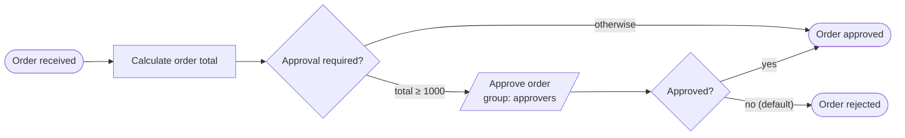

# 01 — Getting Started

A minimal Spring Boot application embedding the Operaton engine, demonstrating
the three building blocks of every process application: a **service task**
backed by a Java delegate, a **user task** with a candidate group, and an
**exclusive gateway** routing on a process variable.

## What you will learn

- Embed Operaton in Spring Boot with `operaton-bpm-spring-boot-starter-webapp`
- Implement a `JavaDelegate` as a Spring bean and wire it with
  `operaton:delegateExpression`
- Route with an exclusive gateway, condition expressions, and a default flow
- Assign user tasks to a group with `operaton:candidateGroups`
- Verify a process end-to-end with Testcontainers (real PostgreSQL)

## Process model

`src/main/resources/order-approval.bpmn` — open it in the
[bpmn.io demo](https://demo.bpmn.io) or Operaton Cockpit to see the diagram.



## Prerequisites

- JDK 21
- Docker (for PostgreSQL — both for local runs and the integration tests)

## Run it

```bash
docker compose up -d --wait
./mvnw spring-boot:run      # or: ./gradlew bootRun
```

Open http://localhost:8080 — Cockpit and Tasklist, login `demo` / `demo`.

## Walk through it

1. Start an instance needing approval:
   ```bash
   curl -u demo:demo -H 'Content-Type: application/json' \
     -d '{"variables":{"quantity":{"value":3,"type":"Integer"},"unitPrice":{"value":500.0,"type":"Double"}}}' \
     http://localhost:8080/engine-rest/process-definition/key/order-approval/start
   ```
2. In Tasklist (as `demo`), find **Approve order** under *All tasks*, claim it,
   set variable `approved` = `true` (type Boolean), complete it.
3. In Cockpit, the instance history shows the path through the approval task
   to *Order approved*.
4. Repeat with `"quantity":{"value":1}` — total 500 skips approval and the
   instance completes immediately (visible only in Cockpit history).

## How it works

- [order-approval.bpmn](src/main/resources/order-approval.bpmn) is
  auto-deployed from the classpath at startup.
- [CalculateOrderTotalDelegate](src/main/java/io/github/kthoms/operaton/examples/gettingstarted/CalculateOrderTotalDelegate.java)
  is a Spring `@Component`; the service task references it by bean name via
  `operaton:delegateExpression="${calculateOrderTotalDelegate}"`.
- The first gateway's outgoing flow `total ≥ 1000` carries
  `${orderTotal >= 1000}`; the auto-approve flow is that gateway's default.
- The second gateway routes on `${approved}`; its default flow is the
  rejection path, so an order is only approved on an explicit `approved=true`.

## Run the tests

```bash
./mvnw verify        # or: ./gradlew build
```

[OrderApprovalProcessIT](src/test/java/io/github/kthoms/operaton/examples/gettingstarted/OrderApprovalProcessIT.java)
boots the application against a Testcontainers PostgreSQL and drives all three
paths end-to-end: auto-approval, manual approval, and rejection.
