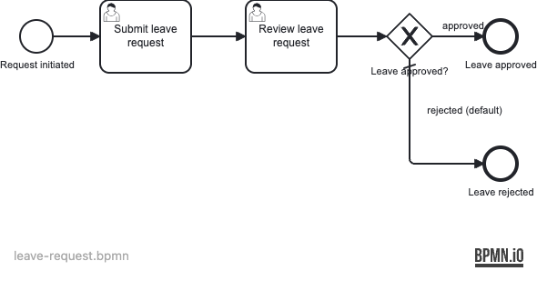

# 04 — User Task Forms

A Spring Boot application demonstrating Operaton **embedded form definitions**: user tasks
carry typed form fields (`operaton:formField`) that Tasklist renders as input controls and
the engine validates on submission.

## What you will learn

- Define form fields inline in BPMN using `<operaton:formData>` and `<operaton:formField>`
  with types `string`, `date`, `boolean`, and `enum`
- Assign user tasks to groups with `operaton:candidateGroups`
- Claim and complete tasks programmatically via `TaskService` and `FormService`
- Retrieve form metadata at runtime with `FormService.getTaskFormData()`
- Seed users and groups idempotently at startup with a Spring `ApplicationRunner`

## Process model




## Prerequisites

- JDK 21
- Docker (for PostgreSQL — both for local runs and the integration tests)

## Run it

```bash
docker compose up -d --wait
./mvnw spring-boot:run      # or: ./gradlew bootRun
```

Open http://localhost:8080 — Cockpit and Tasklist, login `demo` / `demo`.
Users `alice` (password not set — use Cockpit to set) and `bob` are seeded at startup.

## Walk through it

### Happy path — leave approved

1. Start a leave request process instance via engine-rest:
   ```bash
   curl -u demo:demo -H 'Content-Type: application/json' \
     -d '{}' \
     http://localhost:8080/engine-rest/process-definition/key/leave-request/start
   ```

2. In Tasklist (login as `demo`), find **Submit leave request** under *All tasks*.
   Claim it and fill in the form: employee name, start/end dates, leave type. Submit.

3. The task moves to **Review leave request**. Claim it, set **Approved** to `true`, add a comment. Submit.

4. In Cockpit, the process history shows the path through *Leave approved*.

### Rejected path

Repeat steps 1-2, then in step 3 set **Approved** to `false`. The process ends at
*Leave rejected*.

## How it works

- [leave-request.bpmn](src/main/resources/leave-request.bpmn) uses `<operaton:formData>` with
  `<operaton:formField>` elements to define typed form fields inline. The engine stores field
  definitions on the task and validates submitted values against the declared types.
- [DataInitializer](src/main/java/org/operaton/examples/usertaskforms/DataInitializer.java)
  implements `ApplicationRunner` to seed groups (`employees`, `managers`) and users (`alice`,
  `bob`) idempotently at startup.
- `operaton:candidateGroups="employees"` / `"managers"` makes tasks visible to the right
  people in Tasklist without hard-coding assignees.
- [IsoDateFormTypePlugin](src/main/java/org/operaton/examples/usertaskforms/IsoDateFormTypePlugin.java)
  registers an ISO 8601 (`yyyy-MM-dd`) date format handler so form field submissions use
  standard date strings rather than the engine's default `dd/MM/yyyy`.
- `FormService.getTaskFormData(taskId)` returns the form field definitions; tests use this
  to verify the form is correctly modelled. `FormService.submitTaskForm(taskId, variables)`
  completes the task with the submitted form values.

## Run the tests

```bash
./mvnw verify        # or: ./gradlew build
```

[LeaveRequestProcessIT](src/test/java/org/operaton/examples/usertaskforms/LeaveRequestProcessIT.java)
drives three paths end-to-end: approved leave, rejected leave, and form metadata verification
(asserts all four form fields are declared on the submit task).
