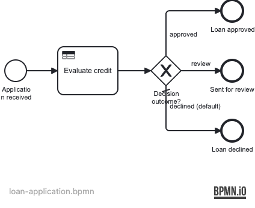

# 05 — DMN Decision

A Spring Boot application demonstrating Operaton **DMN decision evaluation** from a BPMN
process: a `businessRuleTask` references a DMN file containing a Decision Requirements Graph
(DRG) — two linked decisions that together determine whether a loan application is approved,
sent for review, or declined.

## What you will learn

- Reference a DMN decision from a BPMN `businessRuleTask` using `operaton:decisionRef`
- Store the decision result in a process variable with `operaton:resultVariable` and
  `operaton:mapDecisionResult="singleEntry"`
- Model a DRG: two decisions linked via `informationRequirement`, so the engine evaluates
  them in dependency order
- Hit policy **UNIQUE** (exactly one rule matches) vs **FIRST** (first matching rule wins)
- Branch a process on a DMN output variable using an exclusive gateway

## Process model

`src/main/resources/loan-application.bpmn` + `src/main/resources/credit-decision.dmn`



DMN Decision Requirements Graph:


## Prerequisites

- JDK 21
- Docker (for PostgreSQL — both for local runs and the integration tests)

## Run it

```bash
docker compose up -d --wait
./mvnw spring-boot:run      # or: ./gradlew bootRun
```

Open http://localhost:8080 — Cockpit and Tasklist, login `demo` / `demo`.

## Walk through it

Start an application with a high credit score (approved):
```bash
curl -u demo:demo -H 'Content-Type: application/json' \
  -d '{"variables":{"creditScore":{"value":750,"type":"Integer"},"requestedAmount":{"value":15000,"type":"Integer"}}}' \
  http://localhost:8080/engine-rest/process-definition/key/loan-application/start
```

Try other combinations:
- `creditScore=450` → HIGH risk → declined
- `creditScore=620, requestedAmount=80000` → MEDIUM risk, large amount → review
- `creditScore=700, requestedAmount=25000` → LOW risk → approved

In Cockpit, open the completed instance and check the `loanDecision` variable to see the DMN output.

## How it works

- [credit-decision.dmn](src/main/resources/credit-decision.dmn) defines two decisions:
  - `risk-level` (UNIQUE hit policy) maps `creditScore` to a `riskLevel` string. UNIQUE
    means exactly one rule may match for any input — the credit score ranges are mutually
    exclusive.
  - `credit-decision` (FIRST hit policy) combines `riskLevel` and `requestedAmount` to
    produce `loanDecision`. FIRST evaluates rules top-to-bottom and stops at the first
    match — useful when earlier rules encode "higher priority" conditions.
  - An `informationRequirement` links the two: the engine evaluates `risk-level` first
    and passes its output as input to `credit-decision`. This is the DRG.
- [loan-application.bpmn](src/main/resources/loan-application.bpmn) uses a `businessRuleTask`
  with `operaton:decisionRef="credit-decision"`. The engine resolves the full DRG automatically.
  `mapDecisionResult="singleEntry"` maps the single-column output directly to the
  `loanDecision` process variable (a plain String).
- An exclusive gateway reads `${loanDecision == 'approved'}` / `${loanDecision == 'review'}`
  and routes accordingly; the default flow handles `declined`.

## Run the tests

```bash
./mvnw verify        # or: ./gradlew build
```

[LoanApplicationProcessIT](src/test/java/org/operaton/examples/dmndecision/LoanApplicationProcessIT.java)
drives 4 input combinations covering all three decision outcomes, asserting both the end event
ID and the `loanDecision` variable value.
