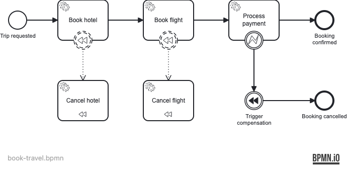

# Example 08 — Error Compensation (Saga)

This example demonstrates BPMN compensation — a saga pattern where a failed step triggers the automatic rollback of previously completed steps via dedicated compensation handlers.

## What you will learn

- How to attach compensation boundary events to service tasks
- How to associate compensation handlers (tasks with `isForCompensation="true"`)
- How an intermediate compensation throw event triggers all registered handlers
- How a BPMN error boundary event catches application-level errors and routes to compensation
- How the saga pattern maps to standard BPMN constructs without custom code

## Process model

The `book-travel` process books a hotel and a flight, then processes payment. If payment fails, a BPMN error boundary event catches the error and triggers compensation, which cancels both the hotel and the flight in reverse order.



All BPMN elements:

| BPMN element | ID |
|---|---|
| Start event | `StartEvent_1` |
| Service task | `Task_BookHotel` |
| Compensation boundary event | `Boundary_CompensateHotel` |
| Compensation handler | `Task_CancelHotel` |
| Service task | `Task_BookFlight` |
| Compensation boundary event | `Boundary_CompensateFlight` |
| Compensation handler | `Task_CancelFlight` |
| Service task | `Task_ProcessPayment` |
| Error boundary event | `Boundary_PaymentError` |
| Intermediate compensation throw | `Event_TriggerCompensation` |
| End event (happy path) | `EndEvent_Confirmed` |
| End event (compensated) | `EndEvent_Cancelled` |

## Prerequisites

- JDK 21
- Docker (tested with Docker Desktop 4.x and Rancher Desktop)

## Run it

Start the database:

```bash
docker compose up -d
```

Run with Maven:

```bash
./mvnw spring-boot:run
```

Run with Gradle:

```bash
./gradlew bootRun
```

Open Operaton Cockpit / Tasklist at http://localhost:8080 and log in with `demo` / `demo`.

## Walk through it

### Happy path — successful booking

```bash
curl -s -X POST http://localhost:8080/engine-rest/process-definition/key/book-travel/start \
  -H "Content-Type: application/json" \
  -d '{"variables": {"tripId": {"value": "TRIP-001", "type": "String"}, "paymentShouldFail": {"value": false, "type": "Boolean"}}}' \
  | jq .id
```

The process completes at `EndEvent_Confirmed`. In Cockpit, navigate to the completed instance and verify variables `hotelBooked`, `flightBooked`, and `paymentConfirmed` are all `true`.

### Alternative path — payment failure triggers saga

```bash
curl -s -X POST http://localhost:8080/engine-rest/process-definition/key/book-travel/start \
  -H "Content-Type: application/json" \
  -d '{"variables": {"tripId": {"value": "TRIP-002", "type": "String"}, "paymentShouldFail": {"value": true, "type": "Boolean"}}}' \
  | jq .id
```

The process completes at `EndEvent_Cancelled`. Verify that `hotelCancelled` and `flightCancelled` are both `true`, confirming the compensation handlers executed.

## How it works

**Compensation boundary events** (`Boundary_CompensateHotel`, `Boundary_CompensateFlight`) are attached to `Task_BookHotel` and `Task_BookFlight` respectively. They are non-interrupting and do not have sequence flows — instead they are connected by BPMN associations to their compensation handler tasks (`Task_CancelHotel`, `Task_CancelFlight`).

**Compensation handlers** (`Task_CancelHotel`, `Task_CancelFlight`) carry `isForCompensation="true"`. The engine registers them when the corresponding service task completes but never executes them on the normal flow. They are only invoked when compensation is triggered.

**Error boundary event** (`Boundary_PaymentError`) catches the `PAYMENT_FAILED` BPMN error thrown by `ProcessPaymentDelegate` via `throw new BpmnError("PAYMENT_FAILED", ...)`. It routes the token to the compensation throw event.

**Intermediate compensation throw event** (`Event_TriggerCompensation`) tells the engine to invoke all registered compensation handlers for the current scope. The engine calls `CancelFlightDelegate` and `CancelHotelDelegate` in reverse order of completion (LIFO), mirroring a database transaction rollback.

Key source files:

- [`src/main/resources/book-travel.bpmn`](src/main/resources/book-travel.bpmn) — process model
- [`src/main/java/org/operaton/examples/errorcompensation/delegate/ProcessPaymentDelegate.java`](src/main/java/org/operaton/examples/errorcompensation/delegate/ProcessPaymentDelegate.java) — throws `BpmnError`
- [`src/main/java/org/operaton/examples/errorcompensation/delegate/CancelHotelDelegate.java`](src/main/java/org/operaton/examples/errorcompensation/delegate/CancelHotelDelegate.java) — compensation handler
- [`src/main/java/org/operaton/examples/errorcompensation/delegate/CancelFlightDelegate.java`](src/main/java/org/operaton/examples/errorcompensation/delegate/CancelFlightDelegate.java) — compensation handler

## Extending the example

- Add a car rental step between hotel and flight booking, with its own compensation handler.
- Replace the boolean `paymentShouldFail` flag with a call to a real payment gateway started via Testcontainers (e.g., WireMock).
- Use a compensation end event inside a sub-process instead of an intermediate throw event.
- Add a notification task after compensation that sends a cancellation email.

## Further reading

- [Operaton BPMN Compensation Events](https://docs.operaton.org/manual/latest/reference/bpmn20/events/compensation-events/)
- [BPMN 2.0 Compensation (OMG spec §10.3.5)](https://www.omg.org/spec/BPMN/2.0/)
- Saga pattern: Chris Richardson, *Microservices Patterns*, Chapter 4
