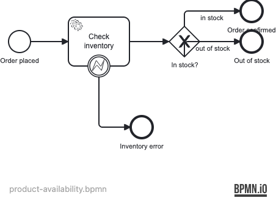

# Example 10 — REST Integration

This example demonstrates how a JavaDelegate calls an external REST API and handles HTTP error responses using BPMN error boundary events and runtime exceptions.

## What you will learn

- How to inject `RestTemplate` into a `JavaDelegate` and call an external HTTP service
- How to map HTTP 4xx responses to `BpmnError` for process-level error handling
- How to let HTTP 5xx responses propagate as `RuntimeException` so the job executor retries
- How to use WireMock via Testcontainers to stub HTTP responses in integration tests
- How to model a boundary error event and branching gateway in BPMN

## Process model




## Prerequisites

- JDK 21
- Docker (tested with Docker Desktop 4.x and Rancher Desktop 1.x)

## Run it

Start the infrastructure:

```bash
docker compose up -d
```

Run the application:

```bash
./mvnw spring-boot:run
# or
./gradlew bootRun
```

Access the Operaton web apps at **http://localhost:8080** with credentials **demo / demo**.

The WireMock stub server is available at **http://localhost:8090** (mapped from container port 8080).

## Walk through it

**Happy path — in stock:**

```bash
curl -s -X POST http://localhost:8080/engine-rest/process-definition/key/product-availability/start \
  -H "Content-Type: application/json" \
  -d '{"variables": {"productId": {"value": "PROD-001", "type": "String"}, "quantity": {"value": 2, "type": "Integer"}}}'
```

The process completes at `EndEvent_Confirmed` with `inventoryAvailable = true`.

**Out of stock:**

```bash
curl -s -X POST http://localhost:8080/engine-rest/process-definition/key/product-availability/start \
  -H "Content-Type: application/json" \
  -d '{"variables": {"productId": {"value": "PROD-EMPTY", "type": "String"}, "quantity": {"value": 1, "type": "Integer"}}}'
```

The process completes at `EndEvent_OutOfStock`.

**Not found (BPMN error path):**

```bash
curl -s -X POST http://localhost:8080/engine-rest/process-definition/key/product-availability/start \
  -H "Content-Type: application/json" \
  -d '{"variables": {"productId": {"value": "PROD-UNKNOWN", "type": "String"}, "quantity": {"value": 1, "type": "Integer"}}}'
```

WireMock returns 404; `CheckInventoryDelegate` catches `HttpClientErrorException` and throws `BpmnError("INVENTORY_ERROR")`. The boundary error event catches it and routes to `EndEvent_Error`.

## How it works

- **`CheckInventoryDelegate`** (`src/main/java/.../delegate/CheckInventoryDelegate.java`) — calls `GET /inventory/{productId}` using `RestTemplate`. A 200 response sets `inventoryAvailable`; a 4xx throws `BpmnError`; a 5xx throws `RuntimeException`.
- **`InventoryConfig`** (`src/main/java/.../InventoryConfig.java`) — declares the `RestTemplate` bean and reads `inventory.service.url` from `application.yaml`.
- **`product-availability.bpmn`** (`src/main/resources/product-availability.bpmn`) — models the service task with a boundary error event for `INVENTORY_ERROR` and an exclusive gateway on `inventoryAvailable`.
- **WireMock mappings** (`src/test/resources/wiremock/mappings/inventory-available.json`) — stub responses for PROD-001 (200 available), PROD-EMPTY (200 unavailable), and PROD-UNKNOWN (404).

## Run the tests

```bash
./mvnw verify
# or
./gradlew build
```

`ProductAvailabilityProcessIT` starts a PostgreSQL container and a WireMock container via Testcontainers. It proves that:
- An in-stock product reaches `EndEvent_Confirmed` with `inventoryAvailable = true`
- An out-of-stock product reaches `EndEvent_OutOfStock` with `inventoryAvailable = false`
- A 404 response triggers the BPMN error boundary and routes to `EndEvent_Error`
