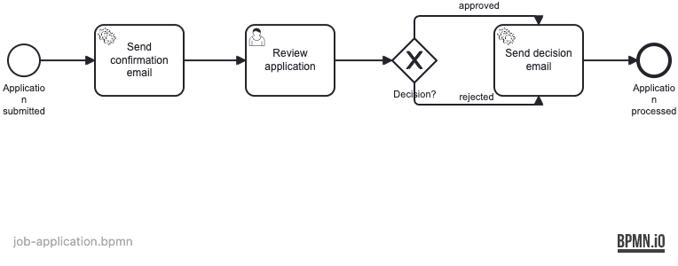

# Example 11 — Mail Integration

This example demonstrates how to send emails from JavaDelegates using Spring Mail, and how to verify email delivery in integration tests using Mailpit as an SMTP server via Testcontainers.

## What you will learn

- How to inject `JavaMailSender` into a `JavaDelegate` and compose `SimpleMailMessage` objects
- How to configure `spring-boot-starter-mail` in `application.yaml`
- How to run Mailpit as a Testcontainers `GenericContainer` for SMTP and API access
- How to verify sent emails by querying the Mailpit REST API from integration tests
- How to model a job-application process with confirmation and decision emails

## Process model




## Prerequisites

- JDK 21
- Docker (tested with Docker Desktop 4.x and Rancher Desktop 1.x)

## Run it

Start the infrastructure:

```bash
docker compose up -d
```

Run the application:

```bash
./mvnw spring-boot:run
# or
./gradlew bootRun
```

Access the Operaton web apps at **http://localhost:8080** with credentials **demo / demo**.

The Mailpit web UI is available at **http://localhost:8025** — view all sent emails here.

## Walk through it

**Submit an application:**

```bash
curl -s -X POST http://localhost:8080/engine-rest/process-definition/key/job-application/start \
  -H "Content-Type: application/json" \
  -d '{
    "variables": {
      "applicantName": {"value": "Jane Doe", "type": "String"},
      "applicantEmail": {"value": "jane@example.com", "type": "String"}
    }
  }'
```

Open http://localhost:8025 — you should see a confirmation email for Jane Doe.

**Approve the application via Tasklist:**

1. Open http://localhost:8080/operaton/app/tasklist (demo/demo)
2. Claim the "Review application" task
3. Complete it with variable `approved = true`

A second email (approval) will appear in Mailpit.

**Reject path:**

Complete the review task with `approved = false` to trigger the rejection email ("Application Update").

## How it works

- **`SendConfirmationEmailDelegate`** (`src/main/java/.../delegate/SendConfirmationEmailDelegate.java`) — sends a receipt acknowledgement to the applicant as soon as the process starts.
- **`SendDecisionEmailDelegate`** (`src/main/java/.../delegate/SendDecisionEmailDelegate.java`) — sends either an approval or rejection email based on the `approved` process variable.
- **`job-application.bpmn`** (`src/main/resources/job-application.bpmn`) — models the full workflow: confirmation service task → user task (HR review) → exclusive gateway → decision service task.
- **Mailpit** is a lightweight SMTP server with a REST API for inspecting received messages. It accepts any email without relay configuration, making it ideal for local development and testing.

## Run the tests

```bash
./mvnw verify
# or
./gradlew build
```

`JobApplicationProcessIT` starts a PostgreSQL container and a Mailpit container via Testcontainers. It proves that:
- Submitting an application sends a confirmation email to the applicant
- Completing the review task with `approved = true` sends an approval email
- Completing the review task with `approved = false` sends a rejection email
