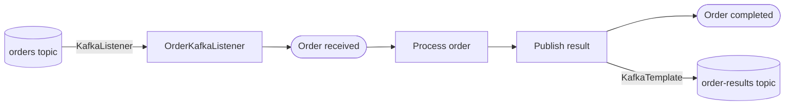

# Example 12 — Kafka Integration

This example demonstrates how to trigger an Operaton process from a Kafka message and publish results back to Kafka from a JavaDelegate, using Testcontainers Kafka for integration testing.

## What you will learn

- How to use `@KafkaListener` to start a process instance when a message arrives on a topic
- How to publish a Kafka message from a `JavaDelegate` using `KafkaTemplate`
- How to configure `spring-kafka` consumer and producer in `application.yaml`
- How to run Kafka via Testcontainers and override `spring.kafka.bootstrap-servers` in tests
- How to use Awaitility to assert async process completion without `Thread.sleep`

## Process model



## Prerequisites

- JDK 21
- Docker (tested with Docker Desktop 4.x and Rancher Desktop 1.x)

## Run it

Start the infrastructure:

```bash
docker compose up -d
```

Run the application:

```bash
./mvnw spring-boot:run
# or
./gradlew bootRun
```

Access the Operaton web apps at **http://localhost:8080** with credentials **demo / demo**.

Kafka is available at **localhost:9092**. Topics used:
- `orders` — inbound: send an order ID here to trigger a process instance
- `order-results` — outbound: processed results are published here

## Walk through it

**Trigger a process via Kafka:**

Use any Kafka CLI tool or producer. With `kafka-console-producer` from the Confluent image:

```bash
docker exec -it integration-kafka-kafka \
  kafka-console-producer --broker-list localhost:9092 --topic orders
> ORDER-001
```

The `OrderKafkaListener` picks up the message and starts a `order-processing` process instance with business key `ORDER-001`.

**Verify in Cockpit:**

Open http://localhost:8080/operaton/app/cockpit — the completed process instance appears in the history with `orderId = ORDER-001` and `orderResult = PROCESSED:ORDER-001`.

**Check the result topic:**

```bash
docker exec -it integration-kafka-kafka \
  kafka-console-consumer --bootstrap-server localhost:9092 \
  --topic order-results --from-beginning
```

You should see `PROCESSED:ORDER-001` published by `PublishOrderResultDelegate`.

## How it works

- **`OrderKafkaListener`** (`src/main/java/.../OrderKafkaListener.java`) — annotated with `@KafkaListener` on the `orders` topic. Each message value is used as the business key and as the `orderId` variable when starting the process.
- **`PublishOrderResultDelegate`** (`src/main/java/.../delegate/PublishOrderResultDelegate.java`) — injects `KafkaTemplate` and publishes `PROCESSED:<orderId>` to the `order-results` topic, then sets `orderResult` on the execution.
- **`order-processing.bpmn`** (`src/main/resources/order-processing.bpmn`) — a linear process: start event → set status via expression → publish result via delegate → end event.
- **Testcontainers `KafkaContainer`** (`confluentinc/cp-kafka:7.4.0`) starts a real Kafka broker; `KafkaInitializer` overrides `spring.kafka.bootstrap-servers` before the application context is created.

## Run the tests

```bash
./mvnw verify
# or
./gradlew build
```

`OrderProcessingIT` starts a PostgreSQL container and a Kafka container via Testcontainers. It proves that:
- A message published to the `orders` topic causes the process to start and complete
- The completed process instance carries the correct `orderId` variable
- Multiple independent orders are each processed exactly once
