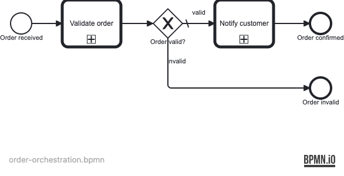
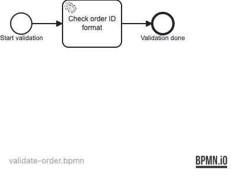
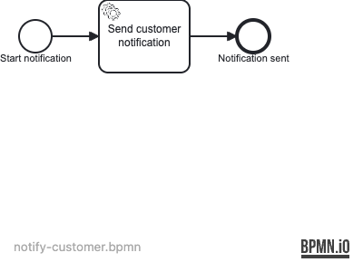

# Example 13 — Call Activity

This example demonstrates **process composition via `callActivity`**: a parent process delegates work to reusable child process definitions, passing variables in and out through `operaton:in` / `operaton:out` mappings.

## What you will learn

- How to model a `callActivity` element that invokes a named child process definition by key.
- How to pass variables into a called process using `operaton:in` mappings and receive results back via `operaton:out` mappings.
- How to branch the parent process on a variable returned from a child process.
- How to verify child process invocation through the history API (`superProcessInstanceId`).
- How to decompose a business flow into independently deployable, reusable process definitions.

## Process model



The parent process orchestrates two child processes. The gateway branches on the `orderValid` variable mapped out of the first child.


**validate-order child process:**



**notify-customer child process:**



Variable mappings:

| Direction | Variable in parent | Variable in child | Call activity |
|---|---|---|---|
| in | `orderId` | `orderId` | `CallActivity_Validate` |
| out | `orderValid` | `isValid` | `CallActivity_Validate` |
| in | `customerEmail` | `customerEmail` | `CallActivity_Notify` |
| in | `orderId` | `orderId` | `CallActivity_Notify` |
| out | `customerNotified` | `notified` | `CallActivity_Notify` |

## Prerequisites

- JDK 21
- Docker (tested with Rancher Desktop 1.x / Docker Engine 24+)

## Run it

Start PostgreSQL:

```bash
docker compose up -d
```

Run with Maven:

```bash
./mvnw spring-boot:run
```

Or with Gradle:

```bash
./gradlew bootRun
```

Open Cockpit at **http://localhost:8080** and log in with **demo / demo**.

## Walk through it

**Happy path — valid order:**

```bash
curl -s -u demo:demo \
  -H "Content-Type: application/json" \
  -d '{"variables":{"orderId":{"value":"ORD-001","type":"String"},"customerEmail":{"value":"alice@example.com","type":"String"}}}' \
  http://localhost:8080/engine-rest/process-definition/key/order-orchestration/start | jq .id
```

In Cockpit, navigate to **Processes → order-orchestration**. The completed instance ends at **Order confirmed**. Drill into the history to see two child process instances: `validate-order` and `notify-customer`.

**Alternative path — invalid order:**

```bash
curl -s -u demo:demo \
  -H "Content-Type: application/json" \
  -d '{"variables":{"orderId":{"value":"INVALID-001","type":"String"},"customerEmail":{"value":"bob@example.com","type":"String"}}}' \
  http://localhost:8080/engine-rest/process-definition/key/order-orchestration/start | jq .id
```

The instance ends at **Order invalid**. Only one child (`validate-order`) appears in the history; `notify-customer` was never called.

## How it works

- `order-orchestration.bpmn` — parent process with two `callActivity` elements. Each carries `operaton:in` / `operaton:out` extension elements that copy variables between the parent scope and the child scope. The exclusive gateway checks `${orderValid == false}` to take the invalid path.
- `validate-order.bpmn` — child process with a single service task backed by `ValidateOrderDelegate` (`src/main/java/…/ValidateOrderDelegate.java`). The delegate sets `isValid = true` when `orderId` starts with `"ORD-"`.
- `notify-customer.bpmn` — child process with a single service task backed by `NotifyCustomerDelegate` (`src/main/java/…/NotifyCustomerDelegate.java`). The delegate sets `notified = true`.
- All three BPMN files are auto-deployed by the Operaton Spring Boot starter at startup.

## Run the tests

```bash
# Maven (runs ITs via Failsafe)
DOCKER_HOST=unix://$HOME/.rd/docker.sock \
TESTCONTAINERS_DOCKER_HOST=unix://$HOME/.rd/docker.sock \
TESTCONTAINERS_RYUK_DISABLED=true \
./mvnw verify

# Gradle
DOCKER_HOST=unix://$HOME/.rd/docker.sock \
TESTCONTAINERS_DOCKER_HOST=unix://$HOME/.rd/docker.sock \
TESTCONTAINERS_RYUK_DISABLED=true \
./gradlew build
```

`OrderOrchestrationProcessIT` (three tests) proves: all three process definitions are deployed; a valid order calls both child processes and ends at `EndEvent_Confirmed`; an invalid order calls only `validate-order` and ends at `EndEvent_InvalidOrder`.
