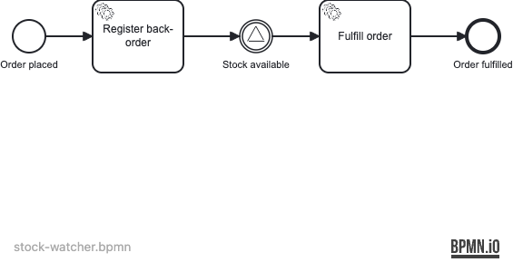
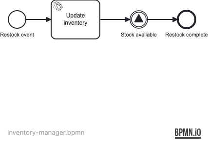

# Example 14 — Signal Events

This example demonstrates **signal events in Operaton**: a signal intermediate throw event that broadcasts to **all** matching subscribers simultaneously, showing the fundamental difference between signals (broadcast) and messages (point-to-point).

## What you will learn

- How to declare a `<bpmn:signal>` and reference it from catch and throw events
- The difference between a signal intermediate catch event (subscriber) and a signal intermediate throw event (broadcaster)
- How one throw event wakes **every** process instance waiting on that signal — broadcast semantics
- How to query active signal subscriptions with `RuntimeService.createEventSubscriptionQuery()`
- How to broadcast a signal programmatically via `RuntimeService.signalEventReceived()`

## Process model

### stock-watcher — waits for stock replenishment



### inventory-manager — broadcasts when stock arrives



### Broadcast interaction


## Prerequisites

- JDK 21
- Docker (tested with Rancher Desktop 1.x / Docker Desktop 4.x)
- Operaton 2.1.0, Spring Boot 4.0.6

## Run it

Start PostgreSQL:

```bash
docker compose up -d
```

Run with Maven:

```bash
./mvnw spring-boot:run
```

Run with Gradle:

```bash
./gradlew bootRun
```

Cockpit / Tasklist: http://localhost:8080  
Credentials: `demo` / `demo`

## Walk through it

**Happy path — broadcast via inventory-manager process:**

1. Start three stock-watcher instances via the Cockpit "Start process" button
   (process key `stock-watcher`), supplying `orderId` values `ORD-A`, `ORD-B`, `ORD-C`.
2. All three instances pause at the "Stock available" signal catch event.
   In Cockpit you can see them all waiting.
3. Start one `inventory-manager` instance (no variables required — or supply `productId`).
4. The inventory-manager completes immediately: it updates inventory, throws the
   `StockAvailable` signal, and ends.
5. All three stock-watcher instances are woken simultaneously, execute "Fulfill order",
   and complete.

**Alternative path — broadcast via API (no inventory-manager process):**

```bash
curl -X POST http://localhost:8080/engine-rest/signal \
  -H "Content-Type: application/json" \
  -d '{"name": "StockAvailable"}'
```

Any stock-watcher instances waiting at the signal catch event are woken and complete.
If no instances are waiting, the call succeeds silently — no error is thrown.

## How it works

Both BPMN files declare the same signal:

```xml
<bpmn:signal id="Signal_StockAvailable" name="StockAvailable"/>
```

`stock-watcher.bpmn` contains an `intermediateCatchEvent` referencing `Signal_StockAvailable`
(see `src/main/resources/stock-watcher.bpmn`).

`inventory-manager.bpmn` contains an `intermediateThrowEvent` referencing the same signal
(see `src/main/resources/inventory-manager.bpmn`).

When the engine executes the throw event it walks every active `EventSubscription` with
`eventType=signal` and `eventName=StockAvailable` and triggers them — all at once, in the
same transaction. This is unlike message correlation, which targets exactly one instance.

Delegates are simple Spring beans in `src/main/java/.../delegate/`:
- `RegisterBackorderDelegate` — sets `backorderRef = "BO-" + orderId`
- `FulfillOrderDelegate` — sets `fulfilled = true`
- `UpdateInventoryDelegate` — sets `inventoryUpdated = true`

## Run the tests

```bash
./mvnw verify
```

```bash
./gradlew build
```

The three integration tests prove:
1. A signal thrown by the `inventory-manager` process wakes all waiting `stock-watcher` instances simultaneously.
2. `RuntimeService.signalEventReceived()` directly broadcasts the signal via the API.
3. Broadcasting when no subscribers are present completes without error and leaves the subscription count unchanged.
