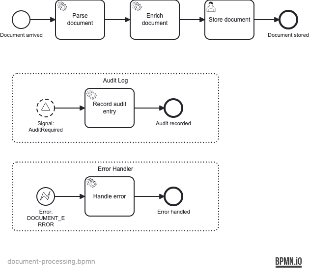

# Example 15 — Event Subprocess

Demonstrates **event subprocesses** in Operaton: subprocesses embedded inside a process that are triggered by an event (signal or error) while the main process is running.

## What you will learn

- How to model a **non-interrupting** event subprocess triggered by a signal — it runs alongside the main flow without cancelling it.
- How to model an **interrupting** event subprocess triggered by a BPMN error — it cancels the main flow and takes over.
- How to broadcast a signal from test code using `RuntimeService.signalEventReceived`.
- How to throw a BPMN error from a delegate to activate an error event subprocess.
- How event subprocesses handle cross-cutting concerns (auditing, error handling) without cluttering the main process.

## Process model

Single process: `document-processing`



**Main flow:** `StartEvent_DocumentArrived` → `Task_ParseDocument` (service) → `Task_EnrichDocument` (service) → `Task_StoreDocument` (user task, group `editors`) → `EndEvent_Stored`

**Non-interrupting event subprocess** (`EventSubProcess_Audit`, `triggeredByEvent="true"`, `isInterrupting="false"`): triggered by signal `AuditRequired`. Runs `Task_RecordAudit`, sets `auditRecorded=true`, ends at `End_AuditDone`. The main flow continues unaffected.

**Interrupting error event subprocess** (`EventSubProcess_Error`, `triggeredByEvent="true"`, `isInterrupting="true"`): triggered by BPMN error `DOCUMENT_ERROR`. Runs `Task_HandleError`, sets `errorHandled=true`, ends at `End_ErrorHandled`. The main flow is cancelled.

## Prerequisites

| Tool | Version |
|---|---|
| JDK | 21 |
| Docker | any recent version |

## Run it

```bash
# Start PostgreSQL
docker compose up -d

# Start the application (Cockpit + Tasklist at http://localhost:8080, credentials demo/demo)
./mvnw spring-boot:run
# or
./gradlew bootRun
```

**Credentials:** Cockpit/Tasklist — `demo` / `demo`

**PostgreSQL:** `localhost:5432`, database `operaton`, user `operaton`, password `operaton`

## Walk through it

### Happy path (no error, no audit signal)

1. Open Tasklist at http://localhost:8080/operaton/app/tasklist/ and log in as `demo/demo`.
2. Start a new process instance via REST:
   ```bash
   curl -s -u demo:demo -X POST http://localhost:8080/engine-rest/process-definition/key/document-processing/start \
     -H "Content-Type: application/json" \
     -d '{"variables": {"simulateError": {"value": false, "type": "Boolean"}}}'
   ```
3. In Tasklist, find the **Store document** task (group `editors`), claim and complete it.
4. In Cockpit, the instance appears in the completed instances list, ending at `Document stored`.

### Trigger the audit signal (non-interrupting)

1. Start a process instance as above (happy path).
2. While the instance waits at the **Store document** user task, broadcast the audit signal:
   ```bash
   curl -s -u demo:demo -X POST http://localhost:8080/engine-rest/signal \
     -H "Content-Type: application/json" \
     -d '{"name": "AuditRequired"}'
   ```
3. The audit event subprocess fires: `auditRecorded` is set to `true`. The user task is still there.
4. Complete the user task in Tasklist — the main flow finishes normally.

### Trigger the error path (interrupting)

1. Start a process instance with `simulateError = true`:
   ```bash
   curl -s -u demo:demo -X POST http://localhost:8080/engine-rest/process-definition/key/document-processing/start \
     -H "Content-Type: application/json" \
     -d '{"variables": {"simulateError": {"value": true, "type": "Boolean"}}}'
   ```
2. `EnrichDocumentDelegate` throws a `BpmnError("DOCUMENT_ERROR")`. The interrupting error event subprocess activates, cancels the main flow, and completes — no user task appears.
3. In Cockpit, the instance is completed with `errorHandled = true`.

## How it works

| File | Role |
|---|---|
| [`src/main/resources/document-processing.bpmn`](src/main/resources/document-processing.bpmn) | Single BPMN with main flow and two embedded event subprocesses |
| [`delegate/ParseDocumentDelegate.java`](src/main/java/org/operaton/examples/eventsubprocess/delegate/ParseDocumentDelegate.java) | Sets `parsed=true`, `documentTitle="Q1 Report"` |
| [`delegate/EnrichDocumentDelegate.java`](src/main/java/org/operaton/examples/eventsubprocess/delegate/EnrichDocumentDelegate.java) | Throws `BpmnError("DOCUMENT_ERROR")` when `simulateError==true`, else sets `enriched=true` |
| [`delegate/RecordAuditDelegate.java`](src/main/java/org/operaton/examples/eventsubprocess/delegate/RecordAuditDelegate.java) | Sets `auditRecorded=true` — invoked by the non-interrupting subprocess |
| [`delegate/HandleDocumentErrorDelegate.java`](src/main/java/org/operaton/examples/eventsubprocess/delegate/HandleDocumentErrorDelegate.java) | Sets `errorHandled=true` — invoked by the interrupting error subprocess |

The event subprocesses are declared inside `<bpmn:process>` with `triggeredByEvent="true"`. The non-interrupting subprocess uses `isInterrupting="false"` on its start event; the interrupting one uses `isInterrupting="true"` (the BPMN default for error start events).

## Run the tests

```bash
./mvnw verify
# or
./gradlew build
```

The integration test `DocumentProcessingIT` proves three scenarios against a real PostgreSQL container (via Testcontainers):

1. **Normal path** — process completes at `EndEvent_Stored` after the user task is completed.
2. **Non-interrupting audit** — after broadcasting the `AuditRequired` signal, `auditRecorded=true` is set and the user task is still active; completing it finishes the main flow normally.
3. **Interrupting error** — with `simulateError=true`, the error subprocess activates, `errorHandled=true` is set, and the process completes without any user task appearing.
