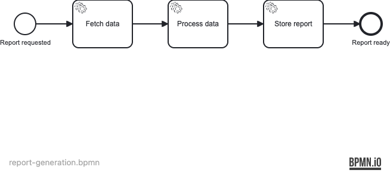

# Example 17 — Async Continuation

This example demonstrates **async continuations** in Operaton: marking service tasks with `operaton:asyncBefore` to introduce transaction boundaries, driving jobs manually in tests via `ManagementService.executeJob()`, and configuring retry behaviour with `operaton:failedJobRetryTimeCycle`.

## What you will learn

- How `operaton:asyncBefore` creates a job in the database before a service task executes, decoupling the caller transaction from the task execution
- How the job executor picks up those jobs and runs them asynchronously in a background thread pool
- How to disable the background job executor in tests (`operaton.bpm.job-execution.enabled=false`) to drive jobs manually and avoid races
- How `operaton:failedJobRetryTimeCycle` (e.g. `R3/PT0S`) configures the number of retries and wait time between attempts for transient failures
- How `ManagementService.executeJob()` fires a specific job immediately — the essential test-control primitive for async processes

## Process model




All three service tasks carry `asyncBefore="true"`. After `startProcessInstanceByKey` returns, execution is suspended at `Task_FetchData` — the process instance is persisted but the delegate has not yet run. Each call to `executeJob()` advances the process by one task.

## Prerequisites

- JDK 21
- Docker (tested with Rancher Desktop and Docker Desktop)
- Maven Wrapper (`mvnw`) or Gradle Wrapper (`gradlew`) — no global installation needed

## Run it

Start the database:

```bash
docker compose up -d
```

Then start the application (either wrapper):

```bash
./mvnw spring-boot:run
# or
./gradlew bootRun
```

Open Operaton Cockpit / Tasklist at **http://localhost:8080** and log in with **demo / demo**.

When you start a process instance via the REST API, the three async tasks show up as jobs in the Cockpit Jobs view before the job executor processes them:

```bash
curl -s -X POST http://localhost:8080/engine-rest/process-definition/key/report-generation/start \
  -H "Content-Type: application/json" \
  -d '{"variables": {"failTwice": {"value": false, "type": "Boolean"}}}' | jq .
```

## Walk through it

### Happy path — all tasks succeed

1. Start an instance as above with `failTwice=false`.
2. In Cockpit → **Process Instances**, open the running instance.
3. Observe that the token is waiting at `Task_FetchData` (one job shown in the Jobs tab).
4. The job executor will automatically pick up and execute all three jobs in sequence, completing the process.
5. After a moment, the instance appears in **Completed** with variables `dataFetched=true`, `dataProcessed=true`, `reportStored=true`.

### Retry path — transient failure in Task_ProcessData

1. Start an instance with `failTwice=true`:

```bash
curl -s -X POST http://localhost:8080/engine-rest/process-definition/key/report-generation/start \
  -H "Content-Type: application/json" \
  -d '{"variables": {"failTwice": {"value": true, "type": "Boolean"}}}' | jq .
```

2. After `Task_FetchData` succeeds, `Task_ProcessData` fails twice before succeeding on the third attempt (retry cycle `R3/PT0S` grants 3 total retries with no delay).
3. In Cockpit during retries, observe the job's retry counter decrementing in the Jobs tab.
4. After the third attempt succeeds, the instance completes normally.

## How it works

**Async tasks create jobs** — when the engine reaches a task with `operaton:asyncBefore="true"` it immediately commits the current transaction and inserts a row into the `ACT_RU_JOB` table. The process instance is suspended at that task boundary.

**The job executor picks up jobs** — a background thread pool (`JobExecutor`) polls `ACT_RU_JOB` for due jobs and executes each one in its own transaction. This is what actually invokes the `JavaDelegate`.

**On failure, retries are decremented** — if the delegate throws, the engine catches the exception, decrements `RETRIES_` on the job row, and re-schedules it after the delay specified in `failedJobRetryTimeCycle`. When `RETRIES_` reaches 0 the job becomes an incident.

**`R3/PT0S` means** 3 remaining retries with a zero-second wait (`PT0S` = ISO 8601 duration of 0 seconds). The total attempts are `initial (1) + retries (3) = 4`, but since the BPMN attribute configures the *retry* count to 3, the engine starts with `RETRIES_=3` and the delegate may be called up to 3 times before an incident is raised.

**`ManagementService.executeJob(id)`** — fires a job synchronously in the caller's thread. In tests with `job-execution.enabled=false` this gives deterministic, race-free control over each task transition.

See the delegates in [`src/main/java/org/operaton/examples/asynccontinuation/delegate/`](src/main/java/org/operaton/examples/asynccontinuation/delegate/) and the BPMN in [`src/main/resources/report-generation.bpmn`](src/main/resources/report-generation.bpmn).

## Run the tests

```bash
./mvnw verify
# or
./gradlew build
```

The integration test class `ReportGenerationProcessIT` verifies three scenarios:

- **Happy path**: all three jobs execute in sequence; process completes with expected variables.
- **Retry path**: `Task_ProcessData` fails twice then succeeds on the third attempt; retry counter decrements correctly per `R3/PT0S`.
- **Pending state**: immediately after start, the process instance is active and has exactly one pending job but has not yet completed.
