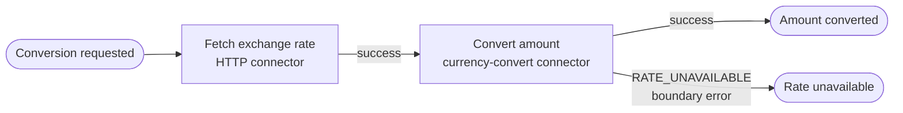
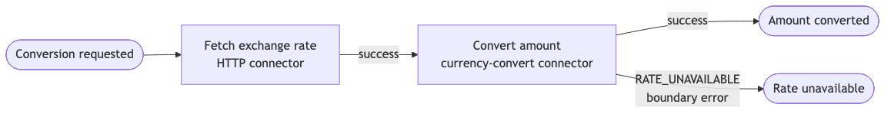

# Example 18 — Integration Connectors

Demonstrates the `operaton:connector` mechanism: calling a REST endpoint **without a Java delegate** using the built-in HTTP connector, and registering a **custom Connector SPI** implementation.

## What you will learn

- How to configure `operaton:connector` in BPMN (no Java code in the service task)
- Input/output parameter mappings for connectors
- How to implement and register a custom `Connector` via the `ConnectorProvider` SPI (`META-INF/services/org.operaton.connect.spi.ConnectorProvider`)
- How a BPMN boundary error event handles connector failures (unparseable response → `BpmnError`)

## Process model

The boundary error event is attached to `ConvertAmount`. Mermaid cannot render boundary event attachment directly; the error path is shown as a labelled edge from the task.





## Prerequisites

| Tool | Version |
|---|---|
| JDK | 21 |
| Docker | any recent |

## Run it

```bash
cd examples/18-integration-connectors
docker compose up -d
./mvnw spring-boot:run
# or: ./gradlew bootRun
```

Cockpit/Tasklist: http://localhost:8080 (demo/demo)

Start a conversion via the REST API:

```bash
curl -X POST http://localhost:8080/engine-rest/process-definition/key/currency-conversion/start \
  -H "Content-Type: application/json" \
  -d '{
    "variables": {
      "exchangeRateServiceUrl": {"value": "https://example.com/rates/USD/EUR", "type": "String"},
      "amount": {"value": 100, "type": "Double"}
    }
  }'
```

## Walk through it

1. Start the process via the REST API above, supplying a real or mocked exchange-rate URL that returns a plain-text number (e.g. `0.92`).
2. Open Cockpit → find the completed instance; inspect the `exchangeRate` and `convertedAmount` variables.
3. Start again with a URL that returns a non-numeric body (or a 404 response). The instance ends at the **Rate unavailable** end event — the boundary error event on `ConvertAmount` catches `RATE_UNAVAILABLE`.

## How it works

- `currency-conversion.bpmn`: two service tasks, each with an `operaton:connector` extension.
  - `FetchExchangeRate` uses `connectorId="http-connector"` (built-in). Input parameters: `url` from `${exchangeRateServiceUrl}` and `method=GET`. Output: raw response body mapped to the process variable `exchangeRate`.
  - `ConvertAmount` uses `connectorId="currency-convert"`. Input: `amount` and `exchangeRate`. Output: `convertedAmount`. If the exchange rate body cannot be parsed as a number, the connector throws `BpmnError("RATE_UNAVAILABLE")`, which is caught by the boundary error event attached to this task.
- `connector/CurrencyConvertConnector.java`: implements `AbstractConnector<CurrencyConvertRequest, CurrencyConvertResponse>`. Parses the rate string; throws `BpmnError` on `NumberFormatException`.
- `connector/CurrencyConvertConnectorProvider.java`: implements `ConnectorProvider`, registered via `META-INF/services/org.operaton.connect.spi.ConnectorProvider`.
- `ConnectProcessEnginePlugin` is listed under `operaton.bpm.process-engine-plugins` in `application.yaml` to activate connector support.

## Run the tests

```bash
./mvnw verify
# or: ./gradlew build
```

The integration tests start PostgreSQL and WireMock in Testcontainers. Two tests are run: a successful conversion (asserts `convertedAmount ≈ 92.0`) and an invalid-rate response (asserts the process instance ends at the `EndEvent_RateUnavailable` end event).
