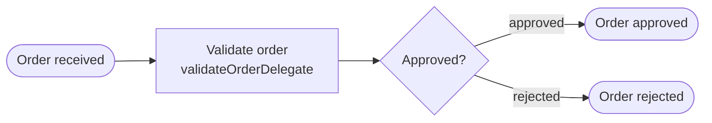
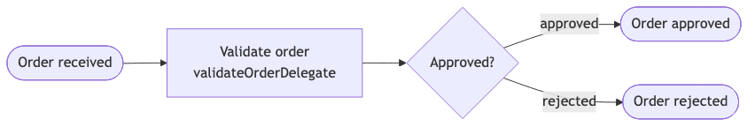

# Example 19 — Runtime: Quarkus

Demonstrates the Operaton engine embedded in a **Quarkus/CDI** application — the same embedded-engine concept as the Spring Boot examples, with a different runtime container.

## What you will learn

- How to embed Operaton in a Quarkus application using `operaton-bpm-quarkus-engine`
- How CDI beans (`@ApplicationScoped @Named`) serve as process delegates resolved by expression
- How to configure the engine with `application.properties` (`quarkus.operaton.*`)
- How to deploy BPMN resources on startup by observing `OperatonEngineStartupEvent`
- How to write `@QuarkusTest` integration tests with a Testcontainers Postgres resource

## Process model





## Prerequisites

| Tool | Version |
|---|---|
| JDK | 21 |
| Docker | any recent |

## Run it

```bash
cd examples/19-runtime-quarkus
docker compose up -d
./mvnw quarkus:dev
# or: ./gradlew quarkusDev
```

Operaton engine REST API: http://localhost:8080/engine-rest/engine

Start a process with `orderTotal=500` (approved):
```bash
curl -X POST http://localhost:8080/engine-rest/process-definition/key/order-approval/start \
  -H "Content-Type: application/json" \
  -d '{"variables": {"orderTotal": {"value": 500, "type": "Double"}}}'
```

Start a process with `orderTotal=1500` (rejected):
```bash
curl -X POST http://localhost:8080/engine-rest/process-definition/key/order-approval/start \
  -H "Content-Type: application/json" \
  -d '{"variables": {"orderTotal": {"value": 1500, "type": "Double"}}}'
```

## Walk through it

1. Start a process with `orderTotal=500` → delegate sets `approved=true` → ends at `EndEvent_Approved`.
2. Start a process with `orderTotal=1500` → delegate sets `approved=false` → gateway takes the default flow → ends at `EndEvent_Rejected`.
3. Query history: `GET http://localhost:8080/engine-rest/history/process-instance`

## How it works

- `operaton-bpm-quarkus-engine` provides a CDI-managed `ProcessEngine` bean and fires `OperatonEngineStartupEvent` after the engine is ready.
- `ProcessDeployment` (src/main/java/…/ProcessDeployment.java) observes `OperatonEngineStartupEvent` and deploys `order-approval.bpmn` via the `RepositoryService`.
- `ValidateOrderDelegate` (src/main/java/…/ValidateOrderDelegate.java) is an `@ApplicationScoped @Named("validateOrderDelegate")` CDI bean resolved by `${validateOrderDelegate}` in the BPMN service task.
- `application.properties` configures the engine via the `quarkus.operaton.*` prefix and connects to a named datasource `operaton-db`.

## Run the tests

```bash
./mvnw verify
# or: ./gradlew build
```

Tests start Testcontainers Postgres via `PostgresTestResource`, inject the `ProcessEngine`, start processes, and assert history end states. Two paths are covered: approved (total < 1000) and rejected (total ≥ 1000).
