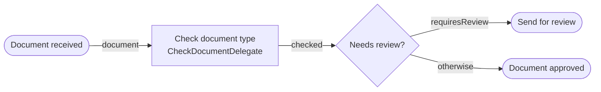
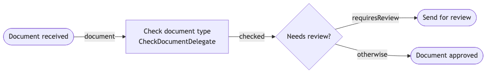

# Example 20 — Distribution: Tomcat

Demonstrates deploying an Operaton **process application WAR** to the `operaton/tomcat` Docker distribution image — the pre-packaged Tomcat server with the Operaton engine already embedded.

## What you will learn

- How to create a process application WAR (`ServletProcessApplication`) targeting a shared engine
- How `META-INF/processes.xml` controls process archive deployment
- How `operaton:class` delegates are invoked by a shared engine without Spring or CDI
- How to test a WAR deployment using Testcontainers + the REST API
- Why WAR classes must target the JDK version of the distribution image (JDK 17)

## Process model





## Prerequisites

| Tool | Version |
|---|---|
| JDK | 21 (host); WAR compiled to JDK 17 |
| Docker | any recent |
| Maven | 3.9+ |

## Run it

Build the WAR first:

```bash
cd examples/20-distribution-tomcat
./mvnw package -DskipTests
```

Then start the stack:

```bash
docker compose up
```

The Operaton REST API is available at http://localhost:8080/engine-rest, and the Operaton Cockpit at http://localhost:8080/operaton (credentials: `demo` / `demo`).

Start a process:

```bash
curl -X POST http://localhost:8080/engine-rest/process-definition/key/document-approval/start \
  -H "Content-Type: application/json" \
  -d '{"variables": {"documentType": {"value": "contract", "type": "String"}}}'
```

## Walk through it

1. Start with `documentType=invoice` — the delegate sets `requiresReview=false`, the default sequence flow fires, the process ends at `EndEvent_Approved`.
2. Start with `documentType=contract` (or `legal`) — the delegate sets `requiresReview=true`, the conditional sequence flow fires, the process ends at `EndEvent_Review`.
3. Check history: `GET http://localhost:8080/engine-rest/history/activity-instance?activityType=noneEndEvent`

## How it works

- `DocumentApprovalApplication` extends `ServletProcessApplication` and is annotated `@WebListener` — this registers it as a Servlet listener so Tomcat initialises it automatically when the WAR deploys.
- `@ProcessApplication("document-approval-app")` registers the application with the Operaton engine embedded in the distribution image.
- `META-INF/processes.xml` declares the `document-approval` process archive; the engine scans the WAR for BPMN files.
- `CheckDocumentDelegate` is a plain Java class referenced via `operaton:class` in the BPMN — no CDI container needed on the Tomcat image.
- The `operaton/tomcat` image provides the Operaton engine as a shared service; the WAR is a thin overlay containing only the delegate and the BPMN model.
- WAR classes must be compiled for JDK 17 (`--release 17`) because the `operaton/tomcat:2.1.1` distribution image runs OpenJDK 17; compiling for JDK 21 causes a `UnsupportedClassVersionError` at deploy time.

## Run the tests

The integration test deploys the WAR to a real `operaton/tomcat` container backed by a PostgreSQL container, then verifies both process paths via the REST API:

```bash
./mvnw verify
```

```bash
./gradlew build
```

Tests take approximately 30 seconds (container startup + WAR deployment). The IT asserts end events via `GET /engine-rest/history/activity-instance?activityType=noneEndEvent`.
