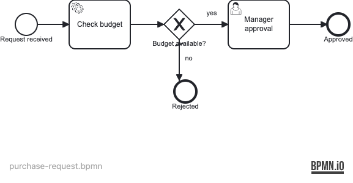

# 23 — Process Engine Plugin

Demonstrates how to extend the Operaton process engine with a custom
`AbstractProcessEnginePlugin` that registers a `BpmnParseListener`, which
injects a `TaskListener` on every user task to record completions in an audit log.

## What you will learn

- Implement an `AbstractProcessEnginePlugin` as a Spring bean, auto-detected at startup
- Register a `BpmnParseListener` via `preInit` to hook into BPMN parsing
- Use `AbstractBpmnParseListener.parseUserTask()` to attach a `TaskListener` to every user task
- Record task completions in a thread-safe audit log without modifying process or delegate code
- Verify plugin behavior end-to-end with Testcontainers (real PostgreSQL)

## Process model



## Prerequisites

- JDK 21
- Docker (for PostgreSQL — both for local runs and the integration tests)

## Run it

```bash
docker compose up -d --wait
./mvnw spring-boot:run      # or: ./gradlew bootRun
```

Open http://localhost:8080 — Cockpit and Tasklist, login `demo` / `demo`.

## Walk through it

1. Start a purchase request with a small amount (budget available):
   ```bash
   curl -u demo:demo -H 'Content-Type: application/json' \
     -d '{"variables":{"amount":{"value":1000.0,"type":"Double"}}}' \
     http://localhost:8080/engine-rest/process-definition/key/purchase-request/start
   ```
2. In Tasklist (as `demo`), find **Manager approval** under *All tasks*, claim it
   and complete it.
3. In Cockpit, the instance history shows the path through the approval task to
   *Approved*.
4. Repeat with `"amount":{"value":9000.0,"type":"Double"}` — the budget check
   sets `budgetAvailable=false`, the process routes straight to *Rejected* with
   no user task created.

## How it works

- [purchase-request.bpmn](src/main/resources/purchase-request.bpmn) defines a
  service task, an exclusive gateway, a user task, and two end events.
- [CheckBudgetDelegate](src/main/java/org/operaton/examples/engineplugin/CheckBudgetDelegate.java)
  sets `budgetAvailable=true` when `amount < 5000`.
- [EngineAuditPlugin](src/main/java/org/operaton/examples/engineplugin/EngineAuditPlugin.java)
  extends `AbstractProcessEnginePlugin` and is detected as a Spring bean by
  the Spring Boot starter. Its `preInit` method adds an `AuditBpmnParseListener`
  to the engine's custom pre-parse listeners.
- [AuditBpmnParseListener](src/main/java/org/operaton/examples/engineplugin/AuditBpmnParseListener.java)
  extends `AbstractBpmnParseListener` and overrides `parseUserTask` to attach an
  `AuditTaskListener` to every user task's `complete` event.
- [AuditTaskListener](src/main/java/org/operaton/examples/engineplugin/AuditTaskListener.java)
  calls `AuditLog.record()` when a task is completed.
- [AuditLog](src/main/java/org/operaton/examples/engineplugin/AuditLog.java)
  is a `@Component` holding a `CopyOnWriteArrayList` of `AuditEntry` records.

The plugin pattern is the primary extension point for customizing engine behavior
without modifying the engine itself — it is used in production for auditing, metrics,
custom history backends, and security checks.

## Run the tests

```bash
./mvnw verify        # or: ./gradlew build
```

[PurchaseRequestIT](src/test/java/org/operaton/examples/engineplugin/PurchaseRequestIT.java)
boots the application against a Testcontainers PostgreSQL and verifies both paths:
the happy path (amount 1000 → user task created and completed → audit log has 1 entry)
and the alternative path (amount 9000 → process ends at *Rejected* with no user task
and no audit entries).
