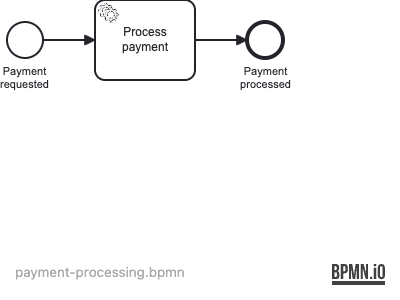

# 24 — Job Retry Profile

Demonstrates configuring custom job retry behavior using `operaton:failedJobRetryTimeCycle` on async service tasks, showing how the process engine automatically retries transient failures and how to observe and control retry counts.

## What you will learn

- Configure `operaton:failedJobRetryTimeCycle` on an async service task to set retry count and delay
- Use `operaton:asyncBefore="true"` to make a service task execute as a job
- Manually trigger job execution via `ManagementService.executeJob()` in tests
- Observe retry counter decrement on each failed execution attempt
- Verify process completion after successful retry

## Process model



## Prerequisites

- JDK 21
- Docker (for PostgreSQL — both for local runs and the integration tests)

## Run it

```bash
docker compose up -d --wait
./mvnw spring-boot:run      # or: ./gradlew bootRun
```

Open http://localhost:8080 — Cockpit and Tasklist, login `demo` / `demo`.

## Walk through it

1. Start a payment processing instance:
   ```bash
   curl -u demo:demo -H 'Content-Type: application/json' \
     -d '{}' \
     http://localhost:8080/engine-rest/process-definition/key/payment-processing/start
   ```
2. In Cockpit, navigate to **Running Instances** and open the instance. The
   process is paused at the "Process payment" service task, which is waiting as
   a job (because `asyncBefore="true"`).
3. To see retry behavior, check the **Jobs** tab in Cockpit or call the jobs
   REST endpoint:
   ```bash
   curl -u demo:demo http://localhost:8080/engine-rest/job?processInstanceId=<id>
   ```
   The job starts with `retries=3` as configured in the BPMN (`R3/PT0S`).
4. Trigger the job executor to execute the pending job (or enable it via the
   Cockpit **Administration** panel). On successful execution the process
   completes and a `paymentConfirmationCode` variable is set.

## How it works

- [payment-processing.bpmn](src/main/resources/payment-processing.bpmn) defines
  the process. The service task carries two key attributes:
  - `operaton:asyncBefore="true"` — the task executes asynchronously as a job
  - `operaton:failedJobRetryTimeCycle="R3/PT0S"` — allows 3 retries with 0-second
    delay between attempts (suitable for testing)
- [PaymentServiceDelegate](src/main/java/org/operaton/examples/jobretryprofile/PaymentServiceDelegate.java)
  is a Spring `@Component` referenced via
  `operaton:delegateExpression="${paymentServiceDelegate}"`. It uses an
  `AtomicInteger` to track invocation count and can be configured to fail for
  a given number of attempts.
- `job-executor-activate: false` in `application.yaml` disables automatic
  job execution so tests can manually control job processing via
  `ManagementService.executeJob()`.
- [DataInitializer](src/main/java/org/operaton/examples/jobretryprofile/DataInitializer.java)
  seeds a user `alice` idempotently at startup.

## Run the tests

```bash
./mvnw verify        # or: ./gradlew build
```

[PaymentProcessingIT](src/test/java/org/operaton/examples/jobretryprofile/PaymentProcessingIT.java)
starts the application against a Testcontainers PostgreSQL and verifies two
paths: successful execution on the first attempt (checking `retries=3` and that
the `paymentConfirmationCode` variable is set), and transient failure with
retry-count decrement (fails 2 times, succeeds on the 3rd, asserting the counter
decrements from 3 → 2 → 1 and the process completes).
