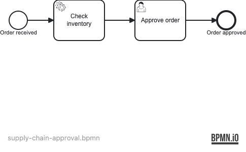

# 25 — Command Interceptor

Demonstrates `CommandInterceptor` for auditing engine API calls — every operation
sent to the process engine (start process, complete task, deploy, …) is wrapped
by a custom interceptor that records its name and duration in a thread-safe audit log.

## What you will learn

- Implement a `CommandInterceptor` that wraps every engine command
- Register the interceptor via an `AbstractProcessEnginePlugin` using
  `getCustomPreCommandInterceptorsTxRequired()`
- The plugin is detected automatically as a Spring bean by the Spring Boot starter
- Measure and record command name and duration in a `CopyOnWriteArrayList`-backed audit log
- Verify interceptor behavior end-to-end with Testcontainers (real PostgreSQL)

## Process model



## Prerequisites

- JDK 21
- Docker (for PostgreSQL — both for local runs and the integration tests)

## Run it

```bash
docker compose up -d --wait
./mvnw spring-boot:run      # or: ./gradlew bootRun
```

Open http://localhost:8080 — Cockpit and Tasklist, login `demo` / `demo`.

## Walk through it

1. Start a supply-chain approval:
   ```bash
   curl -u demo:demo -H 'Content-Type: application/json' \
     -d '{}' \
     http://localhost:8080/engine-rest/process-definition/key/supply-chain-approval/start
   ```
2. In Tasklist (as `alice`, password `alice`), find **Approve order** under *All tasks*,
   claim it, and complete it.
3. In Cockpit, the instance history shows the process completed at *Order approved*.
4. Every engine call during this walkthrough was silently recorded by `CommandAuditInterceptor`.

## How it works

- [supply-chain-approval.bpmn](src/main/resources/supply-chain-approval.bpmn) defines a
  service task (check inventory), a user task (approve order), and an end event.
- [ReviewTaskDelegate](src/main/java/org/operaton/examples/commandinterceptor/ReviewTaskDelegate.java)
  sets `inventoryAvailable=true`, simulating an inventory check.
- [CommandAuditPlugin](src/main/java/org/operaton/examples/commandinterceptor/CommandAuditPlugin.java)
  extends `AbstractProcessEnginePlugin` and is detected as a Spring bean. Its `preInit`
  method adds a `CommandAuditInterceptor` to the engine's custom pre-command interceptors.
- [CommandAuditInterceptor](src/main/java/org/operaton/examples/commandinterceptor/CommandAuditInterceptor.java)
  extends `CommandInterceptor` and wraps every `Command` execution: it records the
  command class name and elapsed time, then delegates to `next.execute(command)`.
- [CommandAuditLog](src/main/java/org/operaton/examples/commandinterceptor/CommandAuditLog.java)
  is a `@Component` holding a `CopyOnWriteArrayList` of `AuditEntry` records (command
  name + duration in ms).
- [DataInitializer](src/main/java/org/operaton/examples/commandinterceptor/DataInitializer.java)
  seeds user `alice` in group `procurement` so the user task can be claimed in Tasklist.

The command interceptor chain is the lowest-level extension point in the Operaton engine —
it fires on every API call, including internal ones triggered by the job executor.

## Run the tests

```bash
./mvnw verify        # or: ./gradlew build
```

[SupplyChainApprovalIT](src/test/java/org/operaton/examples/commandinterceptor/SupplyChainApprovalIT.java)
boots the application against a Testcontainers PostgreSQL and verifies that:
- at least one command is recorded when starting a process instance,
- the start command appears in the audit log,
- all recorded durations are non-negative,
- completing a user task produces additional audit entries,
- the process reaches the completed state,
- and every audit entry has a non-empty command name.
