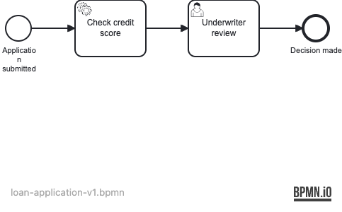
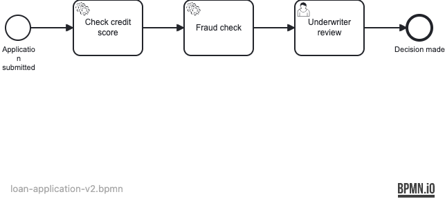

# 26 — Process Migration

Demonstrates how to migrate running process instances from one process definition version to
another using the Operaton `MigrationPlan` API, without losing in-flight state.

## What you will learn

- Deploy multiple versions of the same process definition
- Create a `MigrationPlan` with `mapEqualActivities()` to auto-map shared activity IDs
- Execute the migration for live process instances via `RuntimeService.newMigration()`
- Assert that a migrated instance retains its position and variables on the new definition
- Verify that new instances on v2 execute the additional step

## Process model

### Version 1



### Version 2



Version 2 adds a **Fraud check** service task between credit scoring and the underwriter review.
Running v1 instances at the `Task_UnderwriterReview` wait state can be migrated to v2 because
that activity ID is identical in both versions.

## Prerequisites

- JDK 21
- Docker (for PostgreSQL — both for local runs and the integration tests)

## Run it

```bash
docker compose up -d --wait
./mvnw spring-boot:run      # or: ./gradlew bootRun
```

Open http://localhost:8080 — Cockpit and Tasklist, login `demo` / `demo`.

## Walk through it

1. Deploy v1 and start an instance via the REST API:
   ```bash
   curl -u demo:demo -H 'Content-Type: application/json' \
     http://localhost:8080/engine-rest/deployment/create \
     -F deployment-name=v1 \
     -F loan-application-v1.bpmn=@src/main/resources/loan-application-v1.bpmn

   # Note the processDefinitionId from the response, then:
   curl -u demo:demo -H 'Content-Type: application/json' \
     -d '{}' \
     "http://localhost:8080/engine-rest/process-definition/key/loan-application/start"
   ```
2. In Cockpit, the instance waits at **Underwriter review**.
3. Deploy v2:
   ```bash
   curl -u demo:demo \
     http://localhost:8080/engine-rest/deployment/create \
     -F deployment-name=v2 \
     -F loan-application-v2.bpmn=@src/main/resources/loan-application-v2.bpmn
   ```
4. Create and execute a migration plan via the REST API or inspect the test for
   the Java API approach. After migration, the Cockpit instance shows it is now
   running on v2, still at **Underwriter review**.
5. In Tasklist (as `alice` with password `alice`), claim and complete the task.
   The instance ends on v2.

## How it works

- [loan-application-v1.bpmn](src/main/resources/loan-application-v1.bpmn) — three activities:
  credit check service task, underwriter review user task, end event.
- [loan-application-v2.bpmn](src/main/resources/loan-application-v2.bpmn) — adds a
  `Task_FraudCheck` service task between credit scoring and the underwriter review.
  `Task_UnderwriterReview` and `EndEvent_Decision` keep the same IDs as v1 to enable
  automatic mapping via `mapEqualActivities()`.
- [CheckCreditDelegate](src/main/java/org/operaton/examples/processmigration/CheckCreditDelegate.java)
  sets `creditScore` and `creditApproved` process variables.
- [FraudCheckDelegate](src/main/java/org/operaton/examples/processmigration/FraudCheckDelegate.java)
  sets `fraudRisk = "low"` — only executed for new v2 instances or instances migrated before that step.
- [DataInitializer](src/main/java/org/operaton/examples/processmigration/DataInitializer.java)
  seeds the `underwriters` group and user `alice` on startup (idempotent).
- `operaton.bpm.auto-deployment-enabled: false` prevents the engine from auto-deploying
  both BPMN files at startup. The test deploys them explicitly and in the correct order.

## Run the tests

```bash
./mvnw verify        # or: ./gradlew build
```

[LoanApplicationMigrationIT](src/test/java/org/operaton/examples/processmigration/LoanApplicationMigrationIT.java)
covers two scenarios:

1. **migrateInstanceFromV1ToV2** — starts a v1 instance at the underwriter task, deploys v2,
   migrates the live instance, asserts it is now on v2 at the same task, then completes it.
2. **newInstanceOnV2HasFraudCheck** — starts a fresh v2 instance and asserts `fraudRisk = "low"`
   was set by the fraud-check delegate before the instance reached the user task.
