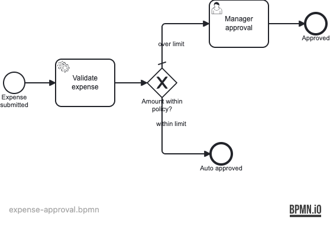

# Example 32 — Unit Testing with JUnit 5

This example shows how to write **fast, isolated unit tests** for Operaton
process logic using `ProcessEngineExtension` with an in-memory H2 engine, and
how to complement them with full **integration tests** using
Testcontainers/PostgreSQL to verify the production database stack.

## What you will learn

- How to use `ProcessEngineExtension` and `@Deployment` to test processes
  without Spring Boot or Docker
- How `operaton:class` allows service-task delegates to be instantiated via
  reflection in unit tests (no application context needed)
- How to assert process end state using `HistoryService` in both unit and
  integration tests
- How to structure a project with both unit tests (`*Test`) and integration
  tests (`*IT`) that each serve a different purpose
- Why you need both: unit tests give fast feedback on process logic; ITs prove
  the process runs correctly on the real PostgreSQL stack

## Process model



The expense-approval process validates the submitted amount, then either
auto-approves it (≤ 500) or routes it to a manager user task (> 500).

## Prerequisites

- JDK 21
- Docker (for the integration test and local run)
- npm package `bpmn-to-image` (optional, to re-render the diagram)

## Run it

Start the database:

```bash
docker compose up -d
```

Run the application:

```bash
./mvnw spring-boot:run
# or
./gradlew bootRun
```

Open Cockpit / Tasklist at <http://localhost:8080> with credentials `demo` /
`demo`.

## Walk through it

**Happy path — small expense (auto-approved):**

```bash
curl -s -u demo:demo -H "Content-Type: application/json" \
  -d '{"variables":{"amount":{"value":100.0,"type":"Double"}}}' \
  http://localhost:8080/engine-rest/process-definition/key/expense-approval/start | jq .id
```

The process ends immediately; no task appears in Tasklist.

**Alternative path — large expense (needs manager approval):**

```bash
curl -s -u demo:demo -H "Content-Type: application/json" \
  -d '{"variables":{"amount":{"value":1500.0,"type":"Double"}}}' \
  http://localhost:8080/engine-rest/process-definition/key/expense-approval/start | jq .id
```

1. Open Tasklist at <http://localhost:8080/operaton/app/tasklist/>.
2. Log in as `demo` / `demo`.
3. Claim and complete the **Manager approval** task.
4. The process ends at the **Approved** end event.

## How it works

- [`expense-approval.bpmn`](src/main/resources/expense-approval.bpmn) — the
  process model. The service task uses `operaton:class` (direct class
  reference), which allows the delegate to be instantiated via reflection in
  unit tests without a Spring context.
- [`ValidateExpenseDelegate`](src/main/java/org/operaton/examples/unittesting/ValidateExpenseDelegate.java)
  — checks that `amount` is set and positive, then sets `valid = true`.
- [`ExpenseApprovalTest`](src/test/java/org/operaton/examples/unittesting/ExpenseApprovalTest.java)
  — unit test. Uses `ProcessEngineExtension` with a standalone H2
  `ProcessEngine`. No Spring, no Docker. Runs in milliseconds.
- [`ExpenseApprovalIT`](src/test/java/org/operaton/examples/unittesting/ExpenseApprovalIT.java)
  — integration test. Uses `@SpringBootTest` + Testcontainers PostgreSQL to
  verify the same scenarios against the production database stack.

The key difference between the two test styles:

| | Unit test (`ExpenseApprovalTest`) | Integration test (`ExpenseApprovalIT`) |
|---|---|---|
| Engine | Standalone in-memory H2 | Spring-managed with PostgreSQL |
| Spring context | None | Full `@SpringBootApplication` |
| Docker | Not needed | PostgreSQL via Testcontainers |
| Typical run time | < 5 s | 30–60 s |
| What it proves | Process logic is correct | Process works on the production stack |

## Run the tests

```bash
./mvnw verify
# or
./gradlew build
```

The unit tests (`ExpenseApprovalTest`) run during the `test` phase via
`maven-surefire-plugin`. The integration tests (`ExpenseApprovalIT`) run during
the `integration-test` phase via `maven-failsafe-plugin`. Both phases are
included in `./mvnw verify`.
