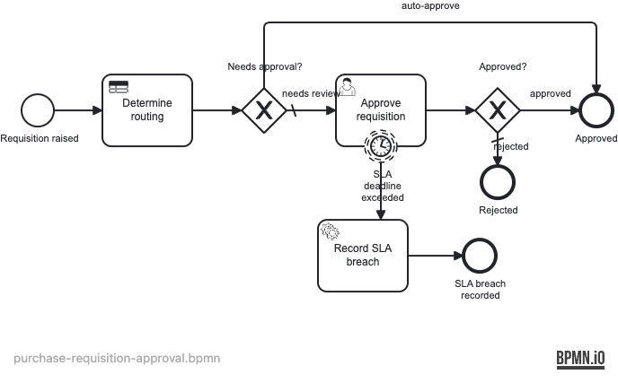

# Approval SLA Metrics

Demonstrates **observing a BPMN process in real time**: a purchase-requisition
approval workflow whose SLA performance is measured with Micrometer, scraped by
Prometheus, and visualised in Grafana. A self-driving load generator keeps the
dashboard live so you can watch SLA breaches and throughput move.

## What this project demonstrates

- Instrumenting an Operaton process with Micrometer counters, a timer histogram
  and a gauge — all emitted from **BPMN execution/task listeners**.
- Exposing engine + custom metrics on Spring Boot Actuator's `/actuator/prometheus`.
- A complete local observability stack (Prometheus + Grafana) wired up with zero
  manual steps — Grafana datasource and dashboard are file-provisioned.
- A **non-interrupting boundary timer** modelling an SLA deadline that records a
  breach without cancelling the in-flight approval.
- A DMN table routing requisitions to an approval tier + SLA by amount.
- A self-driving demo (load generator + simulated reviewers) behind one config flag.

## Architecture overview

A single Spring Boot 4 application embeds the Operaton engine (Cockpit/Tasklist/
Admin included). Requisitions are routed by the `purchase-requisition-routing`
DMN table to one of three tiers. Non-auto tiers create an `approve-requisition`
user task carrying a non-interrupting SLA boundary timer. Listeners feed a
Micrometer `MeterRegistry`; the Prometheus registry publishes them on
`/actuator/prometheus`.

The application runs on the host (`./mvnw spring-boot:run`, port 8080). Docker
Compose provides the surrounding infrastructure — PostgreSQL, Prometheus (scrapes
the host app at `host.docker.internal:8080`) and Grafana (anonymous viewer access,
dashboard auto-loaded).

Actors: an employee raises requisitions (here, the load generator); `managers`
and `directors` groups approve them (here, the simulated reviewer); `demo/demo`
is the engine admin.

## Process model



1. **Requisition raised** — variables `amount`, `requesterId`.
2. **Determine routing** — DMN `purchase-requisition-routing` → `approvalTier`,
   `slaDuration`, `approverGroup`.
3. **Needs approval?** — `auto` tier (amount < 1000) approves immediately; otherwise
   an **Approve requisition** user task is created for `approverGroup`.
4. **SLA boundary timer** (non-interrupting) — fires at `slaDuration`; **Record SLA
   breach** increments the breach counter; the task stays open.
5. **Approved?** — routes to **Approved** or **Rejected** end events; each records
   the outcome counter.

The DMN uses hit policy **FIRST**: rules are ordered by ascending amount, so
`< 1000` → auto, the `< 10000` rule catches the 1000–9999 band, and the catch-all
rule handles `>= 10000`. SLA durations are compressed to seconds (`PT5S` manager,
`PT2S` director) so the demo is observable in real time; production values would
be hours.

## Prerequisites

- **JDK 21**
- **Docker** (recent, with Compose V2)
- (Optional, to re-render the diagram) `npm install -g bpmn-to-image`

Credentials (throwaway dev values): engine admin `demo/demo`; approver users
`alice/alice` (managers), `bob/bob` (directors); Grafana `admin/admin` (or
anonymous viewer).

## Run it

```bash
cd examples/approval-sla-metrics
docker compose up -d            # Postgres + Prometheus + Grafana
./mvnw spring-boot:run          # or: ./gradlew bootRun
```

- App / Cockpit / Tasklist: http://localhost:8080 (`demo/demo`)
- Metrics: http://localhost:8080/actuator/prometheus
- Prometheus: http://localhost:9090
- Grafana dashboard: http://localhost:3000/d/approval-sla

## Walk through it

1. Start the stack and the app as above. The load generator
   (`demo.load-generator.enabled=true`, the default) begins starting requisitions
   immediately and simulated reviewers complete them after random delays.
2. Open the **Grafana** dashboard. Within a minute the **throughput**, **wait
   percentiles**, **SLA breaches** and **in-progress** panels show live data.
   Director-tier breaches appear fastest (2s SLA).
3. To drive it by hand instead, set `demo.load-generator.enabled=false`, restart,
   open **Tasklist**, start *Purchase Requisition Approval* with an `amount`, and
   approve the task as `alice` or `bob`. Watch the metrics change on
   `/actuator/prometheus`.
4. Alternative path — leave a director-tier task (amount ≥ 10000) untouched for a
   couple of seconds and watch `approval_sla_breaches_total{tier="director"}`
   increment while the task stays open (non-interrupting timer).

## How it works

- **Process & decision** — `src/main/resources/purchase-requisition-approval.bpmn`
  and `purchase-requisition-routing.dmn`.
- **Metrics** — `metrics/ApprovalMetrics.java` owns every meter; the listeners
  `listener/ApprovalTaskMetricsListener.java` (wait timer + in-progress gauge),
  `delegate/SlaBreachDelegate.java` (breach counter) and
  `listener/RequisitionOutcomeListener.java` (outcome counter) feed it, wired from
  the BPMN via `operaton:delegateExpression` / listeners.
- **Demo engine** — `demo/RequisitionLoadGenerator.java` and
  `demo/SimulatedReviewer.java`, both `@ConditionalOnProperty(demo.load-generator.enabled)`.
- **Observability** — `prometheus/prometheus.yml`, `grafana/provisioning/**`,
  `grafana/dashboards/approval-sla.json`.
- **Seed identities** — `DataInitializer.java`.

## Run the tests

```bash
./mvnw verify      # Testcontainers ITs via failsafe
./gradlew build    # same ITs via the test task
```

`ApprovalSlaMetricsIT` starts PostgreSQL via Testcontainers and drives the process
end-to-end: auto-approve (no user task), manager happy path (asserts wait timer +
outcome counter), and director SLA breach (asserts the breach counter increments
while the task stays open). `ApprovalMetricsTest` unit-tests the meter logic with a
`SimpleMeterRegistry`. Prometheus and Grafana are exploration infrastructure and
are verified manually via `docker compose`.
