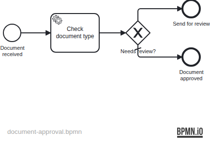

# Example 21 — Distribution: WildFly

Demonstrates deploying an Operaton **process application WAR** to the `operaton/wildfly` Docker distribution image — the pre-packaged WildFly server with the Operaton engine already embedded.

## What you will learn

- How to create a process application WAR (`JakartaServletProcessApplication`) targeting a shared engine
- How `META-INF/processes.xml` controls process archive deployment on WildFly
- How `operaton:class` delegates are invoked by a shared engine without Spring or CDI
- How to test a WAR deployment using Testcontainers + the REST API
- Why WAR classes must target the JDK version of the distribution image (JDK 17)

## Process model



## Prerequisites

| Tool | Version |
|---|---|
| JDK | 21 (host); WAR compiled to JDK 17 |
| Docker | any recent |
| Maven | 3.9+ |

## Run it

Build the WAR first:

```bash
cd examples/21-distribution-wildfly
./mvnw package -DskipTests
```

Then start the stack:

```bash
docker compose up
```

The Operaton REST API is available at http://localhost:8080/engine-rest, and the Operaton Cockpit at http://localhost:8080/operaton (credentials: `demo` / `demo`).

Start a process:

```bash
curl -X POST http://localhost:8080/engine-rest/process-definition/key/document-approval/start \
  -H "Content-Type: application/json" \
  -d '{"variables": {"documentType": {"value": "contract", "type": "String"}}}'
```

## Walk through it

1. Start with `documentType=invoice` — the delegate sets `requiresReview=false`, the default sequence flow fires, the process ends at `EndEvent_Approved`.
2. Start with `documentType=contract` (or `legal`) — the delegate sets `requiresReview=true`, the conditional sequence flow fires, the process ends at `EndEvent_Review`.
3. Check history:

```bash
curl "http://localhost:8080/engine-rest/history/activity-instance?activityType=noneEndEvent"
```

## How it works

- `DocumentApprovalApplication` extends `JakartaServletProcessApplication` and is annotated `@ProcessApplication("document-approval-app")` — the `JakartaServletProcessApplicationDeployer` Servlet Container Initializer (SCI) bundled in the engine module detects and registers it automatically when the WAR deploys; no `@WebListener` or `beans.xml` is needed.
- `META-INF/processes.xml` declares the `document-approval` process archive; the engine scans the WAR for BPMN files.
- `CheckDocumentDelegate` is a plain Java class referenced via `operaton:class` in the BPMN — no CDI container needed on the WildFly image.
- `WEB-INF/jboss-deployment-structure.xml` declares module dependencies so WildFly exposes the Operaton engine classes to the WAR classloader.
- The `operaton/wildfly` image provides the Operaton engine as a shared service; the WAR is a thin overlay containing only the delegate and the BPMN model.
- WAR classes must be compiled for JDK 17 (`--release 17`) because the `operaton/wildfly:2.1.1` distribution image runs OpenJDK 17; compiling for JDK 21 causes a `UnsupportedClassVersionError` at deploy time.

## Run the tests

The integration test deploys the WAR to a real `operaton/wildfly` container backed by a PostgreSQL container, then verifies both process paths via the REST API:

```bash
./mvnw verify
```

```bash
./gradlew build
```

Tests take approximately 60–90 seconds (container startup + WAR deployment). The IT waits until `/engine-rest/process-definition/key/document-approval` responds (not just `/engine-rest/engine`) because the WildFly deployment scanner runs every 5 seconds and the REST endpoint resolves before the WAR is fully deployed. The IT asserts end events via `GET /engine-rest/history/activity-instance?activityType=noneEndEvent`.

## Variant: Non-ProcessApplication Spring client

A plain Spring web application can connect to the WildFly-managed engine
**without** becoming a `ProcessApplication`. This is useful when the app wants
Spring DI but does not own the BPMN deployment lifecycle.

**Key files:**
- [`client/SpringWildflyConfig.java`](src/main/java/org/operaton/examples/distributionwildfly/client/SpringWildflyConfig.java) —
  `@Configuration` that exposes a `ProcessEngine` bean by looking up
  `java:global/operaton-bpm-platform/process-engine/default` from WildFly's JNDI registry.
- [`client/ProcessEngineClient.java`](src/main/java/org/operaton/examples/distributionwildfly/client/ProcessEngineClient.java) —
  `@Component` injected with the JNDI-sourced `ProcessEngine`; calls
  `repositoryService.createDeploymentQuery()`.
- [`WEB-INF/applicationContext.xml`](src/main/webapp/WEB-INF/applicationContext.xml) —
  XML alternative showing the same lookup via `<jee:jndi-lookup>`.
- [`WEB-INF/web.xml`](src/main/webapp/WEB-INF/web.xml) —
  wires `ContextLoaderListener` and declares the resource reference.

**When to use this pattern** rather than `JakartaServletProcessApplication`:

- The application is a pure Spring MVC / JAX-RS service that has no processes of its own to deploy.
- The BPMN processes are already deployed by another WAR (or the engine admin).
- You want Spring DI (`@Autowired`) to access engine services without the ProcessApplication lifecycle.
