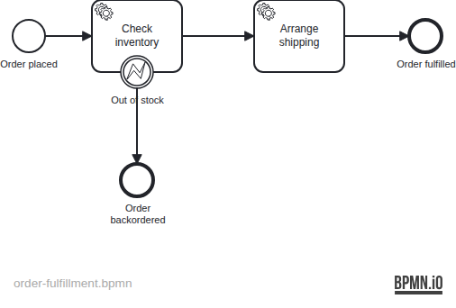

# 03 — External Task Worker

A Spring Boot application demonstrating the Operaton **external task pattern**:
a Java worker decouples from the engine by polling tasks over HTTP, locking them,
and completing (or failing) them in its own thread and transaction.

## What you will learn

- Mark service tasks as external with `operaton:type="external"` and `operaton:topic`
- Build a long-polling worker using `ExternalTaskClient` (from `operaton-external-task-client`)
- Complete a task, signal a `BpmnError` to trigger a boundary event, or report a transient
  failure with a retry count via `handleFailure`
- Disable production workers in tests and spin up an inline test worker against a random port
- Verify an externally-driven process end-to-end with Awaitility + Testcontainers

## Process model



Worker interaction:


## Prerequisites

- JDK 21
- Docker (for PostgreSQL — both for local runs and the integration tests)

## Run it

```bash
docker compose up -d --wait
./mvnw spring-boot:run      # or: ./gradlew bootRun
```

Open http://localhost:8080 — Cockpit and Tasklist, login `demo` / `demo`.

The embedded worker starts automatically and polls `http://localhost:8080/engine-rest`.

## Walk through it

### Happy path — order fulfilled

1. Start an instance:
   ```bash
   curl -u demo:demo -H 'Content-Type: application/json' \
     -d '{"variables":{"orderId":{"value":"ORD-001","type":"String"},"sku":{"value":"WIDGET-42","type":"String"},"quantity":{"value":2,"type":"Integer"}}}' \
     http://localhost:8080/engine-rest/process-definition/key/order-fulfillment/start
   ```
2. The worker polls, locks, and completes both tasks. In Cockpit history you will see
   `reservationId` and `trackingId` variables on the completed instance.

### Out-of-stock — boundary event path

1. Start with `simulateOutOfStock=true`:
   ```bash
   curl -u demo:demo -H 'Content-Type: application/json' \
     -d '{"variables":{"orderId":{"value":"ORD-002","type":"String"},"sku":{"value":"RARE-ITEM","type":"String"},"quantity":{"value":1,"type":"Integer"},"simulateOutOfStock":{"value":true,"type":"Boolean"}}}' \
     http://localhost:8080/engine-rest/process-definition/key/order-fulfillment/start
   ```
2. The worker calls `handleBpmnError("OUT_OF_STOCK")`. The error boundary event catches it and
   the process ends at *Order backordered*.

## How it works

- [order-fulfillment.bpmn](src/main/resources/order-fulfillment.bpmn) defines two external
  service tasks using `operaton:type="external"` and `operaton:topic`. The engine writes a task
  record to the database; no Java code runs until a worker fetches and locks it via
  long-polling HTTP.
- [InventoryCheckHandler](src/main/java/org/operaton/examples/externaltaskworker/InventoryCheckHandler.java)
  implements `ExternalTaskHandler`. When `simulateOutOfStock` is true it calls
  `handleBpmnError("OUT_OF_STOCK")` — a business-level routing signal, not a retryable error.
  Otherwise it completes with `reservationId`.
- [ShippingHandler](src/main/java/org/operaton/examples/externaltaskworker/ShippingHandler.java)
  always completes with a `trackingId`. In a real system this is where a carrier API would
  be called.
- [ExternalWorkerConfig](src/main/java/org/operaton/examples/externaltaskworker/ExternalWorkerConfig.java)
  creates the `ExternalTaskClient` bean (conditional on `operaton.worker.enabled=true`).
  `@Bean(destroyMethod = "stop")` shuts down the long-poll background threads on context close.
- The IT sets `operaton.worker.enabled=false` to prevent the production worker from starting,
  then creates its own `ExternalTaskClient` after `@LocalServerPort` is injected, pointing the
  worker at the random test server port.

## Run the tests

```bash
./mvnw verify        # or: ./gradlew build
```

[OrderFulfillmentIT](src/test/java/org/operaton/examples/externaltaskworker/OrderFulfillmentIT.java)
boots the application on a random port with the production workers disabled, creates an inline
test worker, and drives three paths: successful fulfillment, out-of-stock boundary event, and
transient failure with automatic retry.

## Other languages

External task workers are not tied to Java — any language can poll the same `/engine-rest`.
[worker-node/](worker-node/) is a Node.js worker built on
[`camunda-external-task-client-js`](https://github.com/camunda/camunda-external-task-client-js)
that drives this exact BPMN and the same three paths against a standalone `operaton/operaton`
engine container.
