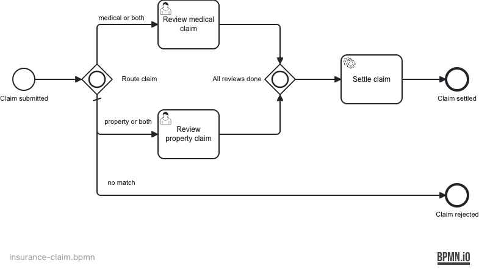

# Example 16 — Inclusive Gateway

This example demonstrates the **inclusive (OR) gateway** in Operaton: multiple outgoing sequence flows can be active simultaneously when their conditions are true, and the corresponding joining gateway waits for all active tokens before continuing.

## What you will learn

- How to model an inclusive (OR) split gateway with conditional outgoing flows
- How the joining inclusive gateway synchronises all active parallel paths
- How to use a `default` flow for the case where no conditions match
- How condition expressions on inclusive gateways differ from exclusive gateways
- How to test single-path, dual-path, and default routing in one test suite

## Process model


An insurance claim is routed to one or both review tracks based on the `claimType` variable. When all active reviews are complete, the claim is settled. If no conditions match, the claim is rejected immediately.



Elements in the BPMN (`insurance-claim.bpmn`):

| Element | ID |
|---|---|
| Start event | `StartEvent_ClaimSubmitted` |
| Inclusive split gateway | `Gateway_Route` |
| User task — medical review | `Task_ReviewMedical` |
| User task — property review | `Task_ReviewProperty` |
| Inclusive join gateway | `Gateway_Join` |
| Service task — settle claim | `ServiceTask_SettleClaim` |
| End event — settled | `EndEvent_ClaimSettled` |
| End event — rejected | `EndEvent_Rejected` |

## Prerequisites

| Tool | Version |
|---|---|
| JDK | 21 |
| Docker | any recent version |

## Run it

```bash
# Start PostgreSQL
docker compose up -d --wait

# Run with Maven
./mvnw spring-boot:run

# Or run with Gradle
./gradlew bootRun
```

- Cockpit / Tasklist: http://localhost:8080
- Credentials: `demo` / `demo`
- Seeded users: `alice` (medicalTeam), `bob` (propertyTeam)

## Walk through it

### Happy path — both tracks active

1. Open a terminal and start a "both" claim:
   ```bash
   curl -s -u demo:demo -X POST http://localhost:8080/engine-rest/process-definition/key/insurance-claim/start \
     -H 'Content-Type: application/json' \
     -d '{"variables": {"claimType": {"value": "both", "type": "String"}}}'
   ```
2. Open Tasklist (http://localhost:8080/operaton/app/tasklist) and log in as `alice`.
   You should see **Review medical claim**. Claim and complete it.
3. Log out, log in as `bob`. You should see **Review property claim** still waiting
   (the inclusive join held the process open). Claim and complete it.
4. Check Cockpit — the process instance should now be completed at **Claim settled**.

### Alternative path — medical only

Repeat step 1 with `"claimType": "medical"`. Only one task appears (for `alice`).
Complete it — the process completes immediately without waiting for a property review.

## How it works

The inclusive split gateway (`Gateway_Route` in `insurance-claim.bpmn`) evaluates
**all** outgoing flows whose condition is true and activates each one:

- `Flow_Medical`: `${claimType == 'medical' || claimType == 'both'}`
- `Flow_Property`: `${claimType == 'property' || claimType == 'both'}`
- `Flow_Default_Rejected`: the `default` flow (no condition), fires only when no
  other flow matches

The joining gateway (`Gateway_Join`) is also an inclusive gateway. Unlike a parallel
join (which always waits for all incoming flows), an inclusive join waits only for
the tokens that were actually activated by the split. When `claimType == "medical"`,
only the medical path token was created, so the join fires as soon as that one task
is complete.

`SettleClaimDelegate` (`src/main/java/.../SettleClaimDelegate.java`) sets the
process variable `settled = true` and is referenced from the BPMN via
`operaton:delegateExpression="${settleClaimDelegate}"`.

`DataInitializer` (`src/main/java/.../DataInitializer.java`) seeds the groups
`medicalTeam` and `propertyTeam` with users `alice` and `bob` on startup.

## Run the tests

```bash
# Maven (runs Testcontainers ITs via failsafe)
./mvnw verify

# Gradle
./gradlew build
```

The integration tests (`InsuranceClaimProcessIT`) prove three routing scenarios
end-to-end against a real PostgreSQL container:

1. Medical-only claim activates only the medical track and settles after one task.
2. Property-only claim activates only the property track and settles after one task.
3. "Both" claim activates both tracks, holds open after the first completion, and
   settles only after both tasks are complete.
