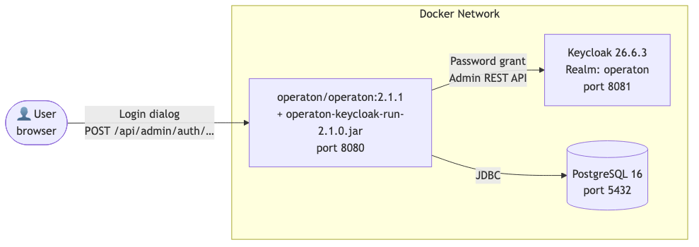

# Keycloak Identity Provider

Demonstrates installing the `operaton-keycloak` identity-provider plugin into the
`operaton/operaton` distribution image and authenticating webapp logins
against an external Keycloak server via the standard login dialog.

## What you will learn

- How to install a process-engine plugin into the `operaton/operaton` run image by
  dropping a fat jar into `configuration/userlib/`
- How to configure the Keycloak identity-provider plugin (`plugin.identity.keycloak`)
  in `configuration/default.yml`, replacing the engine's built-in identity service
- Why `operaton.bpm.admin-user` must be absent when using a read-only identity provider
- How to provision a Keycloak realm from a single `realm.json` file (sidecar pattern)
- The difference between authentication (Keycloak validates the password) and
  authorization (engine authorizations grant access to Cockpit/Tasklist)

## Topology



| Container | Image | Port |
|---|---|---|
| `operaton` | custom (built from `Dockerfile`) | 8080 |
| `keycloak` | `keycloak/keycloak:26.6.3` | 8081 |
| `postgres` | `postgres:16-alpine` | 5432 |
| `keycloak-config` | `keycloak/keycloak:26.6.3` | — (one-shot sidecar) |

## Prerequisites

- JDK 21
- Docker (recent version)
- Internet access for first build (downloads `operaton-keycloak-run-2.1.0.jar` from Maven Central)

## Run it

```bash
cd examples/integration-keycloak
docker compose up -d --wait
```

`docker compose up --wait` builds the custom operaton image on first run (~2 min — downloads the
plugin jar), starts Keycloak, runs the `keycloak-config` sidecar to import the realm, then starts
operaton. Subsequent starts are fast.

**Operaton webapps:** http://localhost:8080

| URL | Credential | Access |
|---|---|---|
| http://localhost:8080/app/cockpit/ | `admin` / `s3cr3t` (Monica) | Full — member of `operaton-admin` |
| http://localhost:8080/app/cockpit/ | `demo` / `demo` | Authenticated, empty — no engine authorizations |
| http://localhost:8081/auth/admin | `keycloak` / `keycloak` | Keycloak admin console |

To stop:
```bash
docker compose down
```

## Walk through it

### Happy path — log in as Monica

1. Open http://localhost:8080 — the standard Operaton login dialog appears.
2. Enter `admin` / `s3cr3t` and click **Sign In**.
3. Cockpit opens. Open **Admin → Users** — the users listed (admin, demo, john, mary, peter) are
   sourced from Keycloak; the engine database contains none of them.

### Authorization separation — log in as a non-admin

1. Log out (top-right → Sign Out).
2. Log in as `demo` / `demo`.
3. The webapps open but process definitions, tasks, and admin sections are empty — Keycloak
   authenticated the user (password grant succeeded) but the engine holds no authorizations for
   `demo`, so the resource layer returns nothing. This illustrates authentication vs authorization.

### Verify Keycloak is doing the work

1. Open the Keycloak admin console: http://localhost:8081/auth/admin (`keycloak` / `keycloak`).
2. Select realm **operaton → Users** — the 5 users and their group memberships are visible.
3. Change `admin`'s password in Keycloak to `newpass`.
4. Return to Operaton — `admin` / `s3cr3t` now fails; `admin` / `newpass` succeeds.

## How it works

**`Dockerfile`** — extends `operaton/operaton:2.1.1` with two additions:
- `ADD … /operaton/configuration/userlib/` — drops the fat jar (all transitive dependencies
  bundled, including httpclient5 and caffeine) into the userlib directory where the run
  distribution auto-discovers plugins.
- `COPY configuration/default.yml …` — replaces the default engine config with ours.

**`configuration/default.yml`** — sets the PostgreSQL datasource (via env vars) and the
`plugin.identity.keycloak` block. Critical: no `operaton.bpm.admin-user` — the Keycloak plugin
is read-only; the engine's `IdentityService.isReadOnly()` returns `true`, and any attempt to
create users at startup is skipped.

**`keycloak/realm.json`** — single source of truth for the `operaton` realm. Groups (sales,
accounting, management, operaton-admin), users with passwords and group memberships, and the
`operaton-identity-service` confidential client with `directAccessGrantsEnabled: true`
(for the login-dialog password grant) and service-account roles `query-users` / `query-groups` /
`view-users` from `realm-management` (for the plugin's admin REST queries).

**Compose sidecar** — `keycloak-config` waits for Keycloak to be healthy then calls
`kcadm.sh create realms --file /realm.json`. The operaton service `depends_on:
keycloak-config: service_completed_successfully` so it only starts after the realm exists.

## Run the tests

```bash
./mvnw verify
```
or
```bash
./gradlew build
```

The integration test (`KeycloakIdentityIT`) builds the custom Docker image, starts PostgreSQL,
Keycloak (with `--import-realm` on the same `realm.json`), and the operaton container on a shared
Testcontainers network. It asserts: login success (`admin`/`s3cr3t` → HTTP 200), login failure
(`admin`/`wrongpass` → HTTP 401), and engine REST identity queries returning the Keycloak-sourced
users and groups.
