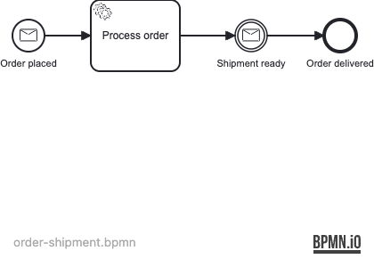

# 06 — Message Events

A Spring Boot application demonstrating Operaton **message events**: a process is started by a
named message and later resumes when a second message arrives, with correlation by business key.

## What you will learn

- Start a process instance via a `messageStartEvent` using `startProcessInstanceByMessage()`
- Suspend a running process at an `intermediateCatchEvent` until a message arrives
- Resume a specific process instance by correlating a message to its business key
- Declare messages in BPMN with `<bpmn:message>` and reference them from event definitions
- Verify active message subscriptions with `EventSubscriptionQuery`
- Handle `MismatchingMessageCorrelationException` when no matching instance exists

## Process model

`src/main/resources/order-shipment.bpmn`



Message correlation sequence:


## Prerequisites

- JDK 21
- Docker (for PostgreSQL — both for local runs and the integration tests)

## Run it

```bash
docker compose up -d --wait
./mvnw spring-boot:run      # or: ./gradlew bootRun
```

Open http://localhost:8080 — Cockpit and Tasklist, login `demo` / `demo`.

## Walk through it

**Step 1 — Place an order (start process via message):**
```bash
curl -u demo:demo -H 'Content-Type: application/json' \
  -d '{"messageName":"OrderPlaced","businessKey":"ORDER-001","processVariables":{"orderId":{"value":"ORDER-001","type":"String"},"customerId":{"value":"CUST-42","type":"String"}}}' \
  http://localhost:8080/engine-rest/message
```
In Cockpit you will see the instance paused at *Shipment ready*.

**Step 2 — Mark shipment ready (correlate message):**
```bash
curl -u demo:demo -H 'Content-Type: application/json' \
  -d '{"messageName":"ShipmentReady","businessKey":"ORDER-001","processVariables":{"trackingId":{"value":"TRACK-XYZ","type":"String"}}}' \
  http://localhost:8080/engine-rest/message
```
The process resumes and completes at *Order delivered*. Check the `trackingId` variable in history.

**Step 3 — Try correlating to an unknown order:**
```bash
curl -u demo:demo -H 'Content-Type: application/json' \
  -d '{"messageName":"ShipmentReady","businessKey":"ORDER-UNKNOWN"}' \
  http://localhost:8080/engine-rest/message
```
Returns HTTP 400 — no matching process instance subscription found.

## How it works

- [order-shipment.bpmn](src/main/resources/order-shipment.bpmn) declares two messages
  (`OrderPlaced`, `ShipmentReady`) at the definitions level. The start event and the
  intermediate catch event each reference one of these messages by ID.
- `startProcessInstanceByMessage("OrderPlaced", businessKey, variables)` starts a new
  process instance via the message start event. The business key becomes the correlation
  handle for subsequent messages.
- After the service task completes, the engine records a **message subscription** for
  `ShipmentReady` against this process instance. The instance is then suspended in the
  database — no threads are blocked.
- `correlateMessage("ShipmentReady", businessKey, variables)` finds the subscription,
  delivers the message (merging variables), and resumes execution.
- If no subscription exists for the given business key, the engine throws
  `MismatchingMessageCorrelationException` — tested in the IT.

## Run the tests

```bash
./mvnw verify        # or: ./gradlew build
```

[OrderShipmentProcessIT](src/test/java/org/operaton/examples/messageevents/OrderShipmentProcessIT.java)
covers three scenarios: the full happy path, duplicate-correlation failure, and independent
correlation of two concurrent process instances.
