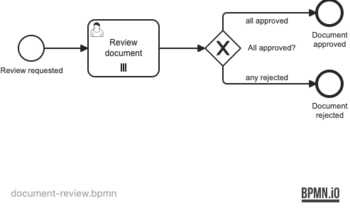

# Example 09 — Multi-Instance

This example demonstrates parallel multi-instance user tasks — running the same task concurrently for each item in a collection, with a configurable completion condition.

## What you will learn

- How to configure a parallel multi-instance user task with `operaton:collection` and `operaton:elementVariable`
- How the engine creates one task instance per collection element and assigns each to its designated reviewer
- How a completion condition (`${nrOfCompletedInstances == nrOfInstances}`) controls when the loop finishes
- How per-instance variables (e.g. `approved`) flow back to the process scope after all instances complete
- How an exclusive gateway routes the outcome to an approval or rejection end event

## Process model


The `document-review` process starts a parallel review cycle where every reviewer in the `reviewers` list receives their own task simultaneously. Once all tasks are complete, a gateway checks the final value of `approved` and routes to the appropriate end event.



All BPMN elements:

| BPMN element | ID |
|---|---|
| Start event | `StartEvent_1` |
| Parallel multi-instance user task | `Task_ReviewDocument` |
| Exclusive gateway | `Gateway_Decision` |
| End event (approved) | `EndEvent_Approved` |
| End event (rejected) | `EndEvent_Rejected` |
| Sequence flow | `Flow_Start_Review` |
| Sequence flow | `Flow_Review_Gateway` |
| Sequence flow (all approved) | `Flow_Approved` |
| Sequence flow (any rejected) | `Flow_Rejected` |

## Prerequisites

- JDK 21
- Docker (tested with Docker Desktop 4.x and Rancher Desktop)

## Run it

Start the database:

```bash
docker compose up -d
```

Run with Maven:

```bash
./mvnw spring-boot:run
```

Run with Gradle:

```bash
./gradlew bootRun
```

Open Operaton Cockpit / Tasklist at http://localhost:8080 and log in with `demo` / `demo`.

Three reviewer users are seeded automatically: `alice` / `alice`, `bob` / `bob`, `carol` / `carol`.

## Walk through it

### Happy path — all reviewers approve

Start a process instance:

```bash
curl -s -X POST http://localhost:8080/engine-rest/process-definition/key/document-review/start \
  -H "Content-Type: application/json" \
  -d '{"variables": {"reviewers": {"value": "[\"alice\",\"bob\",\"carol\"]", "type": "Json"}, "document": {"value": "Q4 Report", "type": "String"}}}' \
  | jq .id
```

Log into Tasklist as `alice` / `alice`. You will see one "Review document" task. Complete it with `approved = true`. Repeat for `bob` and `carol`. After all three complete, the process ends at `EndEvent_Approved`.

### Alternative path — one reviewer rejects

Start another instance as above. Complete alice's and bob's tasks with `approved = true`, then complete carol's task with `approved = false`. Because carol's completion is last, the process variable `approved` is `false`, and the process ends at `EndEvent_Rejected`.

You can also verify via the REST API. After starting the instance, list tasks:

```bash
curl -s http://localhost:8080/engine-rest/task?processInstanceId=<id> | jq '[.[] | {id, assignee}]'
```

Complete a task:

```bash
curl -s -X POST http://localhost:8080/engine-rest/task/<taskId>/complete \
  -H "Content-Type: application/json" \
  -d '{"variables": {"approved": {"value": true, "type": "Boolean"}}}'
```

## How it works

**Parallel multi-instance** is configured on `Task_ReviewDocument` via `<bpmn:multiInstanceLoopCharacteristics isSequential="false" ...>`. The engine reads the `reviewers` list from the process variable and creates one concurrent task per entry. Each task gets a local variable `reviewer` (the `operaton:elementVariable`) and is assigned to that reviewer via `operaton:assignee="${reviewer}"`.

**Completion condition** `${nrOfCompletedInstances == nrOfInstances}` is the standard "wait for all" condition. Built-in variables `nrOfInstances`, `nrOfActiveInstances`, and `nrOfCompletedInstances` are maintained by the engine for every multi-instance activity.

**Variable aggregation** — each instance writes its `approved` result as a local variable. In the default behavior, the last completed instance's local variable value propagates to the process scope. The gateway then reads that value to decide the outcome.

**Exclusive gateway** routes on `${approved == true}` (to `EndEvent_Approved`) and `${approved != true}` (to `EndEvent_Rejected`).

Key source files:

- [`src/main/resources/document-review.bpmn`](src/main/resources/document-review.bpmn) — process model with multi-instance loop
- [`src/main/java/org/operaton/examples/multiinstance/DataInitializer.java`](src/main/java/org/operaton/examples/multiinstance/DataInitializer.java) — seeds alice, bob, carol into the identity service

## Run the tests

```bash
./mvnw verify
```

```bash
./gradlew build
```

The integration tests (`DocumentReviewProcessIT`) prove:
1. Three parallel tasks are created when three reviewers are supplied.
2. All approvals route to `EndEvent_Approved`.
3. A final rejection routes to `EndEvent_Rejected` regardless of earlier approvals.
