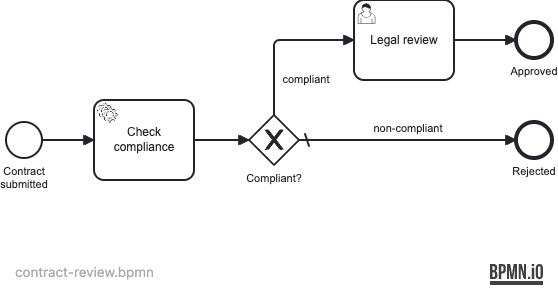

# 28 — Multi-Tenancy

A Spring Boot application embedding the Operaton engine and demonstrating
**tenant-identifier multi-tenancy**: multiple tenants share a single engine
instance but each tenant's deployments, process instances, and tasks are
fully isolated from the others.

## What you will learn

- Deploy the same BPMN process separately for each tenant using
  `repositoryService.createDeployment().tenantId(tenantId)`
- Start process instances scoped to a specific tenant with
  `createProcessInstanceByKey().processDefinitionTenantId()`
- Read the tenant ID inside a `JavaDelegate` via
  `DelegateExecution.getTenantId()` to apply tenant-specific business rules
- Filter tasks by tenant with `taskService.createTaskQuery().tenantIdIn(...)`
- Seed tenant-scoped groups and users idempotently at startup

## Process model



## Prerequisites

- JDK 21
- Docker (for PostgreSQL — both for local runs and the integration tests)

## Run it

```bash
docker compose up -d --wait
./mvnw spring-boot:run      # or: ./gradlew bootRun
```

Open http://localhost:8080 — Cockpit and Tasklist, login `demo` / `demo`.

Tenant users:
- `alice` / `alice` — member of `tenant-aLegal` (Tenant A legal reviewer)
- `bob` / `bob` — member of `tenant-bLegal` (Tenant B legal reviewer)

## Walk through it

**Tenant A — strict compliance (only "standard" contracts pass):**

1. Submit a compliant contract for Tenant A:
   ```bash
   curl -u demo:demo -H 'Content-Type: application/json' \
     -d '{"variables":{"contractType":{"value":"standard","type":"String"}},"tenantId":"tenant-a"}' \
     http://localhost:8080/engine-rest/process-definition/key/contract-review/tenant-id/tenant-a/start
   ```
2. Log in to Tasklist as `alice` (password `alice`). Find **Legal review** in *All tasks*, claim and complete it.
3. In Cockpit, the instance history shows the path through the legal review to *Approved*.

**Tenant A — non-compliant contract (enterprise type rejected):**

```bash
curl -u demo:demo -H 'Content-Type: application/json' \
  -d '{"variables":{"contractType":{"value":"enterprise","type":"String"}},"tenantId":"tenant-a"}' \
  http://localhost:8080/engine-rest/process-definition/key/contract-review/tenant-id/tenant-a/start
```

The process completes immediately at *Rejected* — no task appears in Tasklist.

**Tenant B — permissive compliance (both "standard" and "enterprise" pass):**

```bash
curl -u demo:demo -H 'Content-Type: application/json' \
  -d '{"variables":{"contractType":{"value":"enterprise","type":"String"}},"tenantId":"tenant-b"}' \
  http://localhost:8080/engine-rest/process-definition/key/contract-review/tenant-id/tenant-b/start
```

Log in as `bob` (password `bob`) to see and complete the legal review task.

## How it works

- [contract-review.bpmn](src/main/resources/contract-review.bpmn) is deployed
  once per tenant by `TenantSetupService` at startup. Automatic deployment is
  disabled (`auto-deployment-enabled: false`) so the engine does not also
  create a global (non-tenant) deployment.
- [ComplianceCheckDelegate](src/main/java/org/operaton/examples/multitenancy/ComplianceCheckDelegate.java)
  calls `execution.getTenantId()` to apply different compliance rules per
  tenant. It also derives a `tenantGroup` variable (tenant ID with hyphens
  stripped) which drives the `${tenantGroup}Legal` candidate-groups UEL
  expression on the user task. Group IDs must satisfy the engine's resource
  identifier whitelist, which forbids hyphens.
- [TenantSetupService](src/main/java/org/operaton/examples/multitenancy/TenantSetupService.java)
  creates the tenant groups and per-tenant deployments idempotently on every
  startup.
- [DataInitializer](src/main/java/org/operaton/examples/multitenancy/DataInitializer.java)
  seeds `alice` (Tenant A legal) and `bob` (Tenant B legal) idempotently.

## Run the tests

```bash
./mvnw verify        # or: ./gradlew build
```

[ContractReviewIT](src/test/java/org/operaton/examples/multitenancy/ContractReviewIT.java)
boots the application against a Testcontainers PostgreSQL and verifies three
scenarios: Tenant A rejects non-standard contracts, Tenant B accepts enterprise
contracts, and tenant process instances are isolated from each other.

## Multi-tenancy approaches

Operaton supports two distinct multi-tenancy strategies; this example uses the first:

**Tenant-identifier (this example)**

A single process engine and a single database schema. Every row (process instance,
task, variable, …) carries a `tenantId` column. Isolation is enforced by the engine
API — callers filter by tenant. Low operational overhead; suitable when all tenants
trust the same application deployment.

**Schema isolation (not shown here)**

A separate database schema per tenant; a separate `ProcessEngine` bean per tenant.
Stronger isolation: one tenant's data is physically unreachable from another tenant's
engine. Higher resource cost.

For a schema isolation example (Camunda 7 / WildFly, Arquillian-tested):
[camunda-bpm-examples/multi-tenancy/schema-isolation](https://github.com/camunda/camunda-bpm-examples/tree/master/multi-tenancy/schema-isolation).
