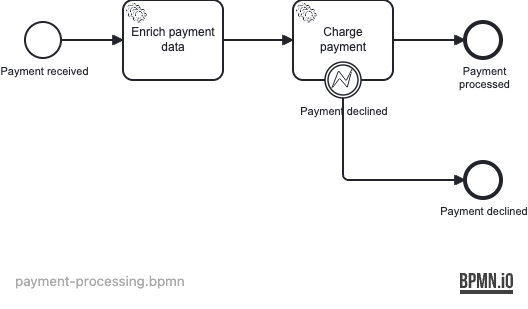

# 02 — Service Tasks

A Spring Boot application demonstrating the two execution modes of Operaton
service tasks: **synchronous** (caller's transaction) and **asynchronous**
(job executor), plus `BpmnError` routing and automatic job retry on failure.

## What you will learn

- Implement a synchronous `JavaDelegate` that runs inside the
  `startProcessInstance` transaction
- Make a service task asynchronous with `operaton:asyncBefore="true"` so the
  engine persists a job and the job executor picks it up in a new transaction
- Configure automatic retries with `<operaton:failedJobRetryTimeCycle>`
- Throw `BpmnError` from a delegate to route to an error boundary event
- Test asynchronous continuations with Awaitility and manually trigger retries
  with `ManagementService.executeJob()`

## Process model



How the engine and payment gateway interact:


## Prerequisites

- JDK 21
- Docker (for PostgreSQL — both for local runs and the integration tests)

## Run it

```bash
docker compose up -d --wait
./mvnw spring-boot:run      # or: ./gradlew bootRun
```

Open http://localhost:8080 — Cockpit and Tasklist, login `demo` / `demo`.

## Walk through it

### Happy path — payment processed

1. Start an instance:
   ```bash
   curl -u demo:demo -H 'Content-Type: application/json' \
     -d '{"variables":{"amount":{"value":99.99,"type":"Double"},"cardNumber":{"value":"4111111111111111","type":"String"}}}' \
     http://localhost:8080/engine-rest/process-definition/key/payment-processing/start
   ```
2. The process completes automatically (the job executor runs `ChargePayment`
   in the background). In Cockpit history you will see the process ended at
   *Payment processed* with variables `enriched=true`, `charged=true`, and
   `chargeId` prefixed `CHG-`.

### Declined payment — boundary event path

1. Start with `simulateDecline=true`:
   ```bash
   curl -u demo:demo -H 'Content-Type: application/json' \
     -d '{"variables":{"amount":{"value":50.0,"type":"Double"},"simulateDecline":{"value":true,"type":"Boolean"}}}' \
     http://localhost:8080/engine-rest/process-definition/key/payment-processing/start
   ```
2. The charge delegate throws `BpmnError("PAYMENT_DECLINED")`. The error
   boundary event catches it and the process ends at *Payment declined*.

## How it works

- [payment-processing.bpmn](src/main/resources/payment-processing.bpmn) is
  auto-deployed from the classpath at startup.
- [EnrichPaymentDelegate](src/main/java/org/operaton/examples/servicetasks/EnrichPaymentDelegate.java)
  is a **synchronous** `JavaDelegate`. It executes in the same thread and
  transaction as `startProcessInstance` — any exception rolls back the whole
  call. It validates the amount and sets `currency` and `enriched`.
- [ChargePaymentDelegate](src/main/java/org/operaton/examples/servicetasks/ChargePaymentDelegate.java)
  is the delegate for the **asynchronous** charge task. `operaton:asyncBefore="true"`
  on the service task means the engine commits a job record before calling the
  delegate; the job executor later picks it up in a new transaction. A
  `RuntimeException` from this delegate does not roll back the start call —
  it only decrements the job's retry counter.
- `<operaton:failedJobRetryTimeCycle>R4/PT5S</operaton:failedJobRetryTimeCycle>`
  gives the charge task 4 automatic retries at 5-second intervals before the
  job is placed in the failed-jobs queue.
- `throw new BpmnError("PAYMENT_DECLINED")` routes execution to
  `BoundaryEvent_PaymentDeclined`, which is attached to the charge task and
  leads to `EndEvent_PaymentDeclined`.

## Run the tests

```bash
./mvnw verify        # or: ./gradlew build
```

[PaymentProcessingIT](src/test/java/org/operaton/examples/servicetasks/PaymentProcessingIT.java)
boots the application against a Testcontainers PostgreSQL and covers three
paths: successful charge (Awaitility waits for the job executor), card
declined via `BpmnError`, and transient error via `ManagementService.executeJob()`
asserting the retry counter decrements from 3 to 2.
