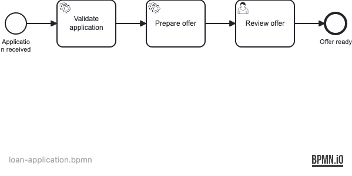

# Spin JSON Variables

Demonstrates JSON-typed process variables using Operaton Spin: store Java objects
as JSON in the process engine and read them back as typed instances in delegates.

## What you will learn

- Use `Variables.objectValue(...).serializationDataFormat("application/json")` to store a Java object as a JSON process variable
- Read a JSON-serialized variable back as a typed Java object in a `JavaDelegate` via `execution.getVariable()`
- Understand that the Spin JSON data format plugin is included automatically with the Spring Boot starter — no extra dependency is needed
- Verify JSON variable round-trip behavior end-to-end with Testcontainers (real PostgreSQL)
- Use `operaton:formKey` with `embedded:app:forms/...` on start events and user tasks to attach embedded HTML forms in Tasklist
- Create a JSON process variable from an AngularJS embedded form using `camForm.variableManager.createVariable`
- Control task visibility in Tasklist by assigning candidate groups (`loanOfficers`) on a user task

## Process model



## Prerequisites

- JDK 21
- Docker (for PostgreSQL — both for local runs and the integration tests)

## Run it

```bash
docker compose up -d --wait
./mvnw spring-boot:run      # or: ./gradlew bootRun
```

Open http://localhost:8080 — Cockpit and Tasklist, login `demo` / `demo`.

## Walk through it

### Starting the process

**Option A — Tasklist start form (recommended):**

Open http://localhost:8080 and log in as `demo` / `demo`. In Tasklist, click
**Start process** and select `loan-application`. Fill in the form fields; the
start form creates the `application` JSON variable directly from those fields.

**Option B — REST API:**

```bash
curl -u demo:demo -H 'Content-Type: application/json' \
  -d '{"variables":{"application":{"value":"{\"applicantName\":\"Alice\",\"amount\":15000,\"termMonths\":48,\"purpose\":\"Home reno\"}","type":"String","valueInfo":{"objectTypeName":"org.operaton.examples.spinjson.LoanApplication","serializationDataFormat":"application/json"}}}}' \
  http://localhost:8080/engine-rest/process-definition/key/loan-application/start
```

### Review the offer

1. Log in to Tasklist as `carol` (password `carol`). The **Review offer** task
   appears for the `loanOfficers` group.
2. Claim and complete the task. The review form shows the calculated
   `annualInterestRate` and `monthlyPayment` computed by **Prepare offer**.
3. In Cockpit, verify that the process instance has completed at **Offer ready**.
   The **Variables** tab shows `application` stored as type `Object` with
   serialization format `application/json`, alongside the calculated
   `applicationValid`, `annualInterestRate`, and `monthlyPayment` variables.
4. Cockpit's variable detail view shows the serialized JSON string, demonstrating
   that the object was stored as JSON and deserialized transparently in each
   delegate.

## How it works

- [loan-application.bpmn](src/main/resources/loan-application.bpmn) defines two
  sequential service tasks (**Validate application** and **Prepare offer**) followed
  by a user task **Review offer** (`UserTask_ReviewOffer`) assigned to the
  `loanOfficers` candidate group.
- [LoanApplication](src/main/java/org/operaton/examples/spinjson/LoanApplication.java)
  is a plain Java class (POJO with no-arg constructor and getters/setters) that Jackson
  can serialize and deserialize automatically.
- [ValidateApplicationDelegate](src/main/java/org/operaton/examples/spinjson/ValidateApplicationDelegate.java)
  reads the `application` variable with `execution.getVariable("application")` — Spin
  deserializes the stored JSON back to a `LoanApplication` instance transparently —
  then sets `applicationValid`.
- [PrepareOfferDelegate](src/main/java/org/operaton/examples/spinjson/PrepareOfferDelegate.java)
  reads the same variable, calculates `annualInterestRate` and `monthlyPayment`, and
  stores them as plain double variables.
- [forms/start-application.html](src/main/webapp/forms/start-application.html) is an
  embedded AngularJS form attached to the start event via `operaton:formKey`
  (`embedded:app:forms/start-application.html`). It uses
  `camForm.variableManager.createVariable` to build the `application` JSON variable
  directly from the form fields.
- [forms/review-offer.html](src/main/webapp/forms/review-offer.html) is an embedded
  form attached to `UserTask_ReviewOffer`; it renders the calculated offer details
  (`annualInterestRate`, `monthlyPayment`) for the loan officer to review and approve.
- The Spin JSON plugin (`operaton-spin-dataformat-json-jackson`) is included
  transitively via `operaton-bpm-spring-boot-starter-webapp`; no explicit dependency
  is required.

## Run the tests

```bash
./mvnw verify        # or: ./gradlew build
```

[LoanApplicationIT](src/test/java/org/operaton/examples/spinjson/LoanApplicationIT.java)
boots the application against a Testcontainers PostgreSQL and contains 3 integration
tests covering the full loan application flow:

1. **`loanApplicationIsProcessedWithJsonVariable`** — verifies the end-to-end flow:
   the `LoanApplication` object is stored as JSON, both delegates deserialize it
   correctly, `applicationValid=true`, and `annualInterestRate` is calculated.
2. **`jsonVariableIsDeserializedCorrectlyInDelegate`** — verifies JSON variable
   deserialization: the `monthlyPayment` calculated by `PrepareOfferDelegate` is a
   positive value after the review task is completed.
3. **`reviewOfferUserTaskIsAssignableToLoanOfficers`** — verifies the `UserTask_ReviewOffer`
   user task: it is visible to the `loanOfficers` candidate group, can be claimed by
   a loan officer (user `carol`), and completes the process when finished.
