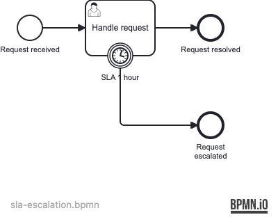

# 07 — Timer Events

A Spring Boot application demonstrating Operaton **timer boundary events**: a user task has a
1-hour SLA enforced by an interrupting timer boundary event, which escalates the process if
the task isn't completed in time. The tests demonstrate how to fire timers instantly using
the job executor API — no `Thread.sleep` required.

## What you will learn

- Attach a `timerBoundaryEvent` to a user task to enforce an SLA (PT1H duration)
- Distinguish the normal completion path from the timer escalation path
- Query for timer jobs using `ManagementService.createJobQuery().timers()`
- Fire a timer immediately in tests with `managementService.executeJob(jobId)` — no wall-clock waiting
- Disable the background job executor in tests with `operaton.bpm.job-execution.enabled=false`
  to prevent the executor from auto-firing timers before the test can control them

## Process model


`src/main/resources/sla-escalation.bpmn`



## Prerequisites

- JDK 21
- Docker (for PostgreSQL — both for local runs and the integration tests)

## Run it

```bash
docker compose up -d --wait
./mvnw spring-boot:run      # or: ./gradlew bootRun
```

Open http://localhost:8080 — Cockpit and Tasklist, login `demo` / `demo`.

## Walk through it

**Start a support request:**
```bash
curl -u demo:demo -H 'Content-Type: application/json' \
  -d '{"variables":{"requestId":{"value":"REQ-001","type":"String"}}}' \
  http://localhost:8080/engine-rest/process-definition/key/sla-escalation/start
```

In Cockpit, open the instance. Under *Jobs* you will see the timer job scheduled 1 hour
from now. The user task is visible in Tasklist.

**Happy path:** In Tasklist, claim and complete the *Handle request* task. The process
ends at *Request resolved* and the timer job is automatically cancelled.

**Escalation path:** Wait 1 hour (or, in tests, call `executeJob`) — the timer fires,
the user task is cancelled, and the process ends at *Request escalated*.

## How it works

- [sla-escalation.bpmn](src/main/resources/sla-escalation.bpmn) attaches `BoundaryEvent_SlaTimer`
  to `UserTask_HandleRequest` using `attachedToRef`. The `<bpmn:timerEventDefinition>` specifies
  a `PT1H` ISO 8601 duration. When the engine enters the user task, it schedules a **timer job**
  in the database with a due date of `now + 1 hour`.
- The **job executor** polls for due jobs and executes them. In tests we disable it with
  `operaton.bpm.job-execution.enabled=false` (via `@SpringBootTest`) so the timer doesn't fire
  unexpectedly. We then call `managementService.executeJob(jobId)` to fire it on demand.
- When the task is completed normally, the engine cancels the boundary timer job — verified
  in the third test by asserting the timer count drops to zero.

## Run the tests

```bash
./mvnw verify        # or: ./gradlew build
```

[SlaEscalationProcessIT](src/test/java/org/operaton/examples/timerevents/SlaEscalationProcessIT.java)
covers: normal completion before timer, timer escalation via `executeJob()`, and job cleanup
on normal completion.
