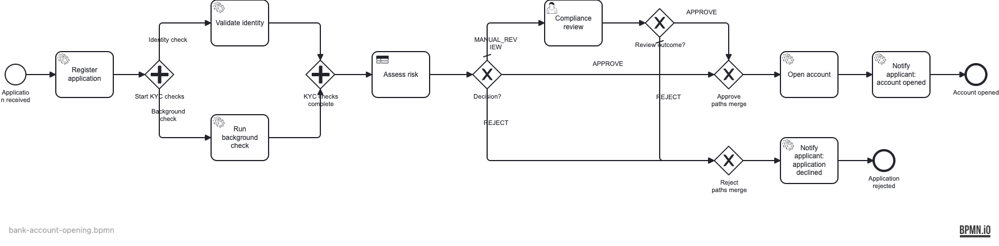

# Bank Account Opening — KYC with Parallel Checks, LLM, DMN, and Email Notification

Demonstrates a full KYC (Know Your Customer) bank account opening flow: applicant
data is collected via a REST endpoint, an **identity check** and an **AI background
check** run concurrently on a **parallel gateway**, a **DMN table** makes the risk
decision, borderline cases route to a **compliance officer user task**, and the
applicant is **notified by email** of the outcome.

## What you will learn

- How to fan out work on a **parallel gateway** and synchronise at a parallel join
- How the **external task** pattern decouples identity validation from the engine
- How to call an LLM via the **HTTP connector** (no Java delegate in the service task)
- How a **DMN business rule task** combines multiple inputs into one routing decision
- How to send outcome **emails via Spring Mail** from BPMN service tasks

## Process model



## Prerequisites

| Tool | Version |
|---|---|
| JDK | 21 |
| Docker | any recent version (required for tests and local run) |

## Run it

Start the local stack (PostgreSQL + Ollama LLM + Mailpit email sink):

```bash
cd examples/use-cases/bank-account-opening
docker compose up -d
```

The first start downloads the `llama3.2` model (~2 GB) via the `ollama-pull`
helper; wait for it: `docker compose logs -f ollama-pull`. On low-resource
machines use a smaller model by setting `LLM_MODEL=llama3.2:1b`.

Run the application:

```bash
./mvnw spring-boot:run
# or
./gradlew bootRun
```

- Operaton Cockpit / Tasklist: http://localhost:8080 (demo / demo)
- Mailpit email UI: http://localhost:8025
- PostgreSQL: localhost:5432 (operaton / operaton)

**Use a hosted LLM instead of Ollama:**

```bash
export LLM_BASE_URL=https://api.openai.com
export LLM_API_KEY=sk-...
export LLM_MODEL=gpt-4o-mini
./mvnw spring-boot:run
```

## Walk through it

### Happy path (account opened)

1. Submit an application for a low-risk applicant:

   ```bash
   curl -s -X POST http://localhost:8080/accounts \
     -H "Content-Type: application/json" \
     -d '{
       "fullName": "Alice Müller",
       "email": "alice@example.com",
       "dateOfBirth": "1985-06-15",
       "gender": "F",
       "nationality": "DE",
       "countryOfResidence": "DE",
       "annualIncome": 65000,
       "employmentStatus": "EMPLOYED",
       "occupation": "Software Engineer",
       "sourceOfFunds": "SALARY",
       "idDocumentType": "PASSPORT",
       "idDocumentNumber": "AB123456",
       "requestedAccountType": "CHECKING"
     }'
   ```

2. Watch the instance flow through Cockpit at http://localhost:8080.
3. Open http://localhost:8025 — an approval email with the generated IBAN will arrive in the Mailpit inbox.

### Manual review path

1. Submit an application with `"nationality": "SY"` (triggers HIGH risk from the LLM).
2. The process parks at the **Compliance review** user task.
3. Log in to Tasklist as `alice` / `alice` (group `compliance`), claim the task, and approve or reject.
4. The appropriate email appears in Mailpit.

## How it works

**Parallel KYC checks** (`ParallelGateway_KycFork` / `ParallelGateway_KycJoin`):
the engine fires both branches simultaneously; neither can proceed past the join
until both complete.

**Identity validation** (`ServiceTask_ValidateIdentity`, topic `identity-validation`):
[IdentityValidationWorker](src/main/java/org/operaton/examples/bankaccountopening/delegate/IdentityValidationWorker.java)
subscribes to the `identity-validation` external task topic, validates the document
number format and date-of-birth plausibility, and completes with `identityVerified`
and `identityScore`.

**Background check** (`ServiceTask_RunBackgroundCheck`): uses `operaton:connector`
with `http-connector` to POST an OpenAI-compatible chat-completion request. The
request body is built by [PromptBuilder](src/main/java/org/operaton/examples/bankaccountopening/PromptBuilder.java);
the response is extracted by [ResponseParser](src/main/java/org/operaton/examples/bankaccountopening/ResponseParser.java)
via connector output-parameter EL expressions (`${responseParser.risk(response)}`).
Connection properties (base URL, model, API key) come from
[LlmProperties](src/main/java/org/operaton/examples/bankaccountopening/LlmProperties.java).
On any parse failure, risk defaults to `HIGH` (fail-safe → manual review).

**DMN risk decision** (`BusinessRuleTask_AssessRisk`, decision `account-risk` in
[account-risk.dmn](src/main/resources/account-risk.dmn)): UNIQUE hit policy —
exactly one rule matches. `identityVerified=false` always rejects; a low identity
score triggers review regardless of background risk; only `identityScore ≥ 60`
combined with `backgroundRisk=LOW` auto-approves.

**Compliance review** (`UserTask_ComplianceReview`): routed when `decision=MANUAL_REVIEW`.
The task is claimable by the `compliance` candidate group (seed users `alice`,
`bob`). The officer sets `reviewOutcome=APPROVE|REJECT`.

**Email notification**: [NotifyApprovalDelegate](src/main/java/org/operaton/examples/bankaccountopening/delegate/NotifyApprovalDelegate.java)
and [NotifyRejectionDelegate](src/main/java/org/operaton/examples/bankaccountopening/delegate/NotifyRejectionDelegate.java)
send via [NotificationService](src/main/java/org/operaton/examples/bankaccountopening/delegate/NotificationService.java)
(Spring Mail). The approval email includes the generated IBAN; the rejection email
includes the LLM rationale.

## Run the tests

```bash
./mvnw verify
# or
./gradlew build
```

Four integration tests run against a real PostgreSQL (Testcontainers), the LLM
stubbed by WireMock, and Mailpit as the SMTP sink: happy path → account opened,
identity failure → rejected, manual review then approved, and parallel-join
assertion confirming both branches set their variables before the DMN runs.
