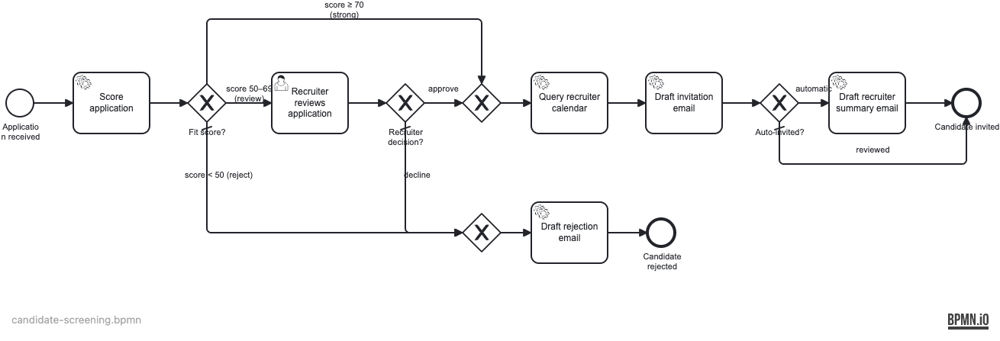

# Candidate Screening — LLM in a process

Uses an LLM (via the Operaton **HTTP connector**) inside a BPMN process to score a job application, drive a confidence-banded gateway, generate candidate and recruiter emails, and propose an interview slot from the recruiter's calendar — escalating the uncertain score band to a human.

## What you will learn

- How to call an OpenAI-compatible LLM over REST from a BPMN service task using the `http-connector`
- How to keep JSON building/parsing in clean Spring beans referenced from connector input/output mappings (no Spin/Groovy in the model)
- How to let an LLM **drive a gateway decision** (a fit score) and escalate the borderline band to a human task
- How to orchestrate a second external service (a calendar free/busy API) in the same process
- How to test LLM/calendar integrations deterministically with WireMock + Testcontainers

## Process model



## Prerequisites

| Tool | Version |
|---|---|
| JDK | 21 |
| Docker | any recent version (required for tests and local run) |

## Run it

Start the local stack (PostgreSQL + a local Ollama LLM + a calendar stub):

```bash
cd examples/use-cases/candidate-screening
docker compose up -d
```

The first start downloads the `llama3.2` model (~2 GB) via the `ollama-pull` helper; wait for it to finish (`docker compose logs -f ollama-pull`). On low-resource machines use a smaller model: `LLM_MODEL=llama3.2:1b` (also `docker compose exec ollama ollama pull llama3.2:1b`).

Run the application:

```bash
./mvnw spring-boot:run
# or
./gradlew bootRun
```

Operaton Cockpit/Tasklist: http://localhost:8080 (demo / demo). Postgres is on 5432, Ollama on 11434, the calendar stub on 8090.

### Use a hosted LLM instead of Ollama

Set environment variables before `spring-boot:run` (then you can stop the `ollama` containers):

- **OpenAI** (paid — get a key at https://platform.openai.com/api-keys):
  ```bash
  export LLM_BASE_URL=https://api.openai.com
  export LLM_API_KEY=sk-...
  export LLM_MODEL=gpt-4o-mini
  ```
- **Groq** (free tier, OpenAI-compatible — https://console.groq.com/keys):
  ```bash
  export LLM_BASE_URL=https://api.groq.com/openai
  export LLM_API_KEY=gsk_...
  export LLM_MODEL=llama-3.1-8b-instant
  ```

## Walk through it

Start a strong candidate (auto-invited):

```bash
curl -s -X POST http://localhost:8080/engine-rest/process-definition/key/candidate-screening/start \
  -H "Content-Type: application/json" \
  -d '{"variables": {
        "candidateName": {"value": "Ada Lindqvist", "type": "String"},
        "position": {"value": "Senior Java Engineer", "type": "String"},
        "applicationText": {"value": "Ten years of Java and Spring Boot leadership.", "type": "String"},
        "recruiterEmail": {"value": "rachel@example.com", "type": "String"}
      }}'
```

A high fit score routes straight to the invitation email and a recruiter summary; the process ends at `EndEvent_Invited`.

Start a borderline candidate, then complete the review in Tasklist (log in as `rachel` / `rachel`, open **Recruiter reviews application**, read the LLM assessment, set **approved**, complete). A weak candidate (e.g. "Recent graduate, no Java experience.") ends at `EndEvent_Rejected` with no human step.

## How it works

- **`ServiceTask_ScoreApplication`** posts an OpenAI Chat Completions request via `http-connector`; `${promptBuilder.scoreRequest(...)}` builds the JSON (with `response_format: json_object`), `${responseParser.score(response)}` / `${responseParser.reasoning(response)}` set `fitScore` and `assessment`. See [PromptBuilder.java](src/main/java/org/operaton/examples/candidatescreening/PromptBuilder.java) and [ResponseParser.java](src/main/java/org/operaton/examples/candidatescreening/ResponseParser.java).
- **`Gateway_FitScore`** branches on `${fitScore}`: ≥ 70 auto-invite, 50–69 to **`UserTask_RecruiterReview`**, < 50 reject. Sequence-flow execution listeners set `autoInvite`.
- **`ServiceTask_QueryCalendar`** posts a free/busy query; [SlotFinder.java](src/main/java/org/operaton/examples/candidatescreening/SlotFinder.java) returns the earliest free working-day slot as `interviewSlot`.
- **`ServiceTask_InvitationEmail`** / **`ServiceTask_RejectionEmail`** / **`ServiceTask_RecruiterSummaryEmail`** generate text via the same connector pattern. The recruiter summary is sent only on the automatic (≥ 70) path (`Gateway_AutoInvited`).
- The connect plugin is enabled in [application.yaml](src/main/resources/application.yaml) via `operaton.bpm.process-engine-plugins`.

## Run the tests

```bash
./mvnw verify
# or
./gradlew build
```

`CandidateScreeningDeploymentIT` proves the process deploys with the connect plugin and seeds the `recruiters` group. `CandidateScreeningIT` runs the process end-to-end against PostgreSQL + WireMock (stubbing both the LLM and the calendar) for all four paths: strong→invited (+summary), weak→rejected, borderline-approved→invited, borderline-declined→rejected.
