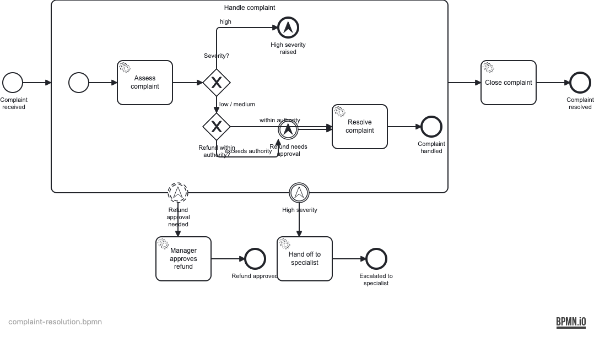

# Customer Complaint Resolution

Demonstrates all four BPMN **escalation event** flavors in a single process: non-interrupting escalation throw, escalation end event, non-interrupting escalation boundary, and interrupting escalation boundary.

> **Note:** User tasks are modelled as service tasks so integration tests run without human interaction. A production process would use user tasks with form bindings.

## What you will learn

- How a **non-interrupting escalation throw** inside a subprocess fires a parallel token without cancelling the subprocess
- How a **non-interrupting escalation boundary** on a subprocess catches the throw and runs a parallel manager-approval path concurrently
- How an **escalation end event** inside a subprocess signals a high-severity condition to the parent scope
- How an **interrupting escalation boundary** cancels the subprocess and reroutes to a specialist-handoff path
- The difference between escalation (non-fatal, parallel) and error (fatal, interrupting) events

## Process model



The "Handle complaint" embedded subprocess assesses the complaint. Low-severity complaints with a refund within the €500 authority threshold resolve directly. Refunds exceeding the threshold fire a non-interrupting escalation, spawning a parallel manager-approval token while the subprocess continues. High-severity complaints fire an escalation end event that triggers the interrupting boundary, cancelling the subprocess and routing to a specialist handoff.

## Prerequisites

- JDK 21
- Docker (for local run and integration tests)

## Run it

```bash
docker compose up -d
./mvnw spring-boot:run   # or: ./gradlew bootRun
```

Cockpit: http://localhost:8080 — login `demo` / `demo`

## Walk through it

**Happy path — low severity, within authority:**

```bash
curl -X POST http://localhost:8080/engine-rest/process-definition/key/complaint-resolution/start \
  -H "Content-Type: application/json" \
  -d '{
    "businessKey": "COMP-HAPPY",
    "variables": {
      "complaintId":     { "value": "COMP-HAPPY", "type": "String" },
      "customer":        { "value": "Alice",      "type": "String" },
      "category":        { "value": "billing",    "type": "String" },
      "severity":        { "value": "low",        "type": "String" },
      "requestedRefund": { "value": 200.0,        "type": "Double" }
    }
  }'
```

Open Cockpit → History → completed instances. The instance ends at **"Complaint resolved"**. No `refundApproved` or `specialistHandoff` variable is set.

**Non-interrupting escalation — refund exceeds authority:**

```bash
curl -X POST http://localhost:8080/engine-rest/process-definition/key/complaint-resolution/start \
  -H "Content-Type: application/json" \
  -d '{
    "businessKey": "COMP-REFUND",
    "variables": {
      "complaintId":     { "value": "COMP-REFUND", "type": "String" },
      "customer":        { "value": "Bob",         "type": "String" },
      "category":        { "value": "service",     "type": "String" },
      "severity":        { "value": "low",         "type": "String" },
      "requestedRefund": { "value": 800.0,         "type": "Double" }
    }
  }'
```

In Cockpit you will see the process instance touch both **"Refund approved"** and **"Complaint resolved"** end events. Variable `refundApproved = true` is set by the parallel manager-approval path.

**Interrupting escalation — high severity:**

```bash
curl -X POST http://localhost:8080/engine-rest/process-definition/key/complaint-resolution/start \
  -H "Content-Type: application/json" \
  -d '{
    "businessKey": "COMP-HIGH",
    "variables": {
      "complaintId":     { "value": "COMP-HIGH", "type": "String" },
      "customer":        { "value": "Carol",     "type": "String" },
      "category":        { "value": "safety",    "type": "String" },
      "severity":        { "value": "high",      "type": "String" },
      "requestedRefund": { "value": 1500.0,      "type": "Double" }
    }
  }'
```

The instance ends at **"Escalated to specialist"**. Variable `specialistHandoff = true`. The subprocess was cancelled by the interrupting boundary — the normal close path did not run.

## How it works

The BPMN ([`complaint-resolution.bpmn`](src/main/resources/complaint-resolution.bpmn)) contains two escalation definitions used across all four event types:

| Escalation code | Used by |
|---|---|
| `REFUND_APPROVAL` | `ThrowEscalation_RefundApproval` (throw, non-interrupting) + `BoundaryEvent_RefundApproval` (boundary, non-interrupting) |
| `HIGH_SEVERITY` | `EndEvent_SP_HighSeverity` (escalation end event) + `BoundaryEvent_HighSeverity` (boundary, interrupting) |

`AssessComplaintDelegate` reads `requestedRefund` and sets `refundWithinAuthority` (Boolean) against a hardcoded 500.0 threshold. The two XOR gateways inside the subprocess use this variable and the incoming `severity` variable to route.

`ApproveRefundDelegate` sets `refundApproved = true` — it runs on the non-interrupting boundary path, concurrently with the subprocess's normal close path.

`HandoffSpecialistDelegate` sets `specialistHandoff = true` — it runs after the interrupting boundary cancels the subprocess.

## Run the tests

```bash
./mvnw verify      # runs 4 ITs via maven-failsafe-plugin
./gradlew build    # same ITs via JUnit Platform
```

The ITs start a PostgreSQL container via Testcontainers, deploy the BPMN, and assert all three paths: happy path (direct resolve), non-interrupting escalation (parallel approval), and interrupting escalation (specialist reroute).
