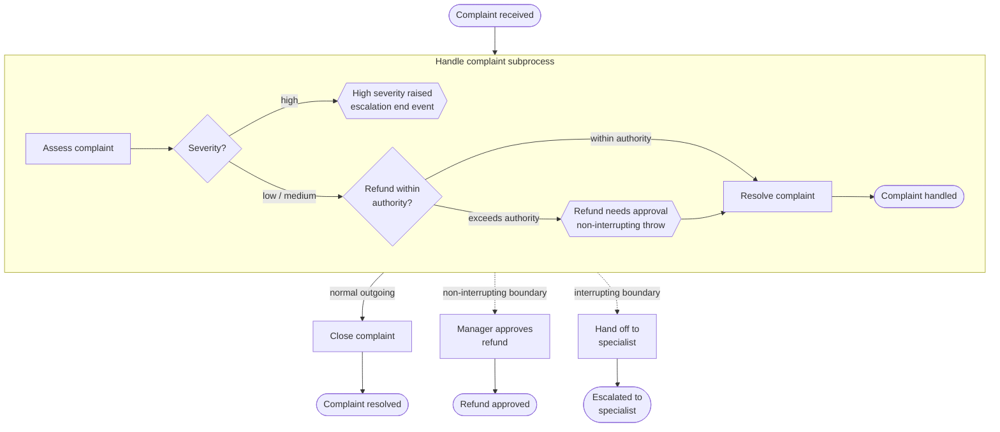

# Customer Complaint Resolution

Demonstrates all four BPMN **escalation event** types in a single process:
non-interrupting escalation throw, escalation end event, non-interrupting
escalation boundary, and interrupting escalation boundary.

> **Note:** User tasks are modelled as service tasks so the integration tests
> run without human interaction. A production process would use user tasks with
> form bindings for complaint assessment and manager approval.

## BPMN Concepts

| Element | Purpose in this process |
|---|---|
| Non-interrupting escalation throw | Inside subprocess: refund exceeds agent authority → spawns parallel manager-approval token while subprocess continues |
| Escalation end event | Inside subprocess: high-severity complaint → raises `HIGH_SEVERITY` escalation, caught by interrupting boundary |
| Non-interrupting escalation boundary | On subprocess: catches `REFUND_APPROVAL`, fires parallel token to manager-approval path without cancelling subprocess |
| Interrupting escalation boundary | On subprocess: catches `HIGH_SEVERITY`, cancels subprocess, routes to specialist-handoff path |

Two escalation codes are defined at the process level:
- `REFUND_APPROVAL` — pairs the intermediate throw inside the subprocess with the non-interrupting boundary outside
- `HIGH_SEVERITY` — pairs the escalation end event inside the subprocess with the interrupting boundary outside

## Process Flow



**Happy path** (low severity, refund ≤ 500): subprocess resolves directly, no
escalation fires, ends at *Complaint resolved*.

**Parallel-approval path** (low severity, refund > 500): non-interrupting
escalation throw fires, manager-approval token runs concurrently while the
subprocess continues, ends at both *Refund approved* and *Complaint resolved*.

**Specialist-reroute path** (high severity): escalation end event fires,
interrupting boundary cancels the subprocess, ends exclusively at *Escalated
to specialist*.

## Running Locally

```bash
# Start PostgreSQL
docker compose up -d --wait

# Run the application
./mvnw spring-boot:run
# or: ./gradlew bootRun

# Open Cockpit/Tasklist at http://localhost:8080  (demo / demo)
```

## Running Tests

```bash
./mvnw verify
# or: ./gradlew build
```

Tests use Testcontainers to start a real PostgreSQL instance. Docker must be
running.

## Configuration

| Property | Default | Description |
|---|---|---|
| `spring.datasource.url` | `jdbc:postgresql://localhost:5432/operaton` | PostgreSQL JDBC URL |
| `spring.datasource.username` | `operaton` | Database user |
| `spring.datasource.password` | `operaton` | Database password |

## Key Code

**`AssessComplaintDelegate`** reads `requestedRefund` and sets
`refundWithinAuthority` (Boolean). The authority threshold is `500.0` —
hard-coded because there is no reason to externalise a constant that never
changes at runtime.

**`ApproveRefundDelegate`** sets `refundApproved = true`. It runs on the
non-interrupting boundary path, concurrently with the subprocess's normal
close path.

**`HandoffSpecialistDelegate`** sets `specialistHandoff = true`. It runs after
the interrupting boundary cancels the subprocess.

The BPMN declares both escalation codes at the process level:
```xml
<bpmn:escalation id="Escalation_RefundApproval" name="Refund Approval"
                 escalationCode="REFUND_APPROVAL" />
<bpmn:escalation id="Escalation_HighSeverity" name="High Severity"
                 escalationCode="HIGH_SEVERITY" />
```

The non-interrupting intermediate throw and boundary reference the same
`escalationRef`; the interrupting end event and boundary reference the other.

## Further Reading

- [BPMN 2.0 Escalation Events (Operaton docs)](https://docs.operaton.org/manual/latest/reference/bpmn20/events/escalation-events/)
- [EXAMPLE_STANDARDS.md](../../../docs/EXAMPLE_STANDARDS.md)
