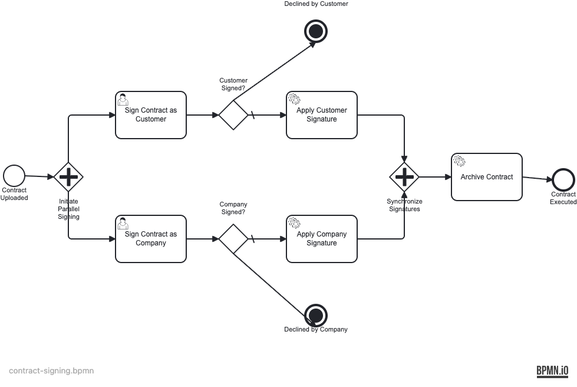

# uc-11-contract-signing — Safe Document Handling with Object Storage

Demonstrates how to orchestrate file-heavy processes safely: large documents live in S3-compatible object storage and the engine tracks only a lightweight reference key, never raw bytes.

## What you will learn

- How to keep large files out of the process database using S3-compatible object storage
- How to pass only S3 object keys between process variables, never file bytes
- How to stamp PDF documents with signature annotations using Apache PDFBox
- How to orchestrate multi-party signing with parallel gateways and terminate end events
- How to use terminate end events to cleanly cancel parallel flows when a signer declines

## Process model



## Prerequisites

- JDK 21
- Docker and Docker Compose
- `npm install -g bpmn-to-image` (to render BPMN diagrams locally)

## Run it

1. **Start the stack:**

```bash
docker compose up -d
```

2. **Run the application (Maven or Gradle):**

```bash
./mvnw spring-boot:run
```

or

```bash
./gradlew bootRun
```

3. **Access:**

- Operaton Cockpit: http://localhost:8080/cockpit (demo / demo)
- Operaton Tasklist: http://localhost:8080/tasklist (demo / demo)
- Object Storage (rustfs): http://localhost:9001 (minioadmin / minioadmin)

4. **Stop:**

```bash
docker compose down
```

## Walk through it

### Upload a contract

```bash
curl -X POST http://localhost:8080/contracts \
  -F "file=@sample-contract.pdf" \
  -F "customer=Alice" \
  -F "company=Operaton GmbH"
```

Response: `{"processInstanceId": "...", "businessKey": "...", "draftKey": "..."}`

### Customer signs

1. Open Tasklist: http://localhost:8080/tasklist
2. Log in as **alice** / alice
3. Claim "Sign contract — customer" task
4. Set `signDecision` to `"signed"` and complete

### Company signs

1. Log in as **bob** / bob
2. Claim "Sign contract — company" task
3. Set `signDecision` to `"signed"` and complete

### Monitor in Cockpit

1. Open http://localhost:8080/cockpit
2. Search for the contract by businessKey
3. Verify process ended at "Contract executed"
4. Check variables: `finalKey` and `documentHash` are set

### Decline scenario

1. Upload a new contract
2. As alice, set `signDecision = "declined"` and complete customer task
3. Process terminates at "Contract declined by customer"
4. Company task is never created (killed by terminate end event)

## How it works

### Safe document flow

- **ContractController.uploadContract()** [`src/main/java/org/operaton/examples/contractsigning/ContractController.java`] — Validates PDF, streams directly to rustfs (never materializes as a process variable), starts process with only the object key.
- **StampSignatureDelegate** [`src/main/java/org/operaton/examples/contractsigning/StampSignatureDelegate.java`] — Runs in parallel for each signer. Fetches draft PDF, stamps signature annotation (name, role, timestamp), stores stamped version under role-specific key.
- **ArchiveContractDelegate** [`src/main/java/org/operaton/examples/contractsigning/ArchiveContractDelegate.java`] — After both signatures applied, merges PDFs, computes final SHA-256 hash, stores as final artifact.

### Key design decisions

1. **No byte[] process variables** — Every PDF operation streams directly from/to rustfs. Prevents database bloat (the anti-pattern this example guards against).
2. **Role-specific keys** — Each parallel signer writes to its own S3 key (`customerSignedKey`, `companySignedKey`) to avoid write-races.
3. **Terminate end events** — When a signer declines, the terminate end event kills the other parallel branch cleanly, preventing dangling tasks.

## Run the tests

Tests use Testcontainers (PostgreSQL + rustfs in Docker) to verify the happy path (both sign) and decline path (one declines, other branch terminates).

```bash
./mvnw verify
```

or

```bash
./gradlew build
```

Tests verify:
- Happy path: both signers sign → process completes with `finalKey` and `documentHash` set
- Decline path: customer declines → instance terminates, company task never created
- Anti-pattern guard: no historic variable contains `byte[]`
