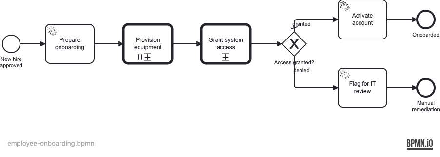
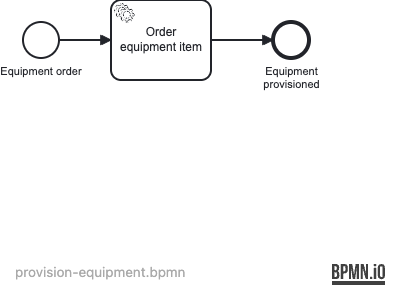
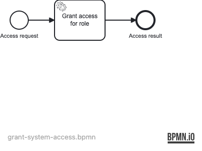

# Employee Onboarding

Demonstrates **call activity** process composition: a parent process orchestrates two reusable child process definitions, including a **parallel multi-instance call activity** that provisions a list of equipment items concurrently.

> **Note:** User tasks are modelled as service tasks so integration tests run without human interaction. A production process would use user tasks with form bindings.

## What you will learn

- How a `callActivity` element invokes a named child process definition by key, with `operaton:in` / `operaton:out` variable mapping
- How a **parallel multi-instance call activity** spawns one child process instance per item in a collection (`operaton:collection` / `operaton:elementVariable`)
- How to pass the current loop element to the child process using `operaton:in sourceExpression`
- How to route the parent process on a variable returned from a child process via `operaton:out`
- How to verify child process invocation counts and lineage using `historyService` with `superProcessInstanceId`

## Process model

**Parent — employee-onboarding:**



The parent orchestrates the full onboarding flow. The multi-instance call activity (denoted by three parallel lines at the bottom of the shape) creates one `provision-equipment` child instance per item in `equipmentList`. After all children complete, a single `grant-system-access` child determines whether the employee is onboarded directly or flagged for IT review.

**Child 1 — provision-equipment (called per equipment item):**



**Child 2 — grant-system-access (called once):**



Variable mappings:

| Direction | Variable in parent | Variable in child | Call activity |
|---|---|---|---|
| in | `equipmentItem` (element var) | `equipmentItem` | `CallActivity_ProvisionEquipment` (per instance) |
| in | `employeeId` | `employeeId` | `CallActivity_ProvisionEquipment` |
| in | `employeeId` | `employeeId` | `CallActivity_GrantAccess` |
| in | `role` | `role` | `CallActivity_GrantAccess` |
| out | `accessGranted` | `accessGranted` | `CallActivity_GrantAccess` |

## Prerequisites

- JDK 21
- Docker

## Run it

```bash
docker compose up -d
./mvnw spring-boot:run   # or: ./gradlew bootRun
```

Cockpit: http://localhost:8080 — login `demo` / `demo`

## Walk through it

**Happy path — engineer role, default equipment list:**

```bash
curl -X POST http://localhost:8080/engine-rest/process-definition/key/employee-onboarding/start \
  -H "Content-Type: application/json" \
  -d '{
    "businessKey": "EMP-001",
    "variables": {
      "employeeId":    { "value": "EMP-001",   "type": "String" },
      "role":          { "value": "engineer",  "type": "String" },
      "equipmentList": { "value": ["laptop","phone","badge"], "type": "Object",
                         "valueInfo": { "objectTypeName": "java.util.ArrayList", "serializationDataFormat": "application/json" } }
    }
  }'
```

Open Cockpit → History → completed instances. The parent ends at **"Onboarded"**. Under History → Process instances you will see three completed `provision-equipment` child instances, each with `superProcessInstanceId` pointing to the parent. The `grant-system-access` instance maps `accessGranted = true` back to the parent.

**Restricted role — access denied:**

```bash
curl -X POST http://localhost:8080/engine-rest/process-definition/key/employee-onboarding/start \
  -H "Content-Type: application/json" \
  -d '{
    "businessKey": "EMP-002",
    "variables": {
      "employeeId":    { "value": "EMP-002",    "type": "String" },
      "role":          { "value": "restricted", "type": "String" },
      "equipmentList": { "value": ["laptop"],   "type": "Object",
                         "valueInfo": { "objectTypeName": "java.util.ArrayList", "serializationDataFormat": "application/json" } }
    }
  }'
```

The parent ends at **"Manual remediation"**. Variable `itReviewRequired = true` is set. `accessGranted = false`.

## How it works

Three BPMN process definitions are deployed from the same Spring Boot application:
- [`employee-onboarding.bpmn`](src/main/resources/employee-onboarding.bpmn) — parent
- [`provision-equipment.bpmn`](src/main/resources/provision-equipment.bpmn) — child 1
- [`grant-system-access.bpmn`](src/main/resources/grant-system-access.bpmn) — child 2

| Delegate | Bean name | Variable output |
|---|---|---|
| `PrepareOnboardingDelegate` | `prepareOnboardingDelegate` | Sets `equipmentList` to default `["laptop","phone","badge"]` if null |
| `ProvisionItemDelegate` | `provisionItemDelegate` | Sets `provisioned = true` (in child scope) |
| `GrantAccessDelegate` | `grantAccessDelegate` | Sets `accessGranted = true` unless `role == "restricted"` |
| `ActivateAccountDelegate` | `activateAccountDelegate` | Logs account activation (no variable output) |
| `FlagForItReviewDelegate` | `flagForItReviewDelegate` | Sets `itReviewRequired = true` |

The multi-instance loop uses `operaton:collection="${equipmentList}"` and `operaton:elementVariable="equipmentItem"` on the `<bpmn:multiInstanceLoopCharacteristics>` element. `operaton:in sourceExpression="${equipmentItem}"` passes each element to its child process instance.

## Run the tests

```bash
./mvnw verify      # runs 4 ITs via maven-failsafe-plugin
./gradlew build    # same ITs via JUnit Platform
```

The ITs start a PostgreSQL container via Testcontainers and assert all three paths: happy path (3 child provision instances, ended at "Onboarded"), restricted role (ended at "Manual remediation", `itReviewRequired = true`), and custom collection (2-item list → exactly 2 child instances).
