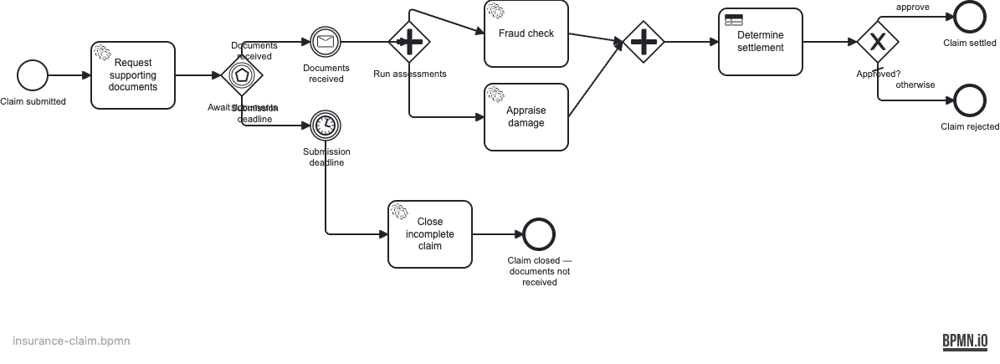

# Insurance Claim

Demonstrates the **event-based gateway** — a race between a message event (documents
received) and a timer event (submission deadline) — together with a **parallel gateway**
for concurrent fraud check and damage appraisal.

## What you will learn

- How to model an **event-based gateway** that races a message catch against a timer catch
- How to use a **parallel gateway** (AND-split / AND-join) for concurrent service calls
- How to correlate a message to a running process instance by **business key**
- How to evaluate a **DMN decision** from a business rule task using the FIRST hit policy with FEEL output expressions
- How to drive the ISO-8601 timer duration from a **process variable** (`${documentDeadline}`)

## Process model



## Prerequisites

- JDK 21
- Docker (for local PostgreSQL)

## Run it

Start the database:

```bash
docker compose up -d
```

Run the application:

```bash
./mvnw spring-boot:run
# or
./gradlew bootRun
```

Open Cockpit / Tasklist: http://localhost:8080  
Credentials: `demo` / `demo`

## Walk through it

**Happy path — collision claim, documents submitted on time:**

```bash
# 1. Start a claim
curl -s -X POST http://localhost:8080/engine-rest/process-definition/key/insurance-claim/start \
  -H "Content-Type: application/json" \
  -d '{
    "businessKey": "CLM-2024-001",
    "variables": {
      "claimNumber":    { "value": "CLM-2024-001", "type": "String" },
      "policyNumber":   { "value": "POL-999",      "type": "String" },
      "claimType":      { "value": "collision",    "type": "String" },
      "estimatedAmount":{ "value": 800.0,          "type": "Double" },
      "documentDeadline":{ "value": "P14D",        "type": "String" }
    }
  }'

# 2. Submit the documents (correlate message by business key)
curl -s -X POST http://localhost:8080/engine-rest/message \
  -H "Content-Type: application/json" \
  -d '{
    "messageName": "documentsReceived",
    "businessKey": "CLM-2024-001"
  }'

# 3. Check the result in Cockpit — the instance should be completed at "Claim settled"
```

**Timeout path — no documents submitted:**

Start a claim with `documentDeadline: "PT30S"` and do NOT send the message.
After 30 seconds the process closes automatically at "Claim closed — documents not received".

**Reject path — flood damage:**

Start a claim with `claimType: "flood"`, submit documents, and observe that the
DMN decision routes to "Claim rejected" regardless of the amount.

## How it works

The process starts at `StartEvent_ClaimSubmitted` and immediately requests documents
via `RequestDocumentsDelegate` (logs the request — in a real system, sends an email).

The **event-based gateway** (`Gateway_AwaitDocuments`) opens two competing subscriptions:
a message subscription for `documentsReceived` and a timer subscription for the duration
in `${documentDeadline}`. Whichever fires first wins; the other is automatically cancelled
by the engine.

If documents arrive first, the **parallel gateway** (`Gateway_AssessmentSplit`) fans out
to two concurrent service tasks:
- `FraudCheckDelegate` — sets `fraudSuspected = (estimatedAmount > 100,000)`
- `AppraiseDamageDelegate` — sets `appraisedAmount = estimatedAmount × 0.9`

The **AND-join** (`Gateway_AssessmentJoin`) waits for both before the business rule task
evaluates `claim-settlement.dmn`. The DMN uses FIRST hit policy: fraud or flood → reject;
small amounts → approve full appraised; medium → approve at 80%; large → reject.

If the deadline fires first, `CloseIncompleteClaimDelegate` logs the closure and the
process ends at `EndEvent_ClaimClosed`.

## Run the tests

```bash
./mvnw verify
# or
./gradlew build
```

The integration tests (`InsuranceClaimIT`) run three scenarios against Testcontainers PostgreSQL:
happy path (collision/800 → settled), reject path (flood → rejected), and timeout path
(PT3S deadline, no message → closed).
