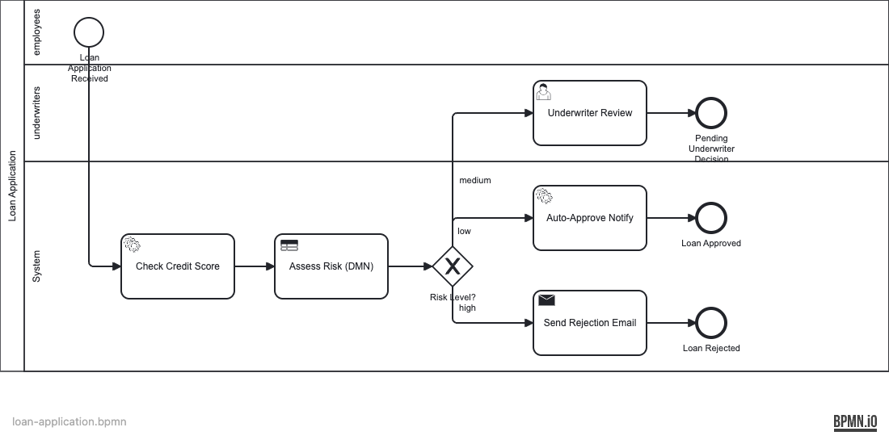

# Operaton Use Case 02 — Loan Application

A self-contained Operaton example for **loan application triage** that combines a credit-score service call, DMN evaluation, and conditional user-task routing.

## Scenario

Each loan application collects a requested `loanAmount`. The workflow enriches that request with a credit score from WireMock, evaluates the DMN decision table, and then routes the application based on the computed `riskLevel`.

## Actors

| Actor | Username | Group | Responsibility |
|------|----------|-------|----------------|
| Applicant | `alice` / `alice` | `employees` | Starts the process with a `loanAmount` |
| Underwriter | `eve` / `eve` | `underwriters` | Reviews only medium-risk applications |
| Decision automation | system | n/a | Calls the credit-score API and evaluates the DMN table |

## Starting the Process

Log in as **alice / alice** (group: `employees`) in Tasklist to start this process. Only members of the `employees` group can initiate a loan application — this is enforced by `candidateStarterGroups` on the process definition.

## Main Flow

1. A caller starts `loan-application` with `loanAmount`.
2. `CreditScoreDelegate` calls the WireMock credit-score endpoint and stores `creditScore`.
3. The BPMN business-rule task evaluates `risk-assessment.dmn` and writes `riskLevel`.
4. The exclusive gateway routes by risk:
   - `low` → auto-approve notification
   - `medium` → **Underwriter Review**
   - `high` → auto-reject notification
5. Medium-risk applications end only after Eve claims and completes the underwriter task.

## Alternate Paths

### Low-risk path

The application never waits on a human. A favorable score and amount combination drives the process straight to the approval notification task and then to completion.

### Medium-risk path

The workflow pauses in Tasklist for the `underwriters` group. This is the only human-in-the-loop branch and is the best path for learning how DMN outputs influence BPMN routing.

### High-risk path

If the DMN decision returns `high`, the process skips the user task completely and sends the rejection notification automatically.

## Process Model




## Risk Rules Reference

- The decision table, not handwritten Java branching, defines the risk thresholds.
- `creditScore` is supplied by the external API delegate before DMN evaluation.
- `riskLevel` is a process variable, so you can inspect the decision outcome directly in Cockpit.
- WireMock is the only external dependency for the example; no real credit bureau integration is required.

## Prerequisites

- Java 21+
- Docker (for PostgreSQL, WireMock, and Mailpit)
- Maven wrapper included (`./mvnw`) or Gradle wrapper (`./gradlew`)

## Run It

### 1. Start dependencies

```bash
docker compose up -d
```

Services started:
- PostgreSQL on port 5432 (credentials: operaton/operaton)
- WireMock on port 8089 (credit-score stub)
- Mailpit SMTP on port 1025 / Web UI on port 8025

### 2. Run the application

```bash
./mvnw spring-boot:run
# or
./gradlew bootRun
```

### 3. Open the web apps

- Tasklist: http://localhost:8080/operaton/app/tasklist
- Cockpit: http://localhost:8080/operaton/app/cockpit
- Mailpit: http://localhost:8025

Login: `demo` / `demo`

## Walk Through It

### Default low-risk example

```bash
curl -s -u alice:alice -X POST http://localhost:8080/engine-rest/process-definition/key/loan-application/start \
  -H "Content-Type: application/json" \
  -d '{
    "variables": {
      "loanAmount": {"value": 100000, "type": "Integer"},
      "applicantEmail": {"value": "alice@example.com", "type": "String"}
    }
  }'
```

With the default WireMock response (score 750), the DMN table routes the instance to the low-risk auto-approval path.

### Medium-risk example

```bash
curl -s -u alice:alice -X POST http://localhost:8080/engine-rest/process-definition/key/loan-application/start \
  -H "Content-Type: application/json" \
  -d '{
    "variables": {
      "creditScore": {"value": 650, "type": "Integer"},
      "loanAmount": {"value": 100000, "type": "Integer"},
      "applicantEmail": {"value": "alice@example.com", "type": "String"}
    }
  }'
```

Eve (`eve / eve`) will receive **Underwriter Review** in Tasklist.

### High-risk example

```bash
curl -s -u alice:alice -X POST http://localhost:8080/engine-rest/process-definition/key/loan-application/start \
  -H "Content-Type: application/json" \
  -d '{
    "variables": {
      "creditScore": {"value": 500, "type": "Integer"},
      "loanAmount": {"value": 100000, "type": "Integer"},
      "applicantEmail": {"value": "alice@example.com", "type": "String"}
    }
  }'
```

The process skips the user task and sends a rejection email. View it in Mailpit at http://localhost:8025.

### List open underwriter tasks

```bash
curl -s http://localhost:8080/engine-rest/task?processDefinitionKey=loan-application
```

### Complete an underwriter review task

```bash
TASK_ID=<id from previous response>
curl -s -X POST \
  http://localhost:8080/engine-rest/task/${TASK_ID}/complete \
  -H "Content-Type: application/json" \
  -d '{"variables": {}}'
```

## How It Works

- **`loan-application.bpmn`** — the process definition with three lanes (employees, underwriters, system) and three outcome paths.
- **`risk-assessment.dmn`** — FIRST-hit decision table mapping credit score + loan amount to a `riskLevel` string (`low`, `medium`, `high`).
- **`CreditScoreDelegate`** (`delegate/CreditScoreDelegate.java`) — calls the credit-score REST endpoint and stores the score as a process variable. Accepts a pre-set `creditScore` variable to bypass the API call (useful in tests).
- **`NotificationDelegate`** (`delegate/NotificationDelegate.java`) — sets `loanDecision=APPROVED` for low-risk approvals.
- **`RejectionEmailDelegate`** (`delegate/RejectionEmailDelegate.java`) — sets `loanDecision=REJECTED` and sends an email via Spring Mail.
- **`DataInitializer`** (`DataInitializer.java`) — seeds groups (`employees`, `underwriters`) and users (`alice`, `eve`) at startup.

## Run the Tests

```bash
./mvnw verify
# or
./gradlew build
```

`LoanApplicationIT` starts PostgreSQL and WireMock via Testcontainers, then covers:
- Process definition and DMN deployment verification
- Isolated DMN evaluation for all three risk levels
- Business-key querying
- End-to-end process execution for all three risk paths (low, medium, high)

## Email Testing with Mailpit

When running with Docker Compose, Mailpit captures all outgoing emails locally.

Access the Mailpit web UI at: http://localhost:8025

To see rejection emails, start processes with high-risk loan amounts that trigger auto-rejection.
Users that may receive emails: applicants whose `applicantEmail` variable is set when starting the process.
