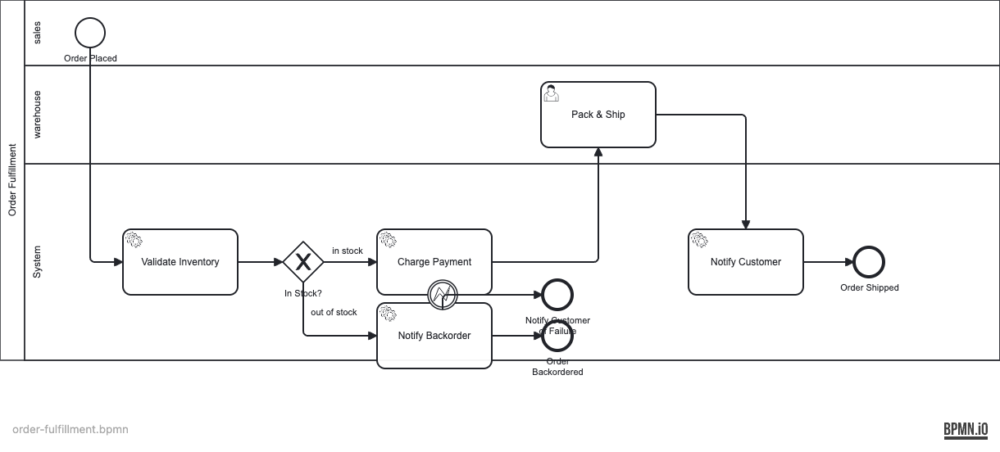

# Operaton Use Case 04 — Order Fulfillment

A self-contained Operaton example for **order fulfillment orchestration** across inventory, payment, warehouse, and customer-notification steps.

## What You Will Learn

- How to use an **exclusive gateway** to branch on inventory availability
- How to use a **BPMN error boundary event** to handle payment failures
- How to wire named Spring beans via `operaton:delegateExpression`
- How to model an `operaton:asyncBefore` service task for job-executor control
- End-to-end IT with Testcontainers (PostgreSQL + WireMock)

## Process Model




## Scenario

Each order starts with an `orderId`. The process checks inventory first, then branches: in-stock orders proceed to payment and warehouse fulfillment; out-of-stock orders go straight to a backorder notification. A BPMN error boundary event on the payment task handles payment failures.

## Actors

| Actor | Username | Group | Responsibility |
|------|----------|-------|----------------|
| Customer / caller | `frank` / `frank` | `sales` | Starts the order process |
| Warehouse operator | `dave` / `dave` | `warehouse` | Packs and ships in-stock orders |
| Automation | system | n/a | Calls inventory, payment, and notification endpoints |
| Admin | `admin` / `admin` | `operaton-admin` | Operaton administration only |

## Prerequisites

- JDK 21+
- Docker

## Run It

### 1. Start dependencies

```bash
docker compose up -d
```

### 2. Run the application

```bash
./mvnw spring-boot:run
# or
./gradlew bootRun
```

### 3. Open the web apps

- Tasklist: http://localhost:8080/operaton/app/tasklist (demo / demo)
- Cockpit: http://localhost:8080/operaton/app/cockpit (demo / demo)

## Walk Through It

### In-stock order (happy path)

```bash
curl -s -X POST http://localhost:8080/engine-rest/process-definition/key/order-fulfillment/start \
  -H "Content-Type: application/json" \
  -d '{"variables": {"orderId": {"value": "ORD-001", "type": "String"}}}'
```

The default inventory stub returns `available: true`, so payment runs and Dave (`dave / dave`) receives **Pack & Ship**.

### Out-of-stock order

Start the process with an `orderId` that begins with `out-of-stock-`:

```bash
curl -s -X POST http://localhost:8080/engine-rest/process-definition/key/order-fulfillment/start \
  -H "Content-Type: application/json" \
  -d '{"variables": {"orderId": {"value": "out-of-stock-ORD-002", "type": "String"}}}'
```

The inventory stub returns `available: false`, and the process goes straight to the backorder notification branch with no warehouse task.

### Complete the Pack & Ship task

```bash
curl -u dave:dave -X POST \
  http://localhost:8080/engine-rest/task/{taskId}/complete \
  -H 'Content-Type: application/json' \
  -d '{}'
```

### Suspend a running process instance

```bash
curl -u admin:admin -X PUT \
  http://localhost:8080/engine-rest/process-instance/{processInstanceId}/suspended \
  -H 'Content-Type: application/json' \
  -d '{"suspended": true}'
```

## How It Works

- **`order-fulfillment.bpmn`** — defines the process with an exclusive gateway (`Gateway_InStock`), an error boundary event (`ErrorBoundary_Payment`) on the payment task, and `operaton:asyncBefore` on `Task_ChargePayment` for async continuation.
- **`InventoryDelegate`** — calls `/inventory/{orderId}` and sets the `available` process variable.
- **`PaymentDelegate`** — calls `/payments` or throws `BpmnError("PAYMENT_FAILED")` when `simulatePaymentFailure` is set.
- **`NotifyCustomerDelegate`** — calls `/notifications/customer` and sets `orderStatus = FULFILLED`.
- **`NotifyBackorderDelegate`** — calls `/notifications/backorder`.
- **`DataInitializer`** — seeds groups (`warehouse`, `sales`, `operaton-admin`) and users (`dave`, `frank`, `admin`) idempotently on startup.

## Run the Tests

```bash
./mvnw verify
# or
./gradlew build
```

`OrderFulfillmentIT` verifies five scenarios against a real PostgreSQL database (via Testcontainers): process deployment, the in-stock warehouse path, the out-of-stock backorder path, the payment failure error boundary path, and suspend/activate of a process instance.

## Project Structure

```
src/
  main/
    java/org/operaton/examples/orderfulfillment/
      OrderFulfillmentApplication.java
      DataInitializer.java
      delegate/
        InventoryDelegate.java
        PaymentDelegate.java
        NotifyCustomerDelegate.java
        NotifyBackorderDelegate.java
    resources/
      order-fulfillment.bpmn
      application.yaml
  test/
    java/org/operaton/examples/orderfulfillment/
      OrderFulfillmentIT.java
    resources/
      wiremock/mappings/
        inventory-in-stock.json
        inventory-out-of-stock.json
        payment-success.json
        notify-customer.json
        notify-backorder.json
```
