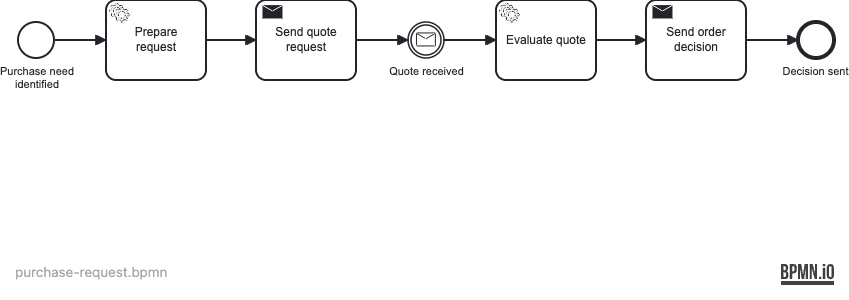
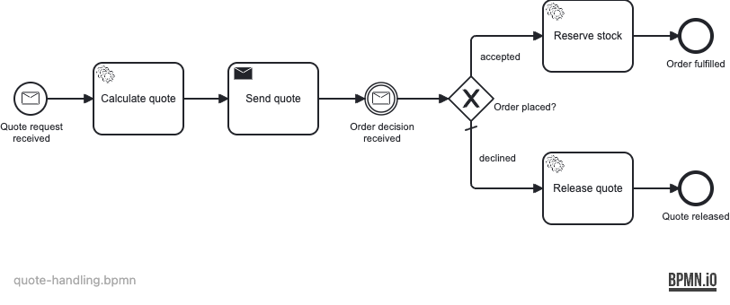

# Procurement Collaboration (Buyer ↔ Supplier)

Two-pool BPMN collaboration between a Buyer process and a Supplier process, communicating via three correlated messages within one Operaton engine.

## What you will learn

- How to model BPMN message flow between two pools and realize it with the Operaton Correlation API
- How `correlateStartMessage()` starts a new process instance by message name
- How `processInstanceVariableEquals()` routes a message to the correct counterpart instance using a correlation key
- Why `asyncBefore` on the supplier start event and `asyncAfter` on the buyer intermediate catch event prevent correlation timing races by ensuring each process registers its subscription before the counterpart's job fires

## Process model

### Buyer — purchase-request



### Supplier — quote-handling



## Prerequisites

- JDK 21+
- Docker

## Run it

Start PostgreSQL:

```bash
docker compose up -d
```

Run the application (Maven or Gradle):

```bash
./mvnw spring-boot:run
# or
./gradlew bootRun
```

Open Cockpit/Tasklist: http://localhost:8080 — credentials `demo` / `demo`.

## Walk through it

Start a buyer instance via the Operaton REST API:

```bash
curl -s -u demo:demo -X POST http://localhost:8080/engine-rest/process-definition/key/purchase-request/start \
  -H "Content-Type: application/json" \
  -d '{"variables": {"requestId": {"value":"REQ-001","type":"String"}, "item": {"value":"laptop","type":"String"}, "quantity": {"value":2,"type":"Integer"}, "maxBudget": {"value":5000,"type":"Integer"}}}'
```

1. The buyer's **Prepare request** task runs and normalises variables.
2. **Send quote request** calls `correlateStartMessage("QuoteRequest")`, which starts a supplier instance with `requestId=REQ-001`.
3. The supplier calculates `totalPrice = 100 × 2 = 200` and correlates `QuoteResponse` back to the buyer using `processInstanceVariableEquals("requestId", "REQ-001")`.
4. The buyer evaluates `200 ≤ 5000` → `accepted=true` and correlates `OrderDecision` to the supplier.
5. The supplier gateway routes to **Reserve stock** → **Order fulfilled**.

To test the over-budget path, set `maxBudget` to `100` (total `200 > 100`). The supplier routes to **Release quote** instead.

## How it works

- [`purchase-request.bpmn`](src/main/resources/purchase-request.bpmn) — Buyer: linear flow with a send task, an intermediate message catch event (`asyncAfter`), and a second send task.
- [`quote-handling.bpmn`](src/main/resources/quote-handling.bpmn) — Supplier: message start event (`asyncBefore`), send task, intermediate message catch event (no additional async attribute), and an exclusive gateway routing on `${accepted}`.
- [`SendQuoteRequestDelegate`](src/main/java/org/operaton/examples/procurementcollaboration/SendQuoteRequestDelegate.java) calls `runtimeService.createMessageCorrelation("QuoteRequest").setVariable(...).correlateStartMessage()`.
- [`SendQuoteResponseDelegate`](src/main/java/org/operaton/examples/procurementcollaboration/SendQuoteResponseDelegate.java) and [`SendOrderDecisionDelegate`](src/main/java/org/operaton/examples/procurementcollaboration/SendOrderDecisionDelegate.java) both call `.processInstanceVariableEquals("requestId", requestId).correlate()`.
- The two async boundaries are: `asyncBefore` on the supplier start event (so `correlateStartMessage()` returns before the supplier runs) and `asyncAfter` on the buyer intermediate catch event (the buyer subscribes synchronously but exits via a job after receiving the QuoteResponse — this ensures the buyer's EvaluateQuote + SendOrderDecision runs as a separate job, after the supplier has already registered its OrderDecision subscription). The supplier intermediate catch event has no additional async attribute because the supplier registers its subscription synchronously in the SendQuote transaction, before the buyer's async job fires.
- This example correlates within one engine. Cross-system messaging over a broker (Kafka/JMS) requires a different architecture; that is out of scope here.

## Run the tests

```bash
./mvnw verify
# or
./gradlew build
```

The integration tests use Testcontainers (PostgreSQL) and Awaitility. They prove: both process definitions deploy (`processDefinitionsAreDeployed`), the within-budget path completes with `accepted=true` and `reserved=true` on the supplier (`withinBudget_orderIsPlaced_supplierReservesStock`), the over-budget path completes with `accepted=false` and the supplier released (`overBudget_orderDeclined_supplierReleasesQuote`), and two concurrent buyers each receive their own `totalPrice` without responses crossing (`correlation_linksResponseToOriginatingBuyer`).
