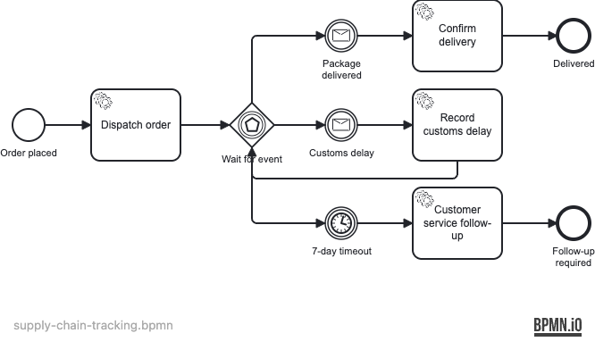

# Supply Chain Tracking

A long-running process instance that parks at an **event-based gateway** waiting for asynchronous
Kafka messages — `PackageDelivered` or `CustomsDelay` — correlated to the right instance by
**tracking number (business key)**, with a 7-day timer as a customer-service safety net.

## What you will learn

- How to model an **event-based gateway** that races multiple async sources (two messages, one timer)
- Correlating **Kafka messages to a specific waiting process instance** by business key
- How the P7D timer **re-arms on each loop** — it is "7 days since the last event", not an absolute deadline
- Handling `MismatchingMessageCorrelationException` to safely drop events for unknown tracking numbers
- Testing timer paths with `ClockUtil` and Awaitility — no `Thread.sleep`

## Process model



The `CustomsDelay` branch loops back into the event-based gateway. Each re-entry re-arms the P7D
timer from that moment — a direct consequence of modeling with a single gateway rather than a
timer-boundary on a wrapping subprocess.

> To render the PNG yourself: `./scripts/render-bpmn.sh examples/use-cases/supply-chain-tracking`
> (requires `npm install -g bpmn-to-image`).

## Prerequisites

- JDK 21
- Docker (recent version)

## Run it

```bash
docker compose up -d
./mvnw spring-boot:run
# or:
./gradlew bootRun
```

Cockpit/Tasklist: http://localhost:8080 — demo/demo

Kafka broker: `localhost:9092` (KRaft mode, no ZooKeeper)

## Walk through it

### Dispatch a shipment

```bash
curl -X POST http://localhost:8080/shipments \
  -H "Content-Type: application/json" \
  -d '{"orderId":"ORD-001","trackingNumber":"TRK-001","destination":"Berlin"}'
```

### Happy path — package delivered

```bash
curl -X POST http://localhost:8080/shipments/TRK-001/events/delivered
```

The Kafka listener correlates `PackageDelivered` to the waiting instance; the process completes at
*Delivered*.

### Alternative path — customs delay then delivery

```bash
# Start a second shipment
curl -X POST http://localhost:8080/shipments \
  -H "Content-Type: application/json" \
  -d '{"orderId":"ORD-002","trackingNumber":"TRK-002","destination":"Tokyo"}'

# Record customs delay (re-arms the 7-day timer)
curl -X POST http://localhost:8080/shipments/TRK-002/events/customs-delay \
  -H "Content-Type: application/json" \
  -d '{"eta":"2026-08-01"}'

# Then deliver
curl -X POST http://localhost:8080/shipments/TRK-002/events/delivered
```

## How it works

| Model element | Code |
|---|---|
| `Dispatch order` | [`DispatchOrderDelegate`](src/main/java/org/operaton/examples/supplychaintracking/delegate/DispatchOrderDelegate.java) — sets `status=IN_TRANSIT`, `dispatchedAt`, initial `eta` |
| `PackageDelivered` catch | [`ShipmentEventListener#onPackageDelivered`](src/main/java/org/operaton/examples/supplychaintracking/ShipmentEventListener.java) — correlates by business key |
| `Confirm delivery` | [`ConfirmDeliveryDelegate`](src/main/java/org/operaton/examples/supplychaintracking/delegate/ConfirmDeliveryDelegate.java) — sets `deliveredAt`, `status=DELIVERED` |
| `CustomsDelay` catch | [`ShipmentEventListener#onCustomsDelay`](src/main/java/org/operaton/examples/supplychaintracking/ShipmentEventListener.java) — correlates by business key |
| `Record customs delay` | [`RecordCustomsDelayDelegate`](src/main/java/org/operaton/examples/supplychaintracking/delegate/RecordCustomsDelayDelegate.java) — increments `delayCount`, extends `eta`, re-enters gateway |
| `7-day timeout` | BPMN `timeDuration=P7D` — fires if no event arrives within 7 days **of gateway entry** |
| `Customer service follow-up` | [`CustomerServiceFollowupDelegate`](src/main/java/org/operaton/examples/supplychaintracking/delegate/CustomerServiceFollowupDelegate.java) — sets `status=FOLLOW_UP_REQUIRED` |

`ShipmentController` starts process instances and publishes Kafka events. `ShipmentEventListener`
correlates those events to waiting instances using
`runtimeService.createMessageCorrelation(name).processInstanceBusinessKey(trackingNumber).correlate()`.
Unknown tracking numbers raise `MismatchingMessageCorrelationException`, which the listener catches
and logs as a warning — the event is dropped without infinite redelivery.

## Run the tests

```bash
./mvnw verify      # failsafe runs SupplyChainTrackingIT — 4 tests
./gradlew build    # Gradle JUnit Platform runs the same 4 tests
```

Tests cover: happy path (PackageDelivered), customs delay then delivery, 7-day timer (ClockUtil),
and business-key isolation across two concurrent shipment instances.
