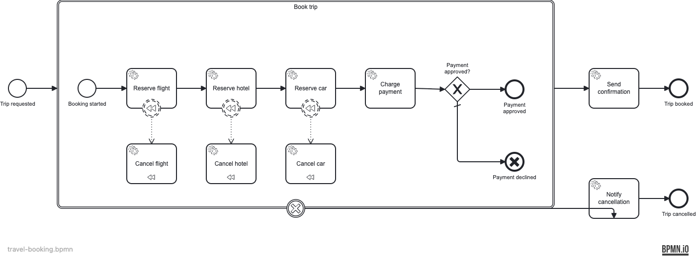

# Travel Booking SAGA

Demonstrates the BPMN **transaction subprocess** with a **cancel end event** and **cancel boundary event** — the canonical SAGA pattern for all-or-nothing distributed reservations.

## What you will learn

- How a `<bpmn:transaction>` subprocess models an all-or-nothing unit of work
- How a **cancel end event** inside the transaction triggers cancellation and automatically fires compensation for every completed activity
- How a **cancel boundary event** on the outer transaction element routes the cancelled outcome to a separate flow
- How **compensation boundary events** are wired to compensation handler tasks (`isForCompensation="true"`) via associations
- The difference from manual compensation (see `error-compensation`): here, compensation is triggered *implicitly* by transaction cancellation — not thrown by hand

## Process model



The "Book trip" transaction subprocess reserves flight → hotel → car sequentially, then charges payment. If the total exceeds the budget, the cancel end event fires, rolling back all reservations automatically. If payment succeeds, the transaction completes normally and a confirmation is sent.

## Prerequisites

- JDK 21
- Docker (for local run and integration tests)

## Run it

```bash
docker compose up -d
./mvnw spring-boot:run   # or: ./gradlew bootRun
```

Cockpit: http://localhost:8080 — login `demo` / `demo`

## Walk through it

**Happy path — within budget:**

```bash
curl -X POST http://localhost:8080/engine-rest/process-definition/key/travel-booking/start \
  -H "Content-Type: application/json" \
  -d '{
    "businessKey": "TRIP-HAPPY",
    "variables": {
      "tripId":      { "value": "TRIP-HAPPY", "type": "String" },
      "customer":    { "value": "Alice",      "type": "String" },
      "destination": { "value": "Paris",      "type": "String" },
      "budget":      { "value": 2000,         "type": "Double" },
      "flightPrice": { "value": 800,          "type": "Double" },
      "hotelPrice":  { "value": 300,          "type": "Double" },
      "carPrice":    { "value": 100,          "type": "Double" }
    }
  }'
```

Open Cockpit → History → completed instances. The instance ends at **"Trip booked"**. Variables `flightRef`, `hotelRef`, `carRef` are set; `paymentApproved = true`.

**Cancel path — over budget:**

```bash
curl -X POST http://localhost:8080/engine-rest/process-definition/key/travel-booking/start \
  -H "Content-Type: application/json" \
  -d '{
    "businessKey": "TRIP-CANCEL",
    "variables": {
      "tripId":      { "value": "TRIP-CANCEL", "type": "String" },
      "customer":    { "value": "Bob",         "type": "String" },
      "destination": { "value": "Tokyo",       "type": "String" },
      "budget":      { "value": 1000,          "type": "Double" },
      "flightPrice": { "value": 800,           "type": "Double" },
      "hotelPrice":  { "value": 300,           "type": "Double" },
      "carPrice":    { "value": 100,           "type": "Double" }
    }
  }'
```

The instance ends at **"Trip cancelled"**. Variables `flightCancelled`, `hotelCancelled`, `carCancelled` are all `true` — the compensation handlers ran automatically. `paymentApproved = false`.

## How it works

The BPMN transaction subprocess ([`travel-booking.bpmn`](src/main/resources/travel-booking.bpmn)) wraps all booking steps. Each reservation task has a compensation boundary event wired (via association) to its compensation handler:

| Reservation task | Compensation handler |
|---|---|
| `ReserveFlightDelegate` | `CancelFlightDelegate` — sets `flightCancelled = true` |
| `ReserveHotelDelegate` | `CancelHotelDelegate` — sets `hotelCancelled = true` |
| `ReserveCarDelegate` | `CancelCarDelegate` — sets `carCancelled = true` |

`ChargePaymentDelegate` computes `total = flightPrice + hotelPrice + carPrice` and sets `paymentApproved = total <= budget`. The XOR gateway routes to either the normal end event or the **cancel end event**.

When the cancel end event fires, the BPMN engine automatically compensates every completed task in the transaction (in reverse completion order), then continues from the cancel boundary event on the outer transaction to `NotifyCancellationDelegate` → "Trip cancelled" end event.

## Run the tests

```bash
./mvnw verify      # runs 3 ITs via maven-failsafe-plugin
./gradlew build    # same ITs via JUnit Platform
```

The ITs start a PostgreSQL container via Testcontainers, deploy the BPMN, run the happy path and the cancel/compensation path, and assert end states and variable values.
