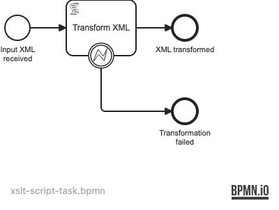

# XSLT Script Task

Demonstrates XML data transformation inside a BPMN **script task** using
a Groovy script and Java's built-in `javax.xml.transform` XSLT API — no
external script engine extension required.

## What you will learn

- How to write a Groovy `scriptFormat="groovy"` script task that transforms
  an XML process variable using `javax.xml.transform.TransformerFactory`
- How to load an XSLT stylesheet from the classpath inside a Groovy script
- How to attach a boundary error event to a script task and handle
  transformation failures gracefully via `BpmnError`
- How to pass XML content between process steps via string variables

## Process model



The script task reads the `inputXml` variable, applies `transform.xsl`
(classpath resource), and writes the result to `transformedXml`. If the
input is not valid XML, the Groovy script throws a `BpmnError` caught by
the boundary error event, routing the process to the "Transformation failed"
end event.

## Prerequisites

| Tool | Version |
|---|---|
| JDK | 21 |
| Docker | any recent |

## Run it

```bash
docker compose up -d --wait
./mvnw spring-boot:run      # or: ./gradlew bootRun
```

Open http://localhost:8080 — Cockpit, login `demo` / `demo`.

Start a process with a sample XML order:

```bash
curl -u demo:demo -H 'Content-Type: application/json' \
  -d '{"variables":{"inputXml":{"value":"<order><id>ORD-001</id><customer>Alice Smith</customer><amount>250.00</amount></order>","type":"String"}}}' \
  http://localhost:8080/engine-rest/process-definition/key/xslt-script-task/start
```

## Walk through it

**Happy path — valid XML order:**

1. Start the process with the `curl` command above.
2. In Cockpit, open the completed instance and inspect the `transformedXml`
   variable. It contains an `<invoice>` document with `INV-ORD-001`.

**Error path — invalid XML:**

```bash
curl -u demo:demo -H 'Content-Type: application/json' \
  -d '{"variables":{"inputXml":{"value":"not xml << invalid","type":"String"}}}' \
  http://localhost:8080/engine-rest/process-definition/key/xslt-script-task/start
```

The process ends at the "Transformation failed" end event; no `transformedXml`
variable is set.

## How it works

- [`xslt-script-task.bpmn`](src/main/resources/xslt-script-task.bpmn) —
  the script task has `scriptFormat="groovy"` with an inline Groovy script.
  The script uses `Thread.currentThread().contextClassLoader` to load the
  XSLT stylesheet, then applies it with `TransformerFactory.newInstance()`.
  On failure it throws `new BpmnError("transform-error", ...)` which the
  boundary error event catches.
- [`transform.xsl`](src/main/resources/org/operaton/examples/xsltscripttask/transform.xsl) —
  transforms `<order>` documents to `<invoice>` shape.

## Run the tests

```bash
./mvnw verify        # or: ./gradlew build
```

[`XsltScriptTaskIT`](src/test/java/org/operaton/examples/xsltscripttask/XsltScriptTaskIT.java)
boots the application against a Testcontainers PostgreSQL and verifies two
scenarios: valid XML produces the expected `<invoice>` document; invalid XML
routes through the error boundary to the "Transformation failed" end event.
