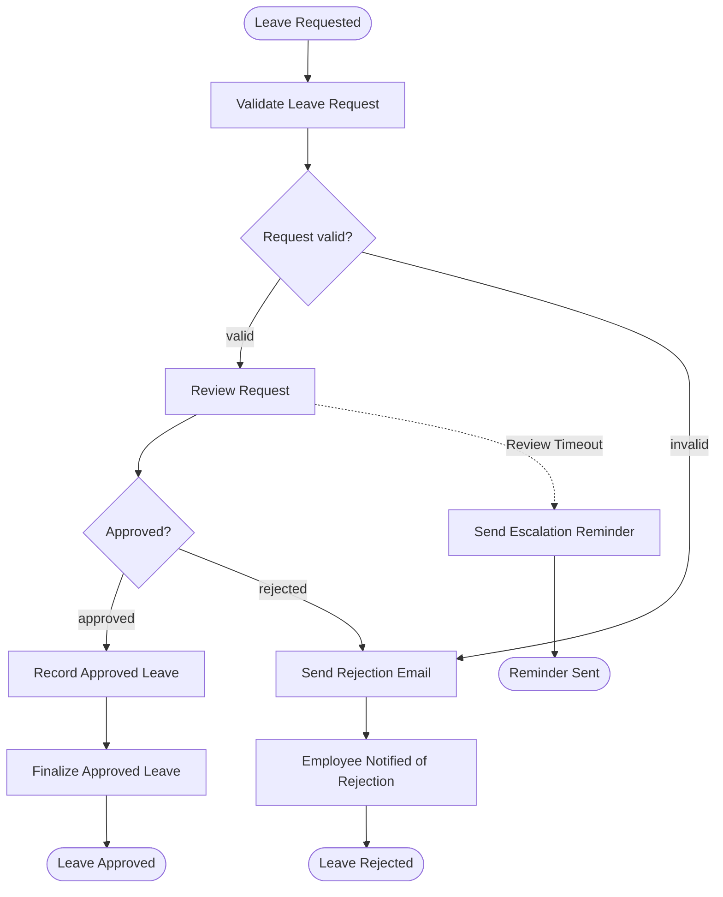

# Operaton Use Case 01 — Leave Request

A self-contained Operaton example for a realistic **leave request approval workflow** with persisted vacation balances.

## What You Will Learn

- How to model a multi-lane approval workflow with validation, manager review, and HR finalization
- How to persist domain state (vacation balances) in a custom table alongside the process engine database
- How to use `operaton:initiator` to capture the authenticated user who started a process
- How to send rejection emails via Spring Mail from a delegate expression
- How to test end-to-end process execution with Testcontainers PostgreSQL

## Process Model



## Actors

| Actor | Username | Group | Responsibility |
|-------|----------|-------|----------------|
| Employee | `alice` / `alice` | `employees` | Starts leave requests and receives rejection notifications |
| Manager | `bob` / `bob` | `managers` | Approves or rejects valid leave requests |
| HR | `carol` / `carol` | `hr` | Finalizes approved leave so the persisted balance is reduced |
| Admin | `admin` / `admin` | `operaton-admin` | Operaton administration only |

## Prerequisites

- JDK 21
- Docker (for PostgreSQL and Mailpit)
- Maven wrapper included (`./mvnw`) or Gradle wrapper (`./gradlew`)

## Run It

### 1. Start the services

```bash
docker compose up -d
```

This starts PostgreSQL on port 5432 and Mailpit SMTP on port 1025 (web UI at http://localhost:8025).

### 2. Run the application

```bash
./mvnw spring-boot:run
# or
./gradlew bootRun
```

The application starts on port 8080.

### 3. Open the web apps

- Tasklist: http://localhost:8080/operaton/app/tasklist
- Cockpit: http://localhost:8080/operaton/app/cockpit
- Admin (demo/demo): http://localhost:8080/operaton/app/admin

## Walk Through It

### Happy path

1. Log in as `alice / alice` in Tasklist.
2. Start **Leave Request Approval** and enter:
   - `startDate` = today or later (ISO format: `2030-07-01`)
   - `durationDays` = any value up to 30
3. Log in as `bob / bob`, claim **Review Request**, and complete it with `Approved = true`.
4. Log in as `carol / carol`, claim **Record Approved Leave**, and complete it.
5. Check Cockpit — Alice's vacation balance is now reduced by `durationDays`.

### Past-date rejection

Start the process with `startDate` before today. No manager task is created. Alice immediately sees **Employee Notified of Rejection** with `rejectionReason = Start date must be today or later.`

### Over-balance rejection

After approving one valid request, start another request for Alice with `durationDays` greater than the updated balance. The second instance is rejected automatically before manager review.

### REST API (curl)

```bash
# Start a leave request as Alice
curl -u alice:alice -X POST \
  http://localhost:8080/engine-rest/process-definition/key/leave-request/start \
  -H 'Content-Type: application/json' \
  -d '{"variables": {"startDate": {"value": "2030-07-01", "type": "String"}, "durationDays": {"value": 5, "type": "Integer"}}}'

# List active tasks
curl -u alice:alice \
  'http://localhost:8080/engine-rest/task?processDefinitionKey=leave-request'

# Complete manager review (approve) — replace {taskId}
curl -u bob:bob -X POST \
  http://localhost:8080/engine-rest/task/{taskId}/complete \
  -H 'Content-Type: application/json' \
  -d '{"variables": {"approved": {"value": true, "type": "Boolean"}}}'

# Complete HR records task — replace {taskId}
curl -u carol:carol -X POST \
  http://localhost:8080/engine-rest/task/{taskId}/complete \
  -H 'Content-Type: application/json' \
  -d '{}'
```

## How It Works

- `leave-request.bpmn` — the process model with four swim lanes: employees, managers, HR, and system
- `LeaveRequestValidationDelegate` — validates start date, duration, and remaining balance; sets `validationPassed`
- `FinalizeLeaveApprovalDelegate` — deducts vacation days from `employee_vacation_balance` after HR approval
- `LeaveRejectionEmailDelegate` — sends a rejection email via Spring Mail (Mailpit catches it locally)
- `EscalationReminderDelegate` — fires on non-interrupting timer boundary if manager review times out (default 72h)
- `VacationBalanceService` — single source of truth for reading and deducting balances via JDBC
- `DataInitializer` — seeds users, groups, memberships, and Alice's initial 30-day balance at startup
- `schema.sql` — creates the `employee_vacation_balance` table (PostgreSQL)

## Run the Tests

```bash
./mvnw verify
# or
./gradlew build
```

`LeaveRequestIT` runs against a real PostgreSQL container (via Testcontainers) and covers:
- Process definition deployment
- Start form field exposure
- Approval path with balance deduction and history assertions
- Manager rejection with employee notification
- Past-date automatic rejection
- Over-balance automatic rejection with persisted balance carried across requests
