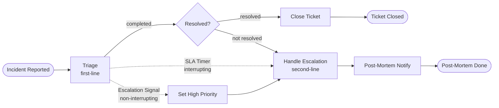

# Operaton Use Case 03 — Incident Management

A self-contained Operaton example for **incident management with SLA escalation** using timer boundary events and service-task integrations.

## What You Will Learn

- How to model an **interrupting timer boundary event** to enforce SLA escalation
- How to use a **non-interrupting signal boundary event** for parallel escalation
- How to wire Spring beans as `JavaDelegate` service tasks
- How to advance the Operaton internal clock in integration tests (no `Thread.sleep`)
- End-to-end IT with Testcontainers (PostgreSQL + WireMock)

## Process Model



Note: Lanes (employees, first-line, second-line, System) and boundary-event attachment cannot be rendered in Mermaid; see `incident-management.bpmn` for the full diagram interchange.

## Scenario

The process starts when a caller reports an `incidentId`. First-line support gets an initial chance to resolve the issue. If the SLA expires, an interrupting timer boundary event escalates the work to second-line engineering and triggers a post-mortem notification path. A non-interrupting signal boundary event allows parallel escalation while the triage task stays active.

## Actors

| Actor | Username | Group | Responsibility |
|------|----------|-------|----------------|
| Incident reporter | `alice` / `alice` | `employees` | Starts the incident process |
| First-line support | `frank` / `frank` | `first-line` | Performs initial triage and can resolve the incident before the SLA fires |
| Second-line engineer | `grace` / `grace` | `second-line` | Handles escalated incidents after the timer interrupts first-line work |
| Automation | system | n/a | Calls ticket-close and post-mortem notification endpoints |

## Prerequisites

- JDK 21+
- Docker

## Run It

### 1. Start dependencies

```bash
docker compose up -d
```

### 2. Run the application

```bash
./mvnw spring-boot:run
# or
./gradlew bootRun
```

### 3. Open the web apps

- Tasklist: http://localhost:8080/operaton/app/tasklist (demo / demo)
- Cockpit: http://localhost:8080/operaton/app/cockpit (demo / demo)

## Walk Through It

### Resolved path (happy path)

1. Start an instance:
   ```bash
   curl -s -X POST http://localhost:8080/engine-rest/process-definition/key/incident-management/start \
     -H "Content-Type: application/json" \
     -d '{"variables": {"incidentId": {"value": "INC-001", "type": "String"}}}'
   ```
2. Log in as `frank / frank` in Tasklist.
3. Claim **Triage** and complete it with `resolved = true`.
4. The workflow calls the close-ticket stub and ends.

### Escalation path (timer fires)

Run the app with a shorter timer for a quick demo:

```bash
./mvnw spring-boot:run -Dspring-boot.run.arguments=--timer.escalation.duration=PT10S
```

Start a new incident and wait 10 seconds. The first-line task disappears and Grace (`grace / grace`) receives **Handle Escalation**.

### Signal escalation (parallel)

Send an `EscalationSignal` while the Triage task is active:

```bash
curl -u frank:frank -X POST \
  http://localhost:8080/engine-rest/signal \
  -H 'Content-Type: application/json' \
  -d '{"name": "EscalationSignal"}'
```

The triage task remains active (non-interrupting) while a **Handle Escalation** task appears for the `second-line` group. `incidentPriority` is set to `HIGH`.

## How It Works

- **`incident-management.bpmn`** — defines the process with a non-interrupting signal boundary event (`Signal_Escalation`) and an interrupting timer boundary event (`BoundaryTimer_Escalate`) both attached to `Task_FirstLineTriage`.
- **`IncidentManagementApplication`** — exposes a `timerDuration` bean so the BPMN expression `${timerDuration}` resolves to the configured value (default `PT1H`).
- **`CloseTicketDelegate`** — posts to `/tickets/{id}/close` on the configured ticket service URL.
- **`PostMortemDelegate`** — posts to `/notifications/post-mortem` on the configured notification service URL.
- **`DataInitializer`** — seeds groups (`employees`, `first-line`, `second-line`) and users (`alice`, `frank`, `grace`) idempotently on startup.

## Run the Tests

```bash
./mvnw verify
# or
./gradlew build
```

`IncidentManagementIT` verifies four scenarios against a real PostgreSQL database (via Testcontainers): process deployment, the resolved path, timer-driven escalation to second-line, and signal-driven parallel escalation.

## Project Structure

```
src/
  main/
    java/org/operaton/examples/incidentmanagement/
      IncidentManagementApplication.java
      DataInitializer.java
      delegate/
        CloseTicketDelegate.java
        PostMortemDelegate.java
    resources/
      incident-management.bpmn
      application.yaml
  test/
    java/org/operaton/examples/incidentmanagement/
      IncidentManagementIT.java
    resources/
      wiremock/mappings/
        close-ticket-stub.json
        post-mortem-stub.json
```
